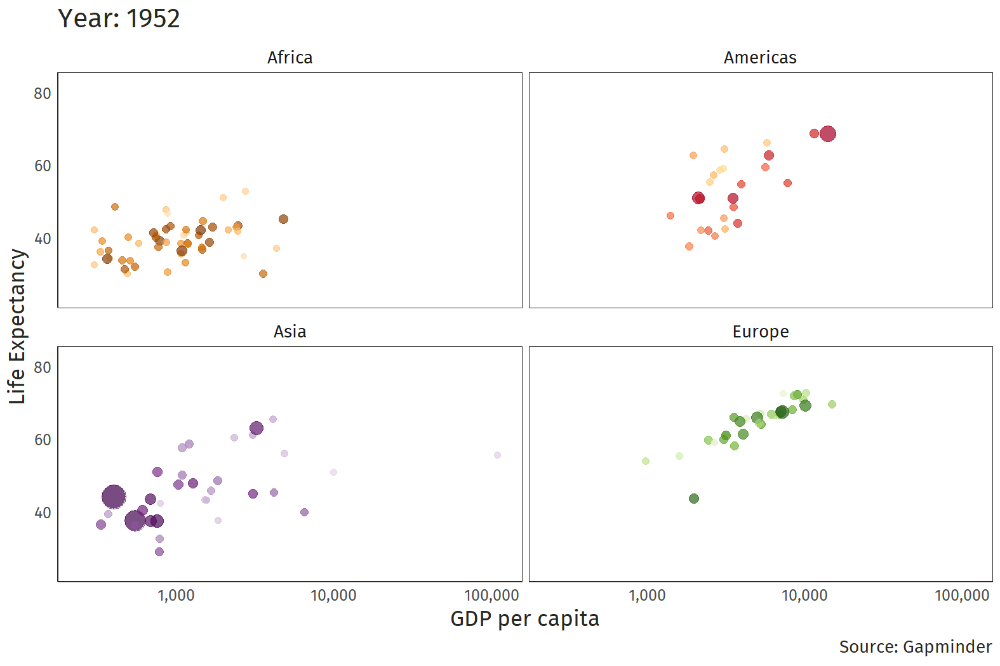
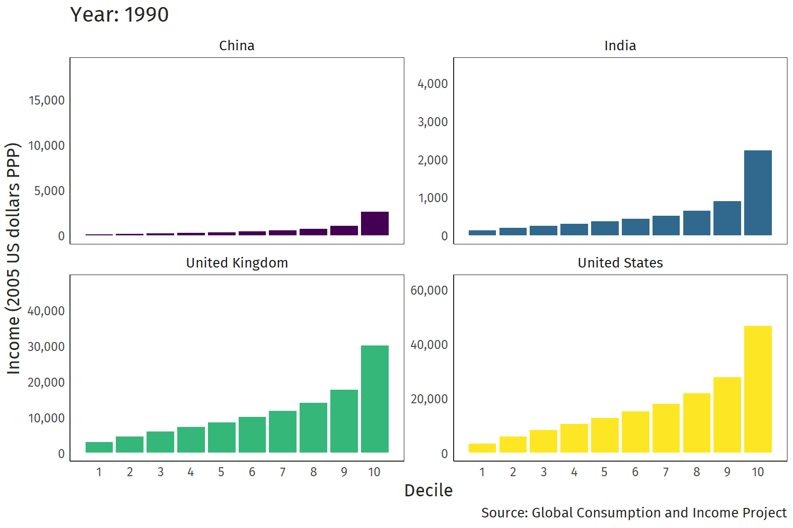

class: inverse, middle

```{r Setup, include = F}
options(htmltools.dir.version = FALSE)
library(pacman)
p_load(ggthemes, readxl, viridis, knitr, dslabs, gapminder, extrafont, Ecdat, wooldridge, tidyverse, magrittr, janitor)
# Define colors
red_pink <- "#e64173"
met_slate <- "#272822" # metropolis font color 
purple <- "#9370DB"
green <- "#007935"
light_green <- "#7DBA97"
orange <- "#FD5F00"
turquoise <- "#44C1C4"
# Notes directory
dir_slides <- "~/GitHub/Intro_Microeconomics_W20/Lectures/02-Economic_Problem_Motivation/"
# Knitr options
opts_chunk$set(
  comment = "#>",
  fig.align = "center",
  fig.height = 7,
  fig.width = 10.5,
  #dpi = 300,
  #cache = T,
  warning = F,
  message = F
)  
theme_simple <- theme_bw() + theme(
  axis.line = element_line(color = met_slate),
  panel.grid = element_blank(),
  rect = element_blank(),
  strip.text = element_blank(),
  text = element_text(family = "Fira Sans", color = met_slate, size = 17),
  axis.text.x = element_text(size = 12),
  axis.text.y = element_text(size = 12),
  axis.ticks = element_blank()
)
theme_gif <- theme_bw() + theme(
  axis.line = element_line(color = met_slate),
  panel.grid = element_blank(),
  rect = element_blank(),
  text = element_text(family = "Fira Sans", color = met_slate, size = 17),
  axis.text.x = element_text(size = 12),
  axis.text.y = element_text(size = 12),
  axis.ticks = element_blank()
)
wrapper <- function(x, ...) paste(strwrap(x, ...), collapse = "\n")
```

# Prologue

---
# Housekeeping

.mono[**iClicker**]**:** Switch your frequency to **DC**.

--

**Lecture slides:** I will post slides on Canvas after lecture.

- You will notice two files for each set of slides: a .mono[PDF] file and an .mono[HTML] file.
- .mono[HTML] requires an internet connection to view, but features incremental pauses and animations.
- .mono[PDF] does not require an internet connection to view, but does not feature any pauses or animations.

--

**You will have discussion this week!**

- Connor will lead you through 1) a brief math review and 2) a worksheet with practice problems.

---
# What is the economic problem?

The economic problem begins with recognizing that resources are .hi[scarce].

- Water, old-growth forests, copper, spotted owls, clean air, *etc.*

- Hours in a day, amount of time you can concentrate intensely, your lifespan, *etc.*

--

**Scarcity** 

> Not having enough of the items we find desirable to satisfy our [unlimited wants](https://www.youtube.com/embed/c3HU4cuhOmY).

---
class: clear-slide

.center[**History's Hockey Stick**]

```{R, echo = FALSE, fig.height = 6.75, dev = "svg"}
gdp <- read_csv("gdp_global.csv") %>% 
  clean_names() %>% 
  rename(gdp = real_gdp_per_capita_in_2011_us) %>% 
  filter(entity %in% c("United Kingdom", "United States", "China", "India", "Egypt"),
         year >= 1000)

ggplot(gdp, aes(x = year, y = gdp, color = entity)) +
  geom_line(size = 1) +
  scale_y_continuous(expand = c(0, 0)) +
  expand_limits(y = 0) +
  labs(color = "",
       caption = "Source: Our World in Data",
       x = "", 
       y = "Real GDP per person (2011 US dollars)") +
  scale_color_brewer(palette = "Dark2") +
  theme_simple

```

---
class: clear-slide

.center[**Living Standards Are Improving**]

```{R, example: gganimate, include = F, cache = T}
# The package for animating ggplot2
library(gganimate)

gg <- ggplot(
  data = gapminder %>% filter(continent != "Oceania"),
  aes(gdpPercap, lifeExp, size = pop, color = country)
) +
geom_point(alpha = 0.7, show.legend = FALSE) +
scale_colour_manual(values = country_colors) +
scale_size(range = c(2, 12)) +
scale_x_log10("GDP per capita", label = scales::comma) +
facet_wrap(~continent) +
theme_gif +
theme(panel.border = element_rect(color = met_slate, fill = NA)) +
# Add gganimate code
labs(title = "Year: {frame_time}",
     caption = "Source: Gapminder") +
ylab("Life Expectancy") +
transition_time(year) +
ease_aes("linear")
# Save the animation
anim_save(
  animation = gg,
  filename = "gapminder.gif",
  path = dir_slides,
  width = 10.5,
  height = 6.5,
  units = "in",
  res = 150,
  nframes = 56,
  fps = 5
)
```

.center[]

---
class: inverse, middle

# Organizing an Economy

---
# How should we organize the economy?

Societies face three fundamental questions about the structure of their economies:

1. *What* should we produce?

2. *How* should we produce?

3. *For whom* should we produce?

--

The way societies act upon those questions poses important consequences for mitigating the costs of scarcity.

---
# How should we organize the economy?

## A few takes

--

Karl Marx:

> From each, according to his ability; to each, according to his need.

--

John the Baptist:

> The man who has two tunics is to share with him who has none; and he who has food is to do likewise.

--

Winston Churchill:

> The inherent vice of capitalism is the unequal sharing of blessings; the inherent virtue of socialism is the equal sharing of miseries.

---
# Economic Systems

**Feudalism:** An economic system based on rigid hierarchies and tradition.

- If your parents were serfs, you were a serf.

- Dominant economic system in Europe during the Middle Ages.

--

**Mercantilism:** An economic system in which the government distributes rights for specific economic activities.

- Example: Hudson's Bay Company and the fur trade.

- The government decides what, how, and for whom to produce.

- Dominant economic system during the Renaissance.

---
# Economic Systems

**Capitalism:** An economic system based on private property, markets, and firms.

- Encourages individuals to act in their own self-interest while market forces of demand and supply coordinate individual pursuits.

- Distribution of goods is to each according to her ability, effort, and inherited property.

- In principle, individuals determine what, how, and for whom to produce.

- Dominant economic system since the Industrial Revolution.

---
# Economic Systems

**Socialism:** An economic system based on individuals' good will toward others, not their own self-interest.

- No private property: the state owns the means of production.

- In principle, society determines what, how, and for whom to produce.

- Dominant economic system in Eastern Europe, China, and some parts of Africa, Southeast Asia, and Latin America during the 1900s.

---
# Economic Systems 🐄 🐄

**Marxism:** 

> You have two cows. Your neighbors help take care of them and you all share the milk.

--

**Communism:** 

> You have two cows. The Supreme Leader takes them both, denies they ever existed, and drafts you into the Army. Milk is banned.

--

**Capitalism:** 

> You have two cows. You sell one and buy a bull. Your herd multiplies, and the economy grows. You sell them and retire on the income.

---
# Economic Systems 🐄 🐄

**Crony Capitalism:** 

> You have two cows. You sell three of them to your publicly-listed company, using letters of credit opened by your brother-in-law at the bank, then execute a debt/equity swap with associated general offer so that you get all four cows back, with a tax exemption for keeping five cows. The milk rights of six cows are transferred via an intermediary to a Cayman Islands company secretly owned by the majority shareholder, who sells the rights to all seven cows back to the listed company. The annual report says that the company owns eight cows, with an option on one more.

---
# Capitalism

Three **institutions** define capitalist economies:

1. **Private property:** The right to use a good as you see fit and exclude others from using it.

2. **Markets:** Settings for individuals to voluntarily exchange goods and services based on mutual benefits.

3. **Firms:** Groups of profit-seeking individuals that use capital and labor to produce and sell goods and services.
 
--

**Q:** Does China have a capitalist economy?
--
<br>**A:** Yes!

Capitalism, like other economic systems, takes a variety of forms.

---
class: clear-slide

.center[**A Rising Tide Lifts *All* Boats?**]

```{R, include = F, cache = T}
income <- read_excel("income_global.xlsx") %>% 
  filter(entity %in% c("United Kingdom", "United States", "China", "India"),
         year >= 1990) %>% 
  select(-c(mean_inc, pop)) %>% 
  pivot_longer(-c(entity, year), names_to = "decile", values_to = "income") %>% 
  mutate(decile = case_when(decile == "d1_inc" ~ 1,
                            decile == "d2_inc" ~ 2,
                            decile == "d3_inc" ~ 3,
                            decile == "d4_inc" ~ 4,
                            decile == "d5_inc" ~ 5,
                            decile == "d6_inc" ~ 6,
                            decile == "d7_inc" ~ 7,
                            decile == "d8_inc" ~ 8,
                            decile == "d9_inc" ~ 9,
                            decile == "d10_inc" ~ 10))

gg2 <- ggplot(
  data = income,
  aes(y = income, x = decile, fill = entity)
) +
geom_col(alpha = 1, show.legend = FALSE) +
facet_wrap(~entity, scales = "free_y") +
scale_x_continuous(breaks = seq(1, 10, 1), labels = c("1", "2", "3", "4", "5", "6", "7", "8", "9", "10")) +
scale_y_continuous(label = scales::comma) +
theme_gif +
theme(panel.border = element_rect(color = met_slate, fill = NA)) +
# Add gganimate code
labs(title = "Year: {frame_time}",
     caption = "Source: Global Consumption and Income Project",
     y = "Income (2005 US dollars PPP)",
     x = "Decile") +
scale_fill_viridis(discrete = TRUE) +
transition_time(year) +
ease_aes("linear")
# Save the animation
anim_save(
  animation = gg2,
  filename = "income.gif",
  path = dir_slides,
  width = 10.5,
  height = 6.5,
  units = "in",
  res = 150,
  nframes = 25,
  fps = 4
)
```

.center[]

---
class: inverse, middle

# Theory

---
# What is a theory?

By example, a theory is structured: if "postulate *A*," then "event *B*."

- If "you attend class regularly," then "you will earn a higher grade."

- If "nobody owns water and we don't act to protect it," then "our water will become contaminated."

- If "the fine for not wearing a seatbelt increases," then "speed will increase."

- If "monitoring workers is costly," then "firms will compensate workers based on performance."

---
# What is a theory?

## Definitions

> An explanation for some phenomenon that is based on observation, experimentation, and reasoning.

> A logical statement or a testable model of the manner in which phenomena interact.

> A structured prediction that is capable of being tested through experimentation or otherwise falsified through empirical observation.

---
# What makes a theory valuable?

**Refutability**

- What do we mean by "good in theory, but lousy in practice?"
- The theory could, in principle, be wrong.
- Economists seek to make statements that could be wrong, but are repeatedly shown to be consistent with the facts.

--

**Predictive power**

- A theory is valuable insofar that it predicts behavior well.

--

**Simplicity**

- *All else being equal*, a simple theory is more valuable than a complex theory.

---
# Important Caveats

**Caveat 1:** A theory does not imply its converse.

- The observation of *B* does not guarantee that *A* is true. *Something else could have caused B!*
- *Example:* More people catch colds in winter months than in summer months, but low temperatures do not *cause* colds.

- *Example:* Indoor temperatures are negatively correlated with the running time on furnaces, but furnaces do not cool houses.

--

**Caveat 2:** Science cannot prove that a theory is true.

- At best, science fails to refute a theory's postulates or predictions.
- *Example:* We will not *prove* that free trade is good. Nor will we *prove* that free trade is bad.

---
class: inverse, middle

# The Central Role of Prices

---
# Prices

Prices play a key role in a capitalist economy.

- Provide a means to coordinate wants and needs by rationing scarce resources.

- Determined through the interaction of consumers (demand) and producers (supply) in markets.

---
# Prices

**Q:** What is a price?

--

**A:** .hi[A price is a ratio] at which two goods are exchanged in a market.

--

**Implication:** It is impossible to change only one price at a time.

- When the dollar price of something changes, it changes not only in terms of dollars but also in terms of all other things dollars can buy.

The failure to recognize this point can have detrimental consequences.

- What relevant prices change when seat-belt wearing becomes regulated?

---
# Policy Analysis: Regulating DUI

A **regulation** seeks to alter the behavior of individuals.

- Uses some set of incentives (sanctions and rewards) to induce people to incur the cost of changing their behavior.

Incentives change the price of an action, either explicitly or implicitly.

- **Positive incentives** raise the benefits or reduce the costs of an action.

- **Negative incentives** reduce the benefits or raise the cost of an action.

---
# Policy Analysis: Regulating DUI

**Background:** Before 1983, an individual operating a vehicle in Ohio with a blood alcohol concentration of 0.1 percent or higher was *presumed* to be under the influence of alcohol.

--

**Policy change:** In 1983, Ohio amended its DUI law to make driving with a blood alcohol concentration of 0.1 percent or higher a *per se* violation.

**Q:** What happened to the costs and benefits of DUI?

--

**A:** Assuming no coincident changes in the probability of arrest, the policy change increased the expected cost of DUI by

1. Reducing the likelihood of a successful plea bargain.
2. Increasing the likelihood that an arrest would result in conviction.

---
# Policy Analysis: Regulating DUI

**Q:** Drinking drivers who wished to avoid the legal penalties associated with DUI could respond to the policy change in several ways. What are some rational responses?

--

**A.sub[1]:** Drink less before driving.

**A.sub[2]:** Drive less after drinking.

**A.sub[3]:** Drive more carefully after drinking.

Any of these responses will reduce erratic driving and the probability of arrest.

---
# Policy Analysis: Regulating DUI

**Q:** Are there any other options for a drunk driver involved in a collision?

--

**A.sub[1]:** Leave the scene before the police arrive.

**A.sub[2]:** Bribe the other driver to delay reporting the collision.

- Allow time for blood alcohol concentration to fall while neither driver loses the ability to make an insurance claim.

- More likely to work in injury-free collisions or collisions that occur in less-populated areas.

--

Both choices are costly, but, *all else being equal*, higher expected costs of DUI enhance their attractiveness.

---
# Policy Analysis: Regulating DUI

## What happened?

**Drunk driving**

The probability that a driver involved in a collision had been drinking declined by about 20 percent.

- The policy change is negatively associated with drunk driving, as policymakers intended.

---
# Policy Analysis: Regulating DUI

## What happened?

**Hit-and-run**

Alcohol-related hit-and-runs increased by 8 percent while sober hit-and-runs (control group) declined by about 15 percent.

- Relative to the control group, alcohol-related hit-and-runs increased by about 27 percent.

---
# Policy Analysis: Regulating DUI

## What happened?

**Bribery**

The fraction of late-reported, "bribable" collisions reported as alcohol-related declined 38 percent.

- Before the policy change, 50 percent of late-reported, "bribable" collisions were reported as alcohol-related.

- After the policy change, only 13 percent were reported as alcohol-related.

---
# Policy Analysis: Regulating DUI

**Takeaway:** The evidence suggests that increasing the conviction rate for drunk driving

1. May reduce the incidence of alcohol-related collisions.

2. May also increase the incidence of alcohol-related hit-and-runs and bribery.

--

**The bigger takeaway?**

.center[.hi[Impossible to change just one price <br> .mono[==>] <br> Impossible to change just one behavior!]]

---
class: inverse, middle

# Cost

---
# Competition

Scarce resources and boundless desires inevitably lead to competition among individuals.

**Q:** How do we compete?

--

- Going to college, paying a higher price, bidding a lower price, cheating, theft, violence, *etc.*

Competitive actions mitigate the costs of scarcity.

Are those behaviors equally costly? To the individual? To society?

- Individuals will pursue competitive strategies that are least costly to them.

---
# Cost

When resources are scarce, the decision to do one thing necessarily implies that something else doesn't get done.

- Every human action has a cost associated with it.

--

**Opportunity cost:** The forgone value of the next-best alternative.

- The opportunity cost of attending this lecture is watching Netflix, going to the gym, or whatever you consider to be your next-best alternative.

- **Important:** Not .purple[*all the other things you could be doing*], but rather .purple[*the next-best thing you could be doing*].

--

The cost of any action includes both direct costs and opportunity costs.

---
class: clear-slide

**Podcast Question:** What would be Lisa Chow's opportunity cost of staying with "Guy 45" had she not broken up with him?

> **A.** The opportunity to go out with lots of other people.

> **B.** The opportunity to meet Kevin (her current husband).

> **C.** Adding another line to her excel spreadsheet.

---
class: clear-slide
count: false

**Podcast Question:** What would be Lisa Chow's opportunity cost of staying with "Guy 45" had she not broken up with him?

> **A.** The opportunity to go out with lots of other people.

> .pink[**B.** The opportunity to meet Kevin (her current husband).]

> **C.** Adding another line to her excel spreadsheet.

---
class: clear-slide

**Podcast Question:** According to Tim Harford, what is the main component of the opportunity cost of an additional romantic partner?

> **A.** Jealousy.

> **B.** Love.

> **C.** Money.

> **D.** Time.

---
class: clear-slide
count: false

**Podcast Question:** According to Tim Harford, what is the main component of the opportunity cost of an additional romantic partner?

> **A.** Jealousy.

> **B.** Love.

> **C.** Money.

> .pink[**D.** Time.]

---
class: clear-slide

.center[**A Typical Age-Earnings Profile**]

```{R, echo = FALSE, fig.height = 6.75, dev = "svg"}
x <- 18:40

No_College <- function(x) 125*x^2 - 2.4*x^3 - 5000
College <- function(x){ifelse(x >= 22, 155*x^2 - 2.95*x^3, NA)}

base_plot <- ggplot(data = data.frame(x = 0), mapping = aes(x = x)) +
  scale_x_continuous(limits = c(18, 40), expand=c(0,0), breaks = c(18, 22.2), labels = c("18", "22")) +
  scale_y_continuous(limits = c(-15000, 75000), label = scales::comma) +
  theme_bw() +
  theme(text = element_text(family = "Fira Sans", color = met_slate, size = 17),
        axis.text.x = element_text(size = 12),
        axis.text.y = element_text(size = 12),
        axis.ticks = element_blank(),
        axis.line = element_line(size = 0.75, color = met_slate),
        axis.line.x = element_blank(),
        axis.text = element_text(size = 18),
        panel.grid.major = element_blank(),
        panel.grid.minor = element_blank(),
        panel.border = element_blank(), 
        panel.background = element_rect(fill = "transparent", color = NA),
        plot.background = element_rect(fill = "transparent", color = NA)) +
  labs(x = "Age", y = "Income") +
  geom_hline(yintercept = 0, size = 0.75, color = met_slate) +
  stat_function(aes(x), fun = No_College, color = green, size = 0.75) + # no college
  annotate("text", label = "No College", x = 35, y = 41000, color = green, family = "Fira Sans", size = 5)

base_plot
```

---
class: clear-slide

.center[**Typical Age-Earnings Profiles**]

```{R, echo = FALSE, fig.height = 6.75, dev = "svg"}
base_plot +
  stat_function(aes(x), fun = College, color = red_pink, size = 0.75) + # college
  geom_segment(aes(x = 22.2, y = -13000, xend = 22.2, yend = 43945), color = red_pink, size = 0.75, linetype = "solid") +
  geom_segment(aes(x = 18, y = -13000, xend = 22.2, yend = -13000), color = red_pink, size = 0.75) +
  annotate("text", label = "College", x = 35, y = 68000, color = red_pink, family = "Fira Sans", size = 5)
```

---
class: clear-slide

**Q:** Which of the following areas represents the opportunity cost of college?

> **Answer:**

```{R, echo = FALSE, fig.height = 5.5, dev = "svg"}
w <- seq(22.2, 40, 0.01)
z <- seq(18, 22.2, 0.01)

base_plot +
  stat_function(aes(x), fun = College, color = red_pink, size = 0.75) + # college
  geom_segment(aes(x = 22.2, y = -13000, xend = 22.2, yend = 43945), color = red_pink, size = 0.75, linetype = "solid") +
  geom_segment(aes(x = 18, y = -13000, xend = 22.2, yend = -13000), color = red_pink, size = 0.75) +
  annotate("text", label = "College", x = 35, y = 68000, color = red_pink, family = "Fira Sans", size = 5) +
  #geom_ribbon(aes(x = z, ymax = 0, ymin = -13000), alpha = 0.2, fill = purple) +
  annotate("text", label = "A", x = 20, y = -6500, color = met_slate, family = "Fira Sans", size = 6) +
  #geom_ribbon(aes(x = z, ymax = No_College(z), ymin = 0), alpha = 0.2, fill = orange) +
  annotate("text", label = "B", x = 20, y = 12500, color = met_slate, family = "Fira Sans", size = 6) +
  #geom_ribbon(aes(x = w, ymax = College(w), ymin = No_College(w)), alpha = 0.2, fill = turquoise) +
  annotate("text", label = "C", x = 35, y = 54500, color = met_slate, family = "Fira Sans", size = 6)
```

---
class: clear-slide
count: false

**Q:** Which of the following areas represents the opportunity cost of college?

> .pink[**Answer:** Area B]

```{R, echo = FALSE, fig.height = 5.5, dev = "svg"}
w <- seq(22.2, 40, 0.01)
z <- seq(18, 22.2, 0.01)

base_plot +
  stat_function(aes(x), fun = College, color = red_pink, size = 0.75) + # college
  geom_segment(aes(x = 22.2, y = -13000, xend = 22.2, yend = 43945), color = red_pink, size = 0.75, linetype = "solid") +
  geom_segment(aes(x = 18, y = -13000, xend = 22.2, yend = -13000), color = red_pink, size = 0.75) +
  annotate("text", label = "College", x = 35, y = 68000, color = red_pink, family = "Fira Sans", size = 5) +
  #geom_ribbon(aes(x = z, ymax = 0, ymin = -13000), alpha = 0.2, fill = purple) +
  annotate("text", label = "A", x = 20, y = -6500, color = met_slate, family = "Fira Sans", size = 6) +
  #geom_ribbon(aes(x = z, ymax = No_College(z), ymin = 0), alpha = 0.2, fill = orange) +
  annotate("text", label = "B", x = 20, y = 12500, color = met_slate, family = "Fira Sans", size = 6) +
  #geom_ribbon(aes(x = w, ymax = College(w), ymin = No_College(w)), alpha = 0.2, fill = turquoise) +
  annotate("text", label = "C", x = 35, y = 54500, color = met_slate, family = "Fira Sans", size = 6)
```

---
class: clear-slide

**Q:** If all you care about is money, under what set of circumstances would you go to college?

> **A.** A .mono[+] B .mono[>] C 

> **B.** A .mono[+] B .mono[<] C 

> **C.** A .mono[+] C .mono[>] B

> **D.** A .mono[+] C .mono[<] B

```{R, echo = FALSE, fig.height = 3, dev = "svg"}
w <- seq(22.2, 40, 0.01)
z <- seq(18, 22.2, 0.01)

base_plot +
  stat_function(aes(x), fun = College, color = red_pink, size = 0.75) + # college
  geom_segment(aes(x = 22.2, y = -13000, xend = 22.2, yend = 43945), color = red_pink, size = 0.75, linetype = "solid") +
  geom_segment(aes(x = 18, y = -13000, xend = 22.2, yend = -13000), color = red_pink, size = 0.75) +
  annotate("text", label = "College", x = 35, y = 68000, color = red_pink, family = "Fira Sans", size = 5) +
  #geom_ribbon(aes(x = z, ymax = 0, ymin = -13000), alpha = 0.2, fill = purple) +
  annotate("text", label = "A", x = 20, y = -6500, color = met_slate, family = "Fira Sans", size = 6) +
  #geom_ribbon(aes(x = z, ymax = No_College(z), ymin = 0), alpha = 0.2, fill = orange) +
  annotate("text", label = "B", x = 20, y = 12500, color = met_slate, family = "Fira Sans", size = 6) +
  #geom_ribbon(aes(x = w, ymax = College(w), ymin = No_College(w)), alpha = 0.2, fill = turquoise) +
  annotate("text", label = "C", x = 35, y = 54500, color = met_slate, family = "Fira Sans", size = 6)
```

---
class: clear-slide
count: false

**Q:** If all you care about is money, under what set of circumstances would you go to college?

> **A.** A .mono[+] B .mono[>] C 

> .pink[**B.** A .mono[+] B .mono[<] C]

> **C.** A .mono[+] C .mono[>] B

> **D.** A .mono[+] C .mono[<] B

```{R, echo = FALSE, fig.height = 3, dev = "svg"}
w <- seq(22.2, 40, 0.01)
z <- seq(18, 22.2, 0.01)

base_plot +
  stat_function(aes(x), fun = College, color = red_pink, size = 0.75) + # college
  geom_segment(aes(x = 22.2, y = -13000, xend = 22.2, yend = 43945), color = red_pink, size = 0.75, linetype = "solid") +
  geom_segment(aes(x = 18, y = -13000, xend = 22.2, yend = -13000), color = red_pink, size = 0.75) +
  annotate("text", label = "College", x = 35, y = 68000, color = red_pink, family = "Fira Sans", size = 5) +
  #geom_ribbon(aes(x = z, ymax = 0, ymin = -13000), alpha = 0.2, fill = purple) +
  annotate("text", label = "A", x = 20, y = -6500, color = met_slate, family = "Fira Sans", size = 6) +
  #geom_ribbon(aes(x = z, ymax = No_College(z), ymin = 0), alpha = 0.2, fill = orange) +
  annotate("text", label = "B", x = 20, y = 12500, color = met_slate, family = "Fira Sans", size = 6) +
  #geom_ribbon(aes(x = w, ymax = College(w), ymin = No_College(w)), alpha = 0.2, fill = turquoise) +
  annotate("text", label = "C", x = 35, y = 54500, color = met_slate, family = "Fira Sans", size = 6)
```

---
class: clear-slide

**Q:** You are planning a trip to Seattle. To get there, you can take the train or fly. The train from Eugene to Seattle takes .mono[8 hours] and costs .mono[$30] for a ticket. A flight from Eugene to Seattle takes .mono[1 hour], and costs .mono[$100] dollars for a ticket. You decide to take the train. How much do you value your time?

--

> Your choice .mono[=>] taking the train is less costly than flying: <br> .pink[.mono[8 hours + $30 <= 1 hour + $100]]

--

> Subtract .mono[$30] from both sides to get <br> .pink[.mono[8 hours <= 1 hour + $70]]

--

> Subtract .mono[1 hour] from both sides to get .pink[.mono[7 hours <= $70]]

--

> Divide both sides by .mono[7] to get .pink[.mono[1 hour <= $10]] 

> **A:** .pink[You value your time at no more than .mono[$10 per hour].]
