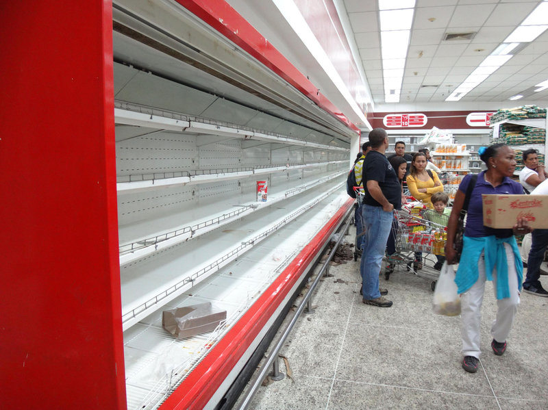
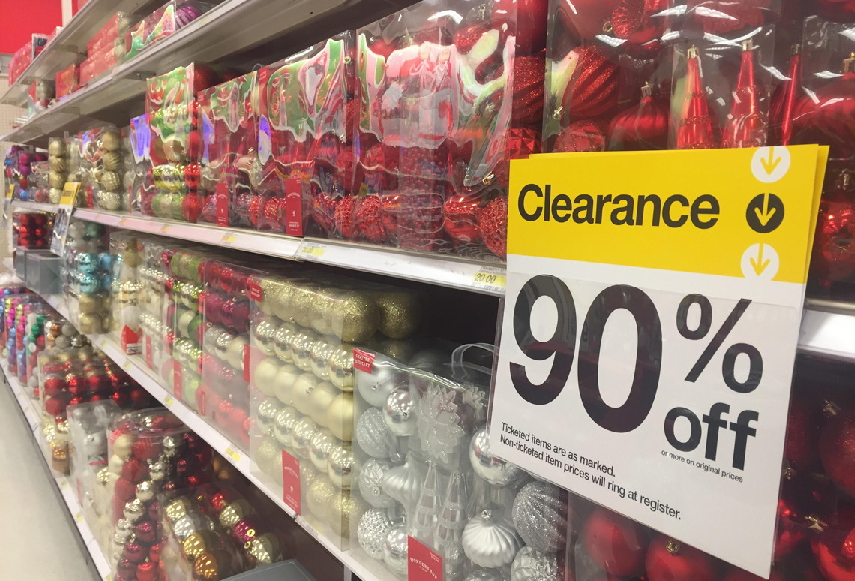

class: inverse, middle

```{r Setup, include = F}
options(htmltools.dir.version = FALSE)
library(pacman)
p_load(ggthemes, readxl, viridis, knitr, dslabs, gapminder, extrafont, Ecdat, wooldridge, tidyverse, magrittr, janitor, RcmdrPlugin.KMggplot2, kableExtra)
# Define colors
red_pink <- "#e64173"
met_slate <- "#272822" # metropolis font color 
purple <- "#9370DB"
green <- "#007935"
light_green <- "#7DBA97"
orange <- "#FD5F00"
turquoise <- "#44C1C4"
# Notes directory
dir_slides <- "~/GitHub/Intro_Microeconomics_W20/Lectures/03-Consumer_Theory/"
# Knitr options
opts_chunk$set(
  comment = "#>",
  fig.align = "center",
  fig.height = 7,
  fig.width = 10.5,
  #dpi = 300,
  #cache = T,
  warning = F,
  message = F
)  
theme_simple <- theme_bw() + theme(
  axis.line = element_line(color = met_slate),
  panel.grid = element_blank(),
  rect = element_blank(),
  strip.text = element_blank(),
  text = element_text(family = "Fira Sans", color = met_slate, size = 17),
  axis.text.x = element_text(size = 12),
  axis.text.y = element_text(size = 12),
  axis.ticks = element_blank()
)
theme_market <- theme_bw() + theme(
  axis.line = element_line(color = met_slate),
  panel.grid = element_blank(),
  rect = element_blank(),
  strip.text = element_blank(),
  text = element_text(family = "Fira Sans", color = met_slate, size = 17),
  axis.title.x = element_text(hjust = 1, size = 17),
  axis.title.y = element_text(hjust = 1, angle = 0, size = 17),
  # axis.text.x = element_text(size = 12),
  # axis.text.y = element_text(size = 12),
  axis.ticks = element_blank()
)
theme_gif <- theme_bw() + theme(
  axis.line = element_line(color = met_slate),
  panel.grid = element_blank(),
  rect = element_blank(),
  text = element_text(family = "Fira Sans", color = met_slate, size = 17),
  axis.text.x = element_text(size = 12),
  axis.text.y = element_text(size = 12),
  axis.ticks = element_blank()
)
wrapper <- function(x, ...) paste(strwrap(x, ...), collapse = "\n")
# functions
demand <- function(x) 10 - x
demand_2 <- function(x) 9 - x
demand_3 <- function(x) 8 - x
demand_inc <- function(x) 11 - x
demand_dec <- function(x) 5 - x
supply <- function(x) 1 + (4/5)*x
step_demand <- data.frame(x = c(0, 1, 2, 3, 4, 5, 6, 7, 8), mv = c(8, 7, 6, 5, 4, 3, 2, 1, 0))
```

# Prologue

---
# Demand and Supply

## Foundations

If goods and time were not scarce, then we would never have to choose among competing alternatives.

- .hi-pink[Consumer theory] characterizes .pink[consumers' choices] in a systematic way.

- .hi-purple[Producer theory] characterizes .purple[producers' and sellers' choices] in a systematic way.

---
# Demand

**Q:** What constrains our consumption of goods?

--

**A:** Lots of things!

- Our income or wealth.
- Price of the good.
- Legality of consuming the good.
- Cost of maintaining the good.
- Our health.
- Our finite existence.
- *etc.*

---
# Demand

**Q:** If we could measure those constraints for a group of individuals, could we predict the choices of those individuals?

--

- **A:** No. To predict behavior, we also need to consider individual tastes or preferences.

--

**Q:** Can we measure tastes or preferences?

--

- **A:** Not typically.

---
# Demand

Our inability to measure preferences requires us to make assumptions.

- However preferences are defined, they do not change during the course of the investigation.

- Preferences are such that individuals strive to reduce the adverse consequences of the constraints they face.

Given those assumptions, we can make refutable hypotheses about how individuals respond to *changes* in the constraints they face.

---
# Demand

.less-right[
### .pink[Demand Curve]

Shows the amount of a good .pink[consumers] are willing and able to purchase at specified prices.

.pink[Downward sloping:] P increases .mono[->] Q.sub[D] decreases.
]

.more-left[
```{r market_demand, echo = FALSE, fig.height = 5, fig.width = 5, dev = "svg"}
ggplot(data = data.frame(x = 0), mapping = aes(x = x)) +
  scale_x_continuous(limits = c(0, 10.5), expand = c(0, 0), breaks = seq(0, 10, 1)) +
  scale_y_continuous(limits = c(0, 10.5), expand = c(0, 0), breaks = seq(0, 10, 1)) +
  theme_market +
  labs(x = "Q", y = "P") +
  stat_function(fun = demand, color = red_pink, size = 1) +
  annotate("text", label = "D", x = 10, y = 0.65, color = red_pink, family = "Fira Sans", size = 9)
```
]

---
# Supply

.less-right[
### .purple[Supply Curve]

Shows the amount of a good .purple[producers or sellers] are willing and able to sell at specified prices.

.purple[Upward sloping:] P increases .mono[->] Q.sub[S] increases.
]

.more-left[
```{r market_supply, echo = FALSE, fig.height = 5, fig.width = 5, dev = "svg"}
ggplot(data = data.frame(x = 0), mapping = aes(x = x)) +
  scale_x_continuous(limits = c(0, 10.5), expand = c(0, 0), breaks = seq(0, 10, 1)) +
  scale_y_continuous(limits = c(0, 10.5), expand = c(0, 0), breaks = seq(0, 10, 1)) +
  theme_market +
  labs(x = "Q", y = "P") +
  stat_function(fun = supply, color = purple, size = 1) + 
  annotate("text", label = "S", x = 10, y = 9.5, color = purple, family = "Fira Sans", size = 9)
```
]

---
# Equilibrium

.less-right[
### Market Clearing

Quantity demanded equals quantity supplied: Q.sub[D] .mono[=] Q.sub[S].

No tendency for prices to change.
]

.more-left[
```{r equilibrium, echo = FALSE, fig.height = 5, fig.width = 5, dev = "svg"}
market <- ggplot(data = data.frame(x = 0), mapping = aes(x = x)) +
  scale_x_continuous(limits = c(0, 10.5), expand = c(0, 0), breaks = seq(0, 10, 1)) +
  scale_y_continuous(limits = c(0, 10.5), expand = c(0, 0), breaks = seq(0, 10, 1)) +
  theme_market +
  labs(x = "Q", y = "P") +
  stat_function(fun = supply, color = purple, size = 1) + # supply function
  annotate("text", label = "S", x = 10, y = 9.5, color = purple, family = "Fira Sans", size = 9) + 
  stat_function(fun = demand, color = red_pink, size = 1) + 
  annotate("text", label = "D", x = 10, y = 0.65, color = red_pink, family = "Fira Sans", size = 9)
market
```
]

---
count:false
# Equilibrium

.less-right[
### Market Clearing

Quantity demanded equals quantity supplied: Q.sub[D] .mono[=] Q.sub[S].

No tendency for prices to change.
]

.more-left[
```{r equilibrium2, echo = FALSE, fig.height = 5, fig.width = 5, dev = "svg"}
market + 
  geom_point(aes(x = 5, y = 5), color = met_slate, size = 2) +
  geom_segment(aes(x = 5, y = 0, xend = 5, yend = 5), linetype  = "dashed", color = met_slate, size = 1) + 
  geom_segment(aes(x = 0, y = 5, xend = 5, yend = 5), linetype  = "dashed", color = met_slate, size = 1)
```
]

---
# Disequilibrium

.less-right[
### Shortage

Quantity demanded exceeds quantity supplied: Q.sub[D] .mono[>] Q.sub[S].

Prices tend to rise.

```{r, fig.retina = 4, echo = FALSE}

```
]

.more-left[
```{r shortage1, echo = FALSE, fig.height = 5, fig.width = 5, dev = "svg"}
market + geom_hline(yintercept = 3, linetype  = "dashed", color = met_slate, size = 1) 
```
]

---
count: false
# Disequilibrium

.less-right[
### Shortage

Quantity demanded exceeds quantity supplied: Q.sub[D] .mono[>] Q.sub[S].

Prices tend to rise.

```{r, fig.retina = 4, echo = FALSE}

```
]

.more-left[
```{r shortage2, echo = FALSE, fig.height = 5, fig.width = 5, dev = "svg"}
market + geom_hline(yintercept = 3, linetype  = "dashed", color = met_slate, size = 1) +
  geom_segment(aes(x = 7, y = 0, xend = 7, yend = 3), linetype  = "dashed", color = met_slate, size = 1) + 
  geom_point(aes(x = 7, y = 3), color = met_slate, size = 2) +
  geom_segment(aes(x = 2.5, y = 0, xend = 2.5, yend = 3), linetype  = "dashed", color = met_slate, size = 1) + 
  geom_point(aes(x = 2.5, y = 3), color = met_slate, size = 2)
```
]

---
# Disequilibrium

.less-right[
### Surplus

Quantity supplied exceeds quantity demanded: Q.sub[S] .mono[>] Q.sub[D].

Prices tend to fall.

```{r, fig.retina = 3, echo = FALSE}

```
]

.more-left[
```{r surplus1, echo = FALSE, fig.height = 5, fig.width = 5, dev = "svg"}
market + geom_hline(yintercept = 7, linetype  = "dashed", color = met_slate, size = 1) 
```
]

---
count: false
# Disequilibrium

.less-right[
### Surplus

Quantity supplied exceeds quantity demanded: Q.sub[S] .mono[>] Q.sub[D].

Prices tend to fall.

```{r, fig.retina = 3, echo = FALSE}

```
]


.more-left[
```{r surplus2, echo = FALSE, fig.height = 5, fig.width = 5, dev = "svg"}
market + geom_hline(yintercept = 7, linetype  = "dashed", color = met_slate, size = 1) +
  geom_segment(aes(x = 3, y = 0, xend = 3, yend = 7), linetype  = "dashed", color = met_slate, size = 1) + 
  geom_point(aes(x = 3, y = 7), color = met_slate, size = 2) +
  geom_segment(aes(x = 7.5, y = 0, xend = 7.5, yend = 7), linetype  = "dashed", color = met_slate, size = 1) + 
  geom_point(aes(x = 7.5, y = 7), color = met_slate, size = 2) 
```
]

---
class: inverse, middle

# Consumer Choice

---
# Individual Preferences

Economists seek to understand the combined actions of individuals.

However, the forthcoming behavioral assumptions concern individual preferences.

- Why? Because describing the preferences of a group is extraordinarily difficult. 

---
# Group Preferences

**Scenario:** Three officials in the current administration have preferences over three ways to respond to recent US-Iran tensions.

- **Official 1:** *bomb them* .mono[>] *impose sanctions* .mono[>] *do nothing*
- **Official 2:** *impose sanctions* .mono[>] *do nothing* .mono[>] *bomb them*
- **Official 3:** *do nothing* .mono[>] *bomb them* .mono[>] *impose sanctions*

--

**Q:** How do we define preferences for this group? 

- What does "the group" prefer?

--

**A:** `r emo::ji("shrug")`

--

- For any course of action, a majority would rather do something else!

---
# Behavioral Assumptions

Four assumptions buy us the ability to model consumer behavior:

1. People have preferences.

2. People prefer more over less.

3. People are willing to substitute.

4. The marginal value of a good decreases as one consumes more of it.

--

**Note:** These assumptions may rule out some realistic behaviors.

---
# Valuation

The value of a good .mono[=] what you are willing to give up to obtain it.

- If you give up .mono[$]30,000-worth of other goods to buy a car, then you value the car at a minimum of .mono[$]30,000.

--

We will maintain that an object's value is limited to what people are willing to pay for the right to control the object.

---
# Total Value

## Definition 1

> The .pink[maximum] amount of money a consumer is .pink[willing to pay] to acquire a specific quantity of a good.

*Example:* The highest price you would pay for 3 pounds of Stumptown coffee.

--

## Definition 2

> The .pink[minimum] amount of money a consumer is .pink[willing to accept] to give up a specific quantity of a good.

*Example:* The lowest amount of money for which you would willingly part with 3 pounds of Stumptown coffee.

---
# Marginal Value

## Definition 1

> The .pink[maximum] amount of money a consumer is .pink[willing to pay] to acquire one more unit of a good.

*Example:* The highest price you would pay for a cup of Stumptown coffee.

--

## Definition 2

> The .pink[minimum] amount of money a consumer is .pink[willing to accept] to give up one more unit of a good.

*Example:* The lowest amount of money for which you would willingly part with a cup of Stumptown coffee.

---
class: clear-slide

**Q:** After running a marathon, how might you value the first glass of water?

--

- How might you value the second glass relative to the first?

--

**Assumption 4:** Diminishing marginal value.

- *All else being equal*, the marginal value of a good decreases as you consume more of it.

- Applies to all goods and all individuals.

---
# Diminishing Marginal Value

.more-left[
```{r mv, echo = FALSE, fig.height = 5, fig.width = 5, dev = "svg"}
ggplot(data = step_demand, mapping = aes(x = x, y = mv)) +
  geom_step(color = red_pink, size = 1) +
  labs(x = "q", y = "MV") +
  scale_x_continuous(limits = c(0, 9.5), expand = c(0, 0), breaks = seq(0, 9, 1)) +
  scale_y_continuous(limits = c(0, 9.5), expand = c(0, 0), breaks = seq(0, 9, 1)) +
  theme_market
```
]

.less-right[
### .pink[Marginal Values Schedule]

MV .mono[=] Marginal value.

q .mono[=] Quantity of a good.

q increases .mono[->] MV decreases.
]

---
# Optimal Purchase

**Q:** How does a consumer decide how much of a good to purchase?

**A:** The consumer makes a decision *at the margin*.

- Purchase an additional unit if the marginal value of the additional unit exceeds the price.

- Do not purchase an additional unit if the price of the additional unit exceeds the marginal value.

- Keep purchasing until marginal value equals the price.

---
# Optimal Purchase

.more-left[
```{r mv1, echo = FALSE, fig.height = 5, fig.width = 5, dev = "svg"}
ggplot(data = step_demand, mapping = aes(x = x, y = mv)) +
  geom_step(color = red_pink, size = 1) +
  labs(x = "q", y = "MV") +
  scale_x_continuous(limits = c(0, 9.5), expand = c(0, 0), breaks = seq(0, 9, 1)) +
  scale_y_continuous(limits = c(0, 9.5), expand = c(0, 0), breaks = seq(0, 9, 1)) +
  theme_market + 
  geom_hline(yintercept = 4.5, linetype  = "dashed", color = met_slate, size = 1) 
```
]

.less-right[
**Q:** How many units does the consumer purchase if the price is .mono[$]4.50?

> **A:**

]

---
count: false
# Optimal Purchase

.more-left[
```{r mv1b, echo = FALSE, fig.height = 5, fig.width = 5, dev = "svg"}
ggplot(data = step_demand, mapping = aes(x = x, y = mv)) +
  geom_step(color = red_pink, size = 1) +
  labs(x = "q", y = "MV") +
  scale_x_continuous(limits = c(0, 9.5), expand = c(0, 0), breaks = seq(0, 9, 1)) +
  scale_y_continuous(limits = c(0, 9.5), expand = c(0, 0), breaks = seq(0, 9, 1)) +
  theme_market + 
  geom_hline(yintercept = 4.5, linetype  = "dashed", color = met_slate, size = 1) +
  geom_segment(aes(x = 4, y = 0, xend = 4, yend = 4.5), linetype  = "dashed", color = met_slate, size = 1) + 
  geom_point(aes(x = 4, y = 4.5), color = met_slate, size = 2)
```
]

.less-right[
**Q:** How many units does the consumer purchase if the price is .mono[$]4.50?

> **A:** .pink[4 units.]

]

---
# Optimal Purchase

.more-left[
```{r mv2, echo = FALSE, fig.height = 5, fig.width = 5, dev = "svg"}
ggplot(data = step_demand, mapping = aes(x = x, y = mv)) +
  geom_step(color = red_pink, size = 1) +
  labs(x = "q", y = "MV") +
  scale_x_continuous(limits = c(0, 9.5), expand = c(0, 0), breaks = seq(0, 9, 1)) +
  scale_y_continuous(limits = c(0, 9.5), expand = c(0, 0), breaks = seq(0, 9, 1)) +
  theme_market + 
  geom_hline(yintercept = 3, linetype  = "dashed", color = met_slate, size = 1) 
```
]

.less-right[
**Q:** How many units does the consumer purchase if the price is .mono[$]3.00?

> **A:**

]

---
count: false
# Optimal Purchase

.more-left[
```{r mv2b, echo = FALSE, fig.height = 5, fig.width = 5, dev = "svg"}
ggplot(data = step_demand, mapping = aes(x = x, y = mv)) +
  geom_step(color = red_pink, size = 1) +
  labs(x = "q", y = "MV") +
  scale_x_continuous(limits = c(0, 9.5), expand = c(0, 0), breaks = seq(0, 9, 1)) +
  scale_y_continuous(limits = c(0, 9.5), expand = c(0, 0), breaks = seq(0, 9, 1)) +
  theme_market + 
  geom_hline(yintercept = 3, linetype  = "dashed", color = met_slate, size = 1) +
  geom_segment(aes(x = 6, y = 0, xend = 6, yend = 3), linetype  = "dashed", color = met_slate, size = 1) + 
  geom_point(aes(x = 6, y = 3), color = met_slate, size = 2)
```
]

.less-right[
**Q:** How many units does the consumer purchase if the price is .mono[$]3.00?

> **A:** .pink[6 units.]

]

---
# Optimal Purchase

.more-left[
```{r mv3, echo = FALSE, fig.height = 5, fig.width = 5, dev = "svg"}
ggplot(data = step_demand, mapping = aes(x = x, y = mv)) +
  geom_step(color = red_pink, size = 1) +
  labs(x = "q", y = "MV") +
  scale_x_continuous(limits = c(0, 9.5), expand = c(0, 0), breaks = seq(0, 9, 1)) +
  scale_y_continuous(limits = c(0, 9.5), expand = c(0, 0), breaks = seq(0, 9, 1)) +
  theme_market + 
  geom_hline(yintercept = 9, linetype  = "dashed", color = met_slate, size = 1) 
```
]

.less-right[
**Q:** How many units does the consumer purchase if the price is .mono[$]9.00?

> **A:**
]

---
count: false
# Optimal Purchase

.more-left[
```{r mv3b, echo = FALSE, fig.height = 5, fig.width = 5, dev = "svg"}
ggplot(data = step_demand, mapping = aes(x = x, y = mv)) +
  geom_step(color = red_pink, size = 1) +
  labs(x = "q", y = "MV") +
  scale_x_continuous(limits = c(0, 9.5), expand = c(0, 0), breaks = seq(0, 9, 1)) +
  scale_y_continuous(limits = c(0, 9.5), expand = c(0, 0), breaks = seq(0, 9, 1)) +
  theme_market + 
  geom_hline(yintercept = 9, linetype  = "dashed", color = met_slate, size = 1)
```
]

.less-right[
**Q:** How many units does the consumer purchase if the price is .mono[$]9.00?

> **A:** .pink[0 units.]

]

---
# Optimal Purchase

## Rule

> A consumer selects her optimal purchase **q.sup[*]** **s.t.** **MV** .mono[**=**] **P**.

--

If the consumer

- Stops purchasing where .green[MV .mono[>] P] .mono[==>] she bought .hi-green[too little].
- Stops purchasing where .purple[MV .mono[<] P] .mono[==>] she bought .hi-purple[too much]. 
- Makes a purchase where .pink[MV .mono[=] P] .mono[==>] she made the .hi-pink[optimal purchase]. 

--

Do you follow such a rule?

- What matters is not that you do, but that you **behave as though you do.**

---
# Living Your Best Life

.more-left[
```{r cs, echo = FALSE, fig.height = 5, fig.width = 5, dev = "svg"}
ggplot(data = step_demand, mapping = aes(x = x, y = mv)) +
  geom_step(color = red_pink, size = 1) +
  labs(x = "q", y = "MV") +
  scale_x_continuous(limits = c(0, 9.5), expand = c(0, 0), breaks = seq(0, 9, 1)) +
  scale_y_continuous(limits = c(0, 9.5), expand = c(0, 0), breaks = seq(0, 9, 1)) +
  theme_market + 
  geom_hline(yintercept = 4.5, linetype  = "dashed", color = met_slate, size = 1) +
  geom_segment(aes(x = 4, y = 0, xend = 4, yend = 4.5), linetype  = "dashed", color = met_slate, size = 1) + 
  geom_point(aes(x = 4, y = 4.5), color = met_slate, size = 2) +
  geom_stepribbon(aes(ymax = ifelse(x < 4, mv, 4.5), ymin = 4.5), fill = red_pink, alpha = 0.2, linetype = "blank") +
  annotate("text", label = "CS", x = 1.25, y = 5.75, color = red_pink, family = "Fira Sans", size = 9)
```
]

.less-right[
### .pink[Consumer Surplus]

The total value of the consumer's purchase in excess of the cost of the purchase.

Measures the gains to the consumer from the transaction.

]

---
# Individual Demand

.more-left[
```{r ind_demand1, echo = FALSE, fig.height = 5, fig.width = 5, dev = "svg"}
ggplot(data = step_demand, mapping = aes(x = x, y = mv)) +
  geom_step(color = red_pink, size = 1) +
  labs(x = "q", y = "P") +
  scale_x_continuous(limits = c(0, 9.5), expand = c(0, 0), breaks = seq(0, 9, 1)) +
  scale_y_continuous(limits = c(0, 9.5), expand = c(0, 0), breaks = seq(0, 9, 1)) +
  theme_market +
  annotate("text", label = "MV = D", x = 7.25, y = 3, color = red_pink, family = "Fira Sans", size = 9)
```
]

.less-right[

Marginal values schedule .mono[<=>] demand curve!

Both show how the quantity demanded changes as the price changes, *holding all other determinants of demand constant*.

]

---
# Individual Demand

.more-left[
```{r ind_demand2, echo = FALSE, fig.height = 5, fig.width = 5, dev = "svg"}
ggplot(data = step_demand, mapping = aes(x = x, y = mv)) +
  stat_function(fun = demand_2, color = red_pink, size = 1) + 
  labs(x = "q", y = "P") +
  scale_x_continuous(limits = c(0, 9.5), expand = c(0, 0), breaks = seq(0, 9, 1)) +
  scale_y_continuous(limits = c(0, 9.5), expand = c(0, 0), breaks = seq(0, 9, 1)) +
  theme_market +
  annotate("text", label = "D", x = 9, y = 0.65, color = red_pink, family = "Fira Sans", size = 9)
```
]

.less-right[

Due to diminishing marginal value, we depict the relationship between P and q.sub[D] as downward sloping.

]

---
# The "Law" of Demand

## Definition

> *All else being equal*, the quantity demanded of a good falls as its price rises.

--

*All else being equal* .mono[=] income, prices of other goods, tastes, quality, age, season, advertising, and other determinants of demand .hi[do not change!]

---
class: clear-slide

.center[**Increase in Price .mono[->] Decrease in q.sub[D]**]
```{r p_increase, echo = FALSE, fig.height = 5.7, fig.width = 5.7, dev = "svg"}
ggplot(data = data.frame(x = 0), mapping = aes(x = x)) +
  scale_x_continuous(limits = c(0, 10.5), expand = c(0, 0), breaks = seq(0, 10, 1)) +
  scale_y_continuous(limits = c(0, 10.5), expand = c(0, 0), breaks = seq(0, 10, 1)) +
  theme_market +
  labs(x = "q", y = "P") +
  stat_function(fun = demand_3, color = red_pink, size = 1)  + 
  annotate("text", label = "D", x = 8, y = 0.65, color = red_pink, family = "Fira Sans", size = 9) +
  geom_point(aes(x = 4, y = 4), color = met_slate, size = 2) +
  geom_segment(aes(x = 4, y = 0, xend = 4, yend = 4), linetype = "dashed", color = met_slate, size = 1) +
  geom_hline(yintercept = 4, linetype = "dashed", color = met_slate, size = 1)
```

---
count: false
class: clear-slide

.center[**Increase in Price .mono[->] Decrease in q.sub[D]**]
```{r p_increase2, echo = FALSE, fig.height = 5.7, fig.width = 5.7, dev = "svg"}
ggplot(data = data.frame(x = 0), mapping = aes(x = x)) +
  scale_x_continuous(limits = c(0, 10.5), expand = c(0, 0), breaks = seq(0, 10, 1)) +
  scale_y_continuous(limits = c(0, 10.5), expand = c(0, 0), breaks = seq(0, 10, 1)) +
  theme_market +
  labs(x = "q", y = "P") +
  stat_function(fun = demand_3, color = red_pink, size = 1)  + 
  annotate("text", label = "D", x = 8, y = 0.65, color = red_pink, family = "Fira Sans", size = 9) +
  geom_point(aes(x = 4, y = 4), color = met_slate, size = 2) +
  geom_segment(aes(x = 4, y = 0, xend = 4, yend = 4), linetype = "dashed", color = met_slate, alpha = 0.5, size = 1) +
  geom_hline(yintercept = 4, linetype = "dashed", color = met_slate, alpha = 0.5, size = 1) +
  
  geom_point(aes(x = 2, y = 6), color = met_slate, size = 2) +
  geom_segment(aes(x = 2, y = 0, xend = 2, yend = 6), linetype = "dashed", color = met_slate, size = 1) +
  geom_hline(yintercept = 6, linetype = "dashed", color = met_slate, size = 1) +
  
  geom_segment(aes(x = 4.1, y = 4 + 0.2, xend = 2.4, yend = 5.9), arrow = arrow(angle = 20, length = unit(0.4,"cm"), type = "closed"), color = met_slate, size = 1)
```

---
class: clear-slide

.center[**Decrease in Price .mono[->] Increase in q.sub[D]**]
```{r p_decrease, echo = FALSE, fig.height = 5.7, fig.width = 5.7, dev = "svg"}
ggplot(data = data.frame(x = 0), mapping = aes(x = x)) +
  scale_x_continuous(limits = c(0, 10.5), expand = c(0, 0), breaks = seq(0, 10, 1)) +
  scale_y_continuous(limits = c(0, 10.5), expand = c(0, 0), breaks = seq(0, 10, 1)) +
  theme_market +
  labs(x = "q", y = "P") +
  stat_function(fun = demand_3, color = red_pink, size = 1)  + 
  annotate("text", label = "D", x = 8, y = 0.65, color = red_pink, family = "Fira Sans", size = 9) +
  geom_point(aes(x = 4, y = 4), color = met_slate, size = 2) +
  geom_segment(aes(x = 4, y = 0, xend = 4, yend = 4), linetype = "dashed", color = met_slate, size = 1) +
  geom_hline(yintercept = 4, linetype = "dashed", color = met_slate, size = 1)
```

---
count: false
class: clear-slide

.center[**Decrease in Price .mono[->] Increase in q.sub[D]**]
```{r p_decrease2, echo = FALSE, fig.height = 5.7, fig.width = 5.7, dev = "svg"}
ggplot(data = data.frame(x = 0), mapping = aes(x = x)) +
  scale_x_continuous(limits = c(0, 10.5), expand = c(0, 0), breaks = seq(0, 10, 1)) +
  scale_y_continuous(limits = c(0, 10.5), expand = c(0, 0), breaks = seq(0, 10, 1)) +
  theme_market +
  labs(x = "q", y = "P") +
  stat_function(fun = demand_3, color = red_pink, size = 1)  + 
  annotate("text", label = "D", x = 8, y = 0.65, color = red_pink, family = "Fira Sans", size = 9) +
  geom_point(aes(x = 4, y = 4), color = met_slate, size = 2, alpha = 0.5) +
  geom_segment(aes(x = 4, y = 0, xend = 4, yend = 4), linetype = "dashed", color = met_slate, size = 1, alpha = 0.5) +
  geom_hline(yintercept = 4, linetype = "dashed", color = met_slate, size = 1, alpha = 0.5) +
  geom_point(aes(x = 6, y = 2), color = met_slate, size = 2) +
  geom_segment(aes(x = 6, y = 0, xend = 6, yend = 2), linetype = "dashed", color = met_slate, size = 1) +
  geom_hline(yintercept = 2, linetype = "dashed", color = met_slate, size = 1) +
  geom_segment(aes(x = 4.4, y = 4 - 0.1, xend = 6.1, yend = 2.2), arrow = arrow(angle = 20, length = unit(0.4, "cm"), type = "closed"), color = met_slate, size = 1)
```

---
# An Important Distinction

## .pink[Demand]

> The .pink[schedule of quantities] of a good that a consumer will buy per unit of time at .pink[various prices], everything else held constant.

A change in demand .pink[*shifts*] the demand curve.

## .green[Quantity demanded]

> The .green[specific quantity] that a consumer will buy per unit of time at a .green[specific price], everything else held constant.

A change in price leads to .green[*movement along*] the demand curve.

---
class: clear-slide

.center[**An Increase in Demand**]
```{r demand_increase, echo = FALSE, fig.height = 5.7, fig.width = 5.7, dev = "svg"}
ggplot(data = data.frame(x = 0), mapping = aes(x = x)) +
  scale_x_continuous(limits = c(0, 10.5), expand = c(0, 0), breaks = seq(0, 10, 1)) +
  scale_y_continuous(limits = c(0, 10.5), expand = c(0, 0), breaks = seq(0, 10, 1)) +
  theme_market +
  labs(x = "q", y = "P") +
  stat_function(fun = demand_3, color = red_pink, size = 1)  + 
  annotate("text", label = expression(D[1]), x = 8, y = 0.65, color = red_pink, family = "Fira Sans", size = 9) 
```

---
count: false
class: clear-slide

.center[**An Increase in Demand**]
```{r demand_increase2, echo = FALSE, fig.height = 5.7, fig.width = 5.7, dev = "svg"}
ggplot(data = data.frame(x = 0), mapping = aes(x = x)) +
  scale_x_continuous(limits = c(0, 10.5), expand = c(0, 0), breaks = seq(0, 10, 1)) +
  scale_y_continuous(limits = c(0, 10.5), expand = c(0, 0), breaks = seq(0, 10, 1)) +
  theme_market +
  labs(x = "q", y = "P") +
  stat_function(fun = demand_3, color = red_pink, size = 1, alpha = 0.5) + 
  annotate("text", label = expression(D[1]), x = 8, y = 0.65, color = red_pink, family = "Fira Sans", size = 9, alpha = 0.5) +
  stat_function(fun = demand_inc, color = red_pink, size = 1) + # increase in demand
  geom_segment(aes(x = 4 + 0.2, y = 4, xend = 7 - 0.2, yend = 4), arrow = arrow(angle = 20, length = unit(0.4,"cm"), type = "closed"), color = met_slate, size = 1) + 
  annotate("text", label = expression(D[2]), x = 8, y = 3.65, color = red_pink, family = "Fira Sans", size = 9)
```

---
class: clear-slide

.center[**A Decrease in Demand**]
```{r demand_decrease, echo = FALSE, fig.height = 5.7, fig.width = 5.7, dev = "svg"}
ggplot(data = data.frame(x = 0), mapping = aes(x = x)) +
  scale_x_continuous(limits = c(0, 10.5), expand = c(0, 0), breaks = seq(0, 10, 1)) +
  scale_y_continuous(limits = c(0, 10.5), expand = c(0, 0), breaks = seq(0, 10, 1)) +
  theme_market +
  labs(x = "q", y = "P") +
  stat_function(fun = demand_3, color = red_pink, size = 1)  + 
  annotate("text", label = expression(D[1]), x = 8, y = 0.65, color = red_pink, family = "Fira Sans", size = 9) 
```

---
count: false
class: clear-slide

.center[**A Decrease in Demand**]
```{r demand_decrease2, echo = FALSE, fig.height = 5.7, fig.width = 5.7, dev = "svg"}
ggplot(data = data.frame(x = 0), mapping = aes(x = x)) +
  scale_x_continuous(limits = c(0, 10.5), expand = c(0, 0), breaks = seq(0, 10, 1)) +
  scale_y_continuous(limits = c(0, 10.5), expand = c(0, 0), breaks = seq(0, 10, 1)) +
  theme_market +
  labs(x = "q", y = "P") +
  stat_function(fun = demand_3, color = red_pink, size = 1, alpha = 0.5) + 
  annotate("text", label = expression(D[1]), x = 8, y = 0.65, color = red_pink, family = "Fira Sans", size = 9, alpha = 0.5) +
  stat_function(fun = demand_dec, color = red_pink, size = 1) + # increase in demand
  geom_segment(aes(x = 5 - 0.2, y = 3, xend = 2 + 0.2, yend = 3), arrow = arrow(angle = 20, length = unit(0.4,"cm"), type = "closed"), color = met_slate, size = 1) + 
  annotate("text", label = expression(D[2]), x = 5, y = 0.65, color = red_pink, family = "Fira Sans", size = 9)
```

---
# The Diamond-Water Paradox

**Q:** Why are diamonds, mere frivolities, so much more expensive than water, which is essential to all life?

--

What resolves the paradox?

- Market prices reflect consumers' marginal values of those goods and not their total values.

---
# The Diamond-Water Paradox

.less-right[
.pink[TV.sub[Water]] .mono[>] .purple[TV.sub[Diamonds]]

.purple[MV.sub[Diamonds]] .mono[>] .pink[MV.sub[Water]]

**Q:** Can you think of other similar situations?
]

.more-left[
```{r diamond_water, echo = FALSE, fig.height = 5.65, fig.width = 6, dev = "svg"}
water <- function(x) {
  1/(0.05*x + 0.1)
}
diamond <- function(x) {
  0.5/(0.05*x + 0.1)
}
ggplot(data = data.frame(x = 0), mapping = aes(x = x)) +
  scale_x_continuous(limits = c(0, 14.5), expand = c(0, 0), breaks = NULL) +
  scale_y_continuous(limits = c(0, 10.5), expand = c(0, 0), breaks = NULL) +
  theme_market +
  labs(x = "Q", y = "MV") +
  stat_function(fun = water, color = red_pink, size = 1) +
  stat_function(fun = diamond, color = purple, size = 1) +
  annotate("text", label = expression(MV[Water]), x = 4.5, y = 4.25, color = red_pink, family = "Fira Sans", size = 9) +
  annotate("text", label = expression(MV[Diamonds]), x = 4.25, y = 1.1, color = purple, family = "Fira Sans", size = 9) +
  geom_point(aes(x = 8, y = 2), color = met_slate, size = 2) +
  geom_segment(aes(x = 8, y = 0, xend = 8, yend = 2), linetype = "dashed", color = met_slate, size = 1) +
  geom_segment(aes(x = 0, y = 2, xend = 8, yend = 2), linetype = "dashed", color = met_slate, size = 1) +
  geom_point(aes(x = .5, y = 4), color = met_slate, size = 2) +
  geom_segment(aes(x = .5, y = 0, xend = .5, yend = 4), linetype = "dashed", color = met_slate, size = 1) +
  geom_segment(aes(x = 0, y = 4, xend = .5, yend = 4), linetype = "dashed", color = met_slate, size = 1)

```
]

---
# Sale Prices

**Q:** Why do firms offer "buy one, get one free" or "buy one, get one half off" sales?

--

Suppose MV.sub[1] .mono[=] .mono[$]4, MV.sub[2] .mono[=] .mono[$]2, and MV.sub[3] .mono[=] .mono[$]1. If the price of the item is .mono[$]5, how many units would the individual buy?

--

- Zero .mono[==>] the firm gets .mono[$]0 in revenue.

--

What if the deal was "buy one at .mono[$]5, get a second free?"

--

- The individual makes the exchange .mono[==>] the firm gets .mono[$]5 in revenue.

--

**A:** Induce consumers who wouldn't otherwise purchase to make a purchase .mono[-->] more revenue.

---
# Practice

**Q:** Based on the the table below, how many units would a consumer purchase if the price is .mono[$]59? By how much is she better off by purchasing that amount?

```{R, echo = F, escape = F}
data.frame(
  v1 = c(1, 2, 3, 4, 5, 6, 7),
  v2 = c(90, 85, "", 55, 40, "", 20),
  v3 = c("", "", 235, "", "", 360, "")
) %>% kable(
  escape = F,
  col.names = c("Unit", "Marginal Value", "Total Value"),
  align = c("c", "c", "c")#,
) %>%
row_spec(1:7, color = met_slate) %>%
row_spec(1:7, extra_css = "line-height: 110%;")
```

--

**A:** .pink[She purchases 3 units. Her consumer surplus is 235 .mono[-] 3 .mono[×] 59 .mono[=] 58.]