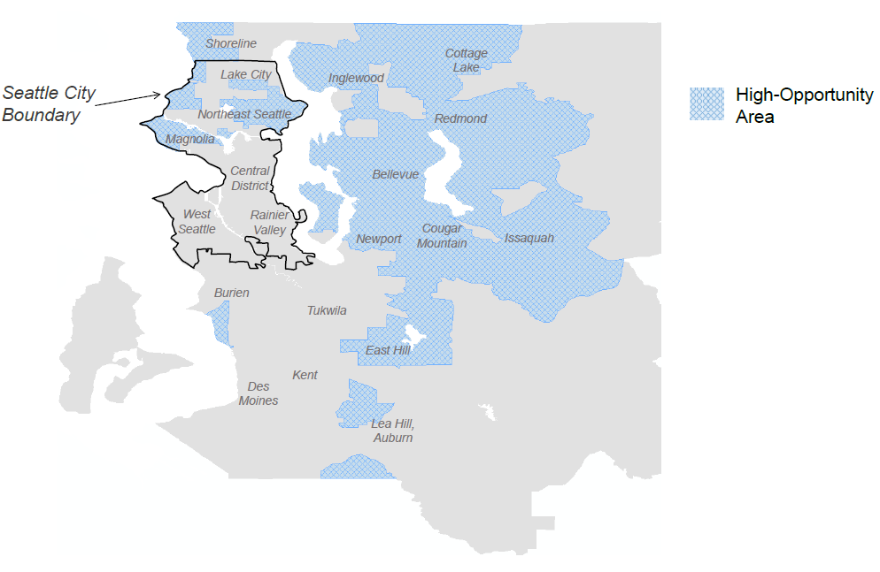

class: inverse, middle

```{r Setup, include = F}
options(htmltools.dir.version = FALSE)
library(pacman)
p_load(ggthemes, readxl, viridis, emoGG, knitr, dslabs, gapminder, extrafont, Ecdat, wooldridge, tidyverse, magrittr, janitor, kableExtra, gridExtra)
# Define colors
red_pink <- "#e64173"
met_slate <- "#272822" # metropolis font color 
purple <- "#9370DB"
green <- "#007935"
light_green <- "#7DBA97"
orange <- "#FD5F00"
turquoise <- "#44C1C4"
red <- "#b92e34"
# Notes directory
dir_slides <- "~/GitHub/Intro_Microeconomics_W20/Lectures/03-Consumer_Theory/"
# Knitr options
opts_chunk$set(
  comment = "#>",
  fig.align = "center",
  fig.height = 7,
  fig.width = 10.5,
  #dpi = 300,
  #cache = T,
  warning = F,
  message = F
)  
theme_simple <- theme_bw() + theme(
  axis.line = element_line(color = met_slate),
  panel.grid = element_blank(),
  rect = element_blank(),
  strip.text = element_blank(),
  text = element_text(family = "Fira Sans", color = met_slate, size = 17),
  # axis.text.x = element_text(size = 12),
  # axis.text.y = element_text(size = 12),
  axis.ticks = element_blank()
)
theme_market <- theme_bw() + theme(
  axis.line = element_line(color = met_slate),
  panel.grid = element_blank(),
  rect = element_blank(),
  strip.text = element_blank(),
  text = element_text(family = "Fira Sans", color = met_slate, size = 17),
  axis.title.x = element_text(hjust = 1, size = 17),
  axis.title.y = element_text(hjust = 1, angle = 0, size = 17),
  # axis.text.x = element_text(size = 12),
  # axis.text.y = element_text(size = 12),
  axis.ticks = element_blank()
)
theme_gif <- theme_bw() + theme(
  axis.line = element_line(color = met_slate),
  panel.grid = element_blank(),
  rect = element_blank(),
  text = element_text(family = "Fira Sans", color = met_slate, size = 17),
  axis.text.x = element_text(size = 12),
  axis.text.y = element_text(size = 12),
  axis.ticks = element_blank()
)
wrapper <- function(x, ...) paste(strwrap(x, ...), collapse = "\n")
```

# Prologue

---
class: clear-slide

.center[**The Fading *American Dream***]
```{R, echo = F, dev = "svg", fig.height = 6.75}
data <- read_csv("fading_american_dream.csv") %>% 
  mutate(cohort_mean = cohort_mean*100)

data %>% 
  ggplot(aes(x = cohort, y = cohort_mean)) +
  geom_point(size = 2, color = red_pink) +
  geom_line(size = 1, color = red_pink) +
  labs(x = "Child's Year of Birth", y = "% of Children Earning more than their Parents",
       caption = "Source: Chetty et al. (Science 2017)") +
  theme_simple
```

---
# Why is the *American Dream* Fading?

**Policy Question:** Why are children's chances of climbing the income ladder falling in America?

- What can we do to reverse this trend?

Difficult to answer with historical data on macroeconomic trends.

- Numerous coinciding changes over time make it difficult to test between alternative explanations.

- Only a handful of data points.

---
# Theoretical Social Science

Historically, the social sciences had limited data to study important policy questions.

**Result:** Social sciences were .pink[theoretical] fields.

- Economists developed .pink[mathematical models].
- Sociologists developed .pink[qualitative theories].
- Both used their theories to make policy recommendations (*e.g.,* to improve upward mobility).

--

**Problem:** Untested theories!

- Five economists often have five different answers to the same question.
- Leads to a politicization of questions that, in principle, have scientific answers (*e.g.,* would universal healthcare make Americans healthier?).

---
# The Rise of Empirical Evidence

Today, the social sciences are increasingly .pink[empirical] thanks to the growing availability of data.

- Ability to test and improve theories using real-world data.

- Analogous to the natural sciences.

---
class: clear-slide

.center[**Empirical Articles in Leading Economics Journals**]
```{R, echo = F, dev = "svg", fig.height = 6.75}
data <- tibble(
  percent = c(38.4, 60.3, 60.0, 72.1),
  year = c("1983", "1993", "2003", "2011")
)

data %>% 
  ggplot(aes(x = year, y = percent, label = percent)) +
  scale_y_continuous(breaks = seq(0, 80, 10)) +
  geom_col(size = 2, fill = red_pink) +
  geom_text(size = 5, position = position_stack(vjust = 0.5), color = "white", family = "Fira Sans") +
  labs(y = "Empirical Articles (% of total)", x = "",
       caption = "Source: Hamermesh (Journal of Economic Literature 2013)") +
  theme_simple
```

---
# What are Data?

.more-left[

```{r, echo=FALSE}
data(wage1)
wage1 <- select(wage1, wage, educ, female) %>%
  mutate(wage = round(wage, 2))
DT::datatable(
  wage1,
  caption = c("Sample of US workers (1976)"),
  colnames = c('<span style="color: #007935 !important">Wage</span>', '<span style="color: #007935 !important">Education</span>', '<span style="color: #007935 !important">Female?</span>'),
  fillContainer = FALSE, options = list(pageLength = 5, lengthChange = FALSE, searching = FALSE), escape = FALSE) %>%
  DT::formatStyle('wage', color = '#9370DB') %>%
  DT::formatStyle('educ', color = '#9370DB') %>%
  DT::formatStyle('female', color = '#9370DB') %>%
  DT::formatStyle(0, color = '#e64173')
```

]

.less-right[

.pink[Rows] represent .hi-pink[observations].

.green[Columns] represent .hi-green[variables].

Each .purple[value] is associated with an .pink[observation] and a .green[variable].

]

---
class: inverse, middle

# Making Comparisons

---
class: clear-slide

**Policy:** In 2017, the University of Oregon started requiring first-year students to live on campus.

**Rationale:** First-year students who live on campus fare better than those who live off campus.

- _80 percent more likely_ to graduate in four years.
- Second-year retention rate _5 percentage points higher_.
- GPAs _0.13 points higher_, on average. 

--

**Q:** .pink[Do these comparisons suggest that the policy will improve student outcomes?]

--

**Q:** .pink[Do they describe the effect of living on campus?]

**Q:** .pink[Do they describe *something else?*]

---
# Other Things Equal

The UO's interpretation of those comparisons warrants skepticism.

- The decision to live on campus is probably related to family wealth and interest in school.

- Family wealth and interest in school are also related to academic achievement.

--

__Why?__ The difference in outcomes between those on and off campus is not an *other things equal* comparison.

__Upshot:__ We can't attribute the difference in outcomes solely to living on campus.

---
# Other Things Equal

## A high bar

When all other factors are held constant, statistical comparisons detect causal relationships.

--

(Micro)economics has developed a comparative advantage in understanding where .hi-purple[other things equal] comparisons can and cannot be made.

- Anyone can retort "_correlation doesn't necessarily imply causation_."

- Understanding _why_ is difficult, but useful for learning from data.

---
# Causal Identification

## Goal 

Identify the effect of a .hi[treatment] on an .hi[outcome].

--

## Ideal comparison

Ideally, we could calculate the .hi[treatment effect] *for each individual* as

$$Y_{1,i} - Y_{0,i}$$

- $Y_{1,i}$ is the outcome for person $i$ when she receives the treatment.
- $Y_{0,i}$ is the outcome for person $i$ when she does not receive the treatment.
- Known as .pink[potential outcomes].

---
# Causal Identification

## Ideal data

.pull-left[
The *ideal* data for 10 people
```{R, ideal_data, echo = F}
set.seed(3)
ideal_df <- data.frame(
  i = 1:10,
  treat = rep(c(1, 0), each = 5),
  Y_1i = c(runif(10, 4, 10) %>% round(2)),
  Y_0i = c(runif(10, 0, 5) %>% round(2))
) %>% 
  mutate(Y_0i = case_when(treat == 1 ~ Y_0i + 2, TRUE ~ Y_0i),
         Y_1i = case_when(treat == 0 ~ Y_1i, TRUE ~ Y_1i))
ideal_df
```
]

--

.pull-right[
Calculate the causal effect of treatment.
$$
\begin{align}
  \tau_i = Y_{1,i} -  Y_{0,i}
\end{align}
$$
for each individual $i$.
]

---
count: false
# Causal Identification

## Ideal data

.pull-left[
The *ideal* data for 10 people
```{R, ideal_data_trt, echo = F}
ideal_df %>% mutate(effect_i = Y_1i - Y_0i)
```
]

.pull-right[
Calculate the causal effect of treatment.
$$
\begin{align}
  \tau_i = Y_{1,i} -  Y_{0,i}
\end{align}
$$
for each individual $i$.
]
---
count: false
# Causal Identification

## Ideal data

.pull-left[
The *ideal* data for 10 people
```{R, ideal_data_trt2, echo = F}
ideal_df %>% mutate(effect_i = Y_1i - Y_0i)
```
]

.pull-right[
Calculate the causal effect of treatment.
$$
\begin{align}
  \tau_i = Y_{1,i} -  Y_{0,i}
\end{align}
$$
for each individual $i$.

The mean of $\tau_i$ is the<br>.hi[average treatment effect].

Thus, $\color{#e64173}{\overline{\tau}}$ .mono[=] `r transmute(ideal_df, effect_i = Y_1i - Y_0i) %>% unlist %>% mean %>% round(2)`
]

---
# Causal Identification

## Ideal comparison
$$
\begin{align}
  \tau_i = \color{#e64173}{Y_{1,i}} &- \color{#9370DB}{Y_{0,i}}
\end{align}
$$

Highlights a fundamental problem.

--

## The problem

- If we observe $\color{#e64173}{Y_{1,i}}$, then we cannot observe $\color{#9370DB}{Y_{0,i}}$.

- If we observe $\color{#9370DB}{Y_{0,i}}$, then we cannot observe $\color{#e64173}{Y_{1,i}}$.

- Can only observe what actually happened; cannot observe the **counterfactual**.

---
# Causal Identification

A dataset that we can observe for 10 people looks something like
.pull-left[
```{R, ideal_data_obs, echo = F}
obs_df <- ideal_df
obs_df$Y_0i[1:5] <- NA
obs_df$Y_1i[6:10] <- NA
obs_df
```
]

--

.pull-right[
We can't observe $\color{#e64173}{Y_{1,i}}$ and $\color{#9370DB}{Y_{0,i}}$ at the same time.

But, we do observe
- $\color{#e64173}{Y_{1,i}}$ for the first 5 observations.
- $\color{#9370DB}{Y_{0,i}}$ for the last 5 observations.

]

---
# Making Comparisons

**Q:** How can we estimate the average treatment effect using the available data?

--

**Idea:** What if we compare the outcome means of each group?

- Take the average of $\color{#e64173}{Y_{1,i}}$ for people who actually received the treatment (.pink[treatment group mean]).

- Take the average of $\color{#9370DB}{Y_{0,i}}$ for people who didn't receive the treatment (.purple[control group mean]).

--

**Q:** Does .pink[treatment group mean] .mono[-] .purple[control group mean] isolate the causal effect of the treatment?

---
# Making Comparisons

.pull-left[
```{R, ideal_data_obs_2, echo = F}
obs_df <- ideal_df
obs_df$Y_0i[1:5] <- NA
obs_df$Y_1i[6:10] <- NA
obs_df
```
]

.pull-right[
.pink[Treatment group mean] .mono[=] `r round(mean(obs_df$Y_1i[1:5]), 2)`

.purple[Control group mean] .mono[=] `r round(mean(obs_df$Y_0i[6:10]), 2)`

Difference-in-means .mono[=] `r round(mean(obs_df$Y_1i[1:5]) - mean(obs_df$Y_0i[6:10]), 2)`
]

--

Difference-in-means .mono[=] .hi-green[average treatment effect] .mono[+] .hi-orange[selection bias]
--
<br> $\quad$ .mono[=] .green[`r transmute(ideal_df, effect_i = Y_1i - Y_0i) %>% unlist %>% mean %>% round(2)`] .mono[+] .orange[(`r round(mean(obs_df$Y_1i[1:5]) - mean(obs_df$Y_0i[6:10]), 2)` .mono[-] `r transmute(ideal_df, effect_i = Y_1i - Y_0i) %>% unlist %>% mean %>% round(2)`)]
--
 .mono[=] .green[`r transmute(ideal_df, effect_i = Y_1i - Y_0i) %>% unlist %>% mean %>% round(2)`] .mono[+] .orange[`r round(mean(obs_df$Y_1i[1:5]) - mean(obs_df$Y_0i[6:10]), 2) - transmute(ideal_df, effect_i = Y_1i - Y_0i) %>% unlist %>% mean %>% round(2)`]

--

.orange[Selection bias] .mono[!=] 0 .mono[==>] people who select into treatment are different than those who do not.

---
class: clear-slide

**Podcast Question:** According to Emily Oster, 

> **A.** Any amount of alcohol consumption during pregnancy can harm a fetus.

> **B.** Large amounts of alcohol consumption during pregnancy do not necessarily harm a fetus.

> **C.** Small amounts of alcohol consumption during pregnancy do not necessarily harm a fetus.

---
count: false
class: clear-slide

**Podcast Question:** According to Emily Oster, 

> **A.** Any amount of alcohol consumption during pregnancy can harm a fetus.

> **B.** Large amounts of alcohol consumption during pregnancy do not necessarily harm a fetus.

> .pink[**C.** Small amounts of alcohol consumption during pregnancy do not necessarily harm a fetus.]

---
class: inverse, middle

# Randomized Control Trials 

---
# Overcoming Selection Bias

**Problem:** Existence of selection bias precludes *other things equal* comparisons.

- To make valid comparisons that yield causal effects, we need to shut down the bias term.

--

**Solution:** Conduct an experiment.

- How? Assign treatment at .pink[random].

- Hence the name, .pink[*randomized* control trial] (RCT).
---
# Randomized Control Trials 

## Example: Effect of de-worming on attendance

**Motivation:** Intestinal worms are common among children in less-developed countries. The symptoms of these parasites can keep school-aged children at home, disrupting human capital accumulation.

**Policy Question:** Do school-based de-worming interventions provide a cost-effective way to increase school attendance? 

---
# Randomized Control Trials 

## Example: Effect of de-worming on attendance

**Research Question:** How much do de-worming interventions increase school attendance?

**Q:** Could we simply compare average attendance among children with and without access to de-worming medication?
--
<br>**A:** If we're after the causal effect, probably not.
--
<br><br>**Q:** Why not?
--
<br>**A:** Selection bias: Families with access to de-worming medication probably have healthier children for other reasons, too (wealth, access to clean drinking water, *etc.*).<br>.pink[Can't make an *all else equal* comparison. Biased and/or spurious results.]

---
# Randomized Control Trials 

## Example: Effect of de-worming on attendance

**Solution:** Run an experiment.

--

Imagine an RCT where we have two groups:

- .hi-slate[Treatment:] Villages that where children get de-worming medication in school.
- .hi-slate[Control:] Villages that where children don't get de-worming medication in school (status quo).

--

By randomizing villages into .hi-slate[treatment] or .hi-slate[control], we will, on average, include all kinds of villages (poor _vs._ less poor, access to clean water _vs._ contaminated water, hospital _vs._ no hospital, *etc.*) in both groups.

--

*All else equal*!

---
class: clear-slide

.hi-slate[54 villages] 
<br>
<br>
```{R, plot1, echo = F, dev = "svg", fig.height = 6.5}
xd <- 9
yd <- 6
set.seed(123)
med_df <- expand.grid(x = 1:xd, y = 1:yd) %>%
  mutate(
    q = x + y + 1.25 * rnorm(xd*yd),
    trt = sample(x = c(T, F), size = xd*yd, replace = T, prob = c(0.51, 0.49)),
  ) %>%
  arrange(-y, x) %>%
  mutate(id = 1:(xd*yd) %>% str_pad(2, "left", "0")) %>%
  arrange(y, x)
ggplot(data = med_df, aes(x, y)) +
geom_tile(color = "grey40", fill = "grey93", size = 0.2) +
geom_text(aes(label = id), color = "grey45", size = 5, family = "Roboto Mono") +
theme_void() +
coord_equal()
```
---
class: clear-slide
count: false

.hi-slate[54 villages] .hi[of varying levels of development]
<br>
<br>
```{R, plot2, echo = F, dev = "svg", fig.height = 6.5}
ggplot(data = med_df,
  aes(x, y)
) +
geom_tile(aes(fill = q), color = "white", size = 0.2) +
scale_fill_viridis(option = "magma", direction = -1) +
theme_void() +
theme(legend.position = "none") +
coord_equal()
```
---
class: clear-slide
count: false

.hi-slate[54 villages] .hi[of varying levels of development] .mono[+] .hi-orange[randomly assigned treatment]
```{R, plot3_1, echo = F, dev = "svg", fig.height = 6.5}
set.seed(246)
ggplot(data = med_df,
  aes(x, y)
) +
geom_tile(aes(fill = q), color = "white", size = 0.2) +
geom_emoji(data = sample_n(med_df, 1), emoji = "1f48a") +
scale_fill_viridis(option = "magma", direction = -1) +
theme_void() +
theme(legend.position = "none") +
coord_equal()
```
---
class: clear-slide
count: false

.hi-slate[54 villages] .hi[of varying levels of development] .mono[+] .hi-orange[randomly assigned treatment]
```{R, plot3_2, echo = F, dev = "svg", fig.height = 6.5}
set.seed(246)
ggplot(data = med_df,
  aes(x, y)
) +
geom_tile(aes(fill = q), color = "white", size = 0.2) +
geom_emoji(data = sample_n(med_df, 2), emoji = "1f48a") +
scale_fill_viridis(option = "magma", direction = -1) +
theme_void() +
theme(legend.position = "none") +
coord_equal()
```
---
class: clear-slide
count: false

.hi-slate[54 villages] .hi[of varying levels of development] .mono[+] .hi-orange[randomly assigned treatment]
```{R, plot3_3, echo = F, dev = "svg", fig.height = 6.5}
set.seed(246)
ggplot(data = med_df,
  aes(x, y)
) +
geom_tile(aes(fill = q), color = "white", size = 0.2) +
geom_emoji(data = sample_n(med_df, 3), emoji = "1f48a") +
scale_fill_viridis(option = "magma", direction = -1) +
theme_void() +
theme(legend.position = "none") +
coord_equal()
```
---
class: clear-slide
count: false

.hi-slate[54 villages] .hi[of varying levels of development] .mono[+] .hi-orange[randomly assigned treatment]
```{R, plot3_4, echo = F, dev = "svg", fig.height = 6.5}
set.seed(246)
ggplot(data = med_df,
  aes(x, y)
) +
geom_tile(aes(fill = q), color = "white", size = 0.2) +
geom_emoji(data = sample_n(med_df, 4), emoji = "1f48a") +
scale_fill_viridis(option = "magma", direction = -1) +
theme_void() +
theme(legend.position = "none") +
coord_equal()
```
---
class: clear-slide
count: false

.hi-slate[54 villages] .hi[of varying levels of development] .mono[+] .hi-orange[randomly assigned treatment]
```{R, plot3_5, echo = F, dev = "svg", fig.height = 6.5}
set.seed(246)
ggplot(data = med_df,
  aes(x, y)
) +
geom_tile(aes(fill = q), color = "white", size = 0.2) +
geom_emoji(data = sample_n(med_df, 5), emoji = "1f48a") +
scale_fill_viridis(option = "magma", direction = -1) +
theme_void() +
theme(legend.position = "none") +
coord_equal()
```
---
class: clear-slide
count: false

.hi-slate[54 villages] .hi[of varying levels of development] .mono[+] .hi-orange[randomly assigned treatment]
```{R, plot3_6, echo = F, dev = "svg", fig.height = 6.5}
set.seed(246)
ggplot(data = med_df,
  aes(x, y)
) +
geom_tile(aes(fill = q), color = "white", size = 0.2) +
geom_emoji(data = sample_n(med_df, 6), emoji = "1f48a") +
scale_fill_viridis(option = "magma", direction = -1) +
theme_void() +
theme(legend.position = "none") +
coord_equal()
```
---
class: clear-slide
count: false

.hi-slate[54 villages] .hi[of varying levels of development] .mono[+] .hi-orange[randomly assigned treatment]
```{R, plot3_7, echo = F, dev = "svg", fig.height = 6.5}
set.seed(246)
ggplot(data = med_df,
  aes(x, y)
) +
geom_tile(aes(fill = q), color = "white", size = 0.2) +
# geom_text(aes(label = trt)) +
geom_emoji(data = sample_n(med_df, 7), emoji = "1f48a") +
scale_fill_viridis(option = "magma", direction = -1) +
theme_void() +
theme(legend.position = "none") +
coord_equal()
```
---
class: clear-slide
count: false

.hi-slate[54 villages] .hi[of varying levels of development] .mono[+] .hi-orange[randomly assigned treatment]
```{R, plot3_8, echo = F, dev = "svg", fig.height = 6.5}
set.seed(246)
ggplot(data = med_df,
  aes(x, y)
) +
geom_tile(aes(fill = q), color = "white", size = 0.2) +
# geom_text(aes(label = trt)) +
geom_emoji(data = sample_n(med_df, 8), emoji = "1f48a") +
scale_fill_viridis(option = "magma", direction = -1) +
theme_void() +
theme(legend.position = "none") +
coord_equal()
```
---
class: clear-slide
count: false

.hi-slate[54 villages] .hi[of varying levels of development] .mono[+] .hi-orange[randomly assigned treatment]
```{R, plot3_9, echo = F, dev = "svg", fig.height = 6.5}
set.seed(246)
ggplot(data = med_df,
  aes(x, y)
) +
geom_tile(aes(fill = q), color = "white", size = 0.2) +
# geom_text(aes(label = trt)) +
geom_emoji(data = sample_n(med_df, 9), emoji = "1f48a") +
scale_fill_viridis(option = "magma", direction = -1) +
theme_void() +
theme(legend.position = "none") +
coord_equal()
```
---
class: clear-slide
count: false

.hi-slate[54 villages] .hi[of varying levels of development] .mono[+] .hi-orange[randomly assigned treatment]
```{R, plot3_10, echo = F, dev = "svg", fig.height = 6.5}
set.seed(246)
ggplot(data = med_df,
  aes(x, y)
) +
geom_tile(aes(fill = q), color = "white", size = 0.2) +
# geom_text(aes(label = trt)) +
geom_emoji(data = sample_n(med_df, round(xd * yd / 2, 0)), emoji = "1f48a") +
scale_fill_viridis(option = "magma", direction = -1) +
theme_void() +
theme(legend.position = "none") +
coord_equal()
```
---
class: clear-slide
count: false

.hi-slate[54 villages] .hi[of varying levels of development] .mono[+] .hi-orange[randomly assigned treatment]
```{R, plot3_11, echo = F, dev = "svg", fig.height = 6.5}
set.seed(248)
ggplot(data = med_df,
  aes(x, y)
) +
geom_tile(aes(fill = q), color = "white", size = 0.2) +
# geom_text(aes(label = trt)) +
geom_emoji(data = sample_n(med_df, round(xd * yd / 2, 0)), emoji = "1f48a") +
scale_fill_viridis(option = "magma", direction = -1) +
theme_void() +
theme(legend.position = "none") +
coord_equal()
```
---
class: clear-slide
count: false

.hi-slate[54 villages] .hi[of varying levels of development] .mono[+] .hi-orange[randomly assigned treatment]
```{R, plot3_12, echo = F, dev = "svg", fig.height = 6.5}
set.seed(250)
ggplot(data = med_df,
  aes(x, y)
) +
geom_tile(aes(fill = q), color = "white", size = 0.2) +
# geom_text(aes(label = trt)) +
geom_emoji(data = sample_n(med_df, round(xd * yd / 2, 0)), emoji = "1f48a") +
scale_fill_viridis(option = "magma", direction = -1) +
theme_void() +
theme(legend.position = "none") +
coord_equal()
```

---
# Randomized Control Trials 

## Example: Effect of de-worming on attendance

We can estimate the .hi[causal effect] of de-worming on school attendance by .purple[comparing] the average attendance rates in the treatment group (💊) with those in the control group (no 💊):

.center[.purple[Treatment group attendance rate .mono[-] Control group attendance rate]]


--

**Result:** [Attendance increases](https://www.povertyactionlab.org/case-study/deworming-schools-improves-attendance-and-benefits-communities-over-long-term) &#8230; by a lot.

--

- 25 percent decrease in absenteeism at a cost of $0.60 per child.
- Long term cost effectiveness: additional 11.91 years of schooling per $100 spent on de-worming in Kenya.

---
# Randomized Control Trials 

## Example: Effect of de-worming on attendance

We can estimate the .hi[causal effect] of de-worming on school attendance by .purple[comparing] the average attendance rates in the treatment group (💊) with those in the control group (no 💊):

.center[.purple[Treatment group attendance rate .mono[-] Control group attendance rate]]

**Q:** Should we trust the results of the comparison? Why?

--

**A:** We probably should. On average, randomly assigning treatment balances the treatment and control groups across other dimensions that affect school attendance.

---
class: clear-slide

.hi[Randomization can go wrong!]
<br>
<br>
```{R, fertilizer_plot3_bad, echo = F, dev = "svg", fig.height = 6.5}
ggplot(data = med_df,
  aes(x, y)
) +
geom_tile(aes(fill = q), color = "white", size = 0.2) +
# geom_text(aes(label = trt)) +
geom_emoji(data = filter(med_df, x < xd/3 | y <= yd/3 | (x == xd & y == yd)), emoji = "1f48a") +
scale_fill_viridis(option = "magma", direction = -1) +
theme_void() +
theme(legend.position = "none") +
coord_equal()
```

---
# Interpreting Results

## .pink[Internal Validity]

Addresses the question, .pink[*should we believe the study?*]

A study has high .pink[internal validity] if we are confident that one variable has a .pink[causal] influence on another variable within the context of the study (*e.g.,* .pink[no selection bias]).

--

## .purple[External Validity]

Addresses the question, .purple[*how far can we generalize the results of the study?*]

A study has high .purple[external validity] to the extent that the results .purple[apply to other contexts] (not just the local environment that generated the results).

--

- Requires internal validity!

---
class: inverse, middle

# Creating Moves to Opportunity

---
# Creating Moves to Opportunity

## Background

**Policy Question:** How can we lift people out of poverty? 

**Research Agenda:** What kinds of social assistance programs have lasting effects on upward mobility?

Economists study a variety of state and federal social assistance programs.

- .purple[Medicaid], .purple[SNAP] (food stamps), .purple[TANF] (cash welfare), .purple[WIC] (benefits for mothers and infants), .purple[National School Lunch Program], .purple[public housing], .pink[Section 8] (housing vouchers), *etc.*

- Considerable variation in benefits and incentive structures.

--

- Today: .pink[Section 8].

---
# Creating Moves to Opportunity

## Background

Neighborhoods matter a great deal for later-in-life outcomes.

Previous research shows that children who move to better neighborhoods are

1. More likely to go college.
2. More likely to earn higher incomes as adults.
3. Less likely to go prison.

--

**Problem:** Low-income families tend to live in neighborhoods with limited upward income mobility.

- Those who receive Section 8 vouchers usually don't move to better neighborhoods.

---
# Creating Moves to Opportunity

## Experiment

**Research Question:** Why do voucher holders stay in low-opportunity neighborhoods? Do they prefer those neighborhoods or do they face barriers to moving?

--

**Social Experiment:** [Creating Moves to Opportunity (CMTO)](https://opportunityinsights.org/paper/cmto/)

274 low-income families in King County, WA randomly assigned to one of two groups:

- .hi-purple[Control group:] Housing voucher for any neighborhood in King County.

- .hi-pink[Treatment group:] Housing voucher for any neighborhood in King County .mono[+] counseling .mono[+] landlord engagement .mono[+] one-time moving cost assistance.

---
class: clear-slide

High-opportunity areas are neighborhoods with

1. High upward social mobility (*i.e.,* children of low-income parents move up in the income distribution as adults).
2. Relatively low rent.

.center[**King County, WA**]
```{r, fig.retina = 2.25, echo = FALSE}

```

---
class: clear-slide

.center[**Creating Moves to Opportunity: Experimental Results**]
```{R, echo = F, escape = F}
tab <- data.frame(
  v1 = c("All Families", "Black Non-Hispanic", "White Non-Hispanic", "Started in High Opportunity Tract", "Didn't Start in High Opportunity Tract", "No College", "Some College or More"),
  v2 = c(14.3, 12.3, 10.3, 22.2, 12.5, 9.1, 22.6),
  v3 = c(54.3, 46.2, 65.9, 85.3, 49.9, 56.9, 52.6),
  v4 = c(40.0, 33.9, 55.6, 63.1, 37.4, 47.8, 30.0),
  v5 = c(5.2, 7.3, 10.2, 15.9, 6.0, 7.0, 8.1),
  v6 = c(274, 134, 64, 21, 193, 139, 132)
) %>% kable(
  escape = F,
  col.names = c("Subgroup", "Control Mean", "Treatment Mean", "Treatment Effect", "Standard Error", "N"),
  align = c("l", rep("c", 5)),
  caption = "Outcome: Share Moving to Opportunity Area (%)"
) %>%
row_spec(1:7, color = met_slate) %>%
row_spec(1:7, extra_css = "line-height: 110%;") %>%
column_spec(1, color = "black", italic = T)
tab
```