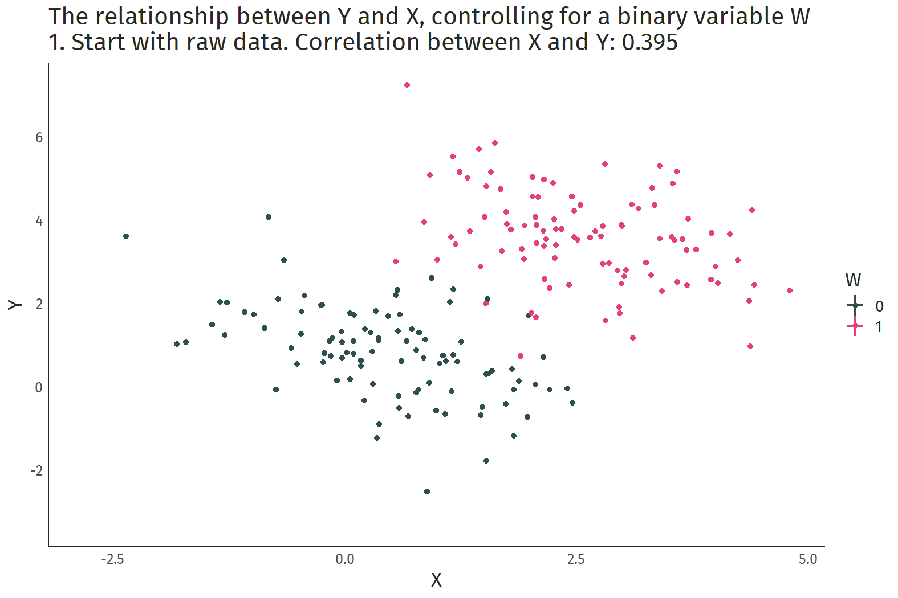

class: inverse, middle

```{r Setup, include = F}
options(htmltools.dir.version = FALSE)
library(pacman)
p_load(ggthemes, readxl, viridis, emoGG, gganimate, knitr, dslabs, gapminder, extrafont, Ecdat, wooldridge, tidyverse, magrittr, janitor, kableExtra, gridExtra, ggforce)
# Define colors
red_pink <- "#e64173"
met_slate <- "#272822" # metropolis font color 
purple <- "#9370DB"
green <- "#007935"
light_green <- "#7DBA97"
orange <- "#FD5F00"
turquoise <- "#44C1C4"
red <- "#b92e34"
# Notes directory
dir_slides <- "~/GitHub/Intro_Microeconomics_W20/Lectures/10-Data_Learning/"
# Knitr options
opts_chunk$set(
  comment = "#>",
  fig.align = "center",
  fig.height = 7,
  fig.width = 10.5,
  #dpi = 300,
  #cache = T,
  warning = F,
  message = F
)  
theme_simple <- theme_bw() + theme(
  axis.line = element_line(color = met_slate),
  panel.grid = element_blank(),
  rect = element_blank(),
  strip.text = element_blank(),
  text = element_text(family = "Fira Sans", color = met_slate, size = 17),
  # axis.text.x = element_text(size = 12),
  # axis.text.y = element_text(size = 12),
  axis.ticks = element_blank()
)
theme_market <- theme_bw() + theme(
  axis.line = element_line(color = met_slate),
  panel.grid = element_blank(),
  rect = element_blank(),
  strip.text = element_blank(),
  text = element_text(family = "Fira Sans", color = met_slate, size = 17),
  axis.title.x = element_text(hjust = 1, size = 17),
  axis.title.y = element_text(hjust = 1, angle = 0, size = 17),
  # axis.text.x = element_text(size = 12),
  # axis.text.y = element_text(size = 12),
  axis.ticks = element_blank()
)
theme_gif <- theme_bw() + theme(
  axis.line = element_line(color = met_slate),
  panel.grid = element_blank(),
  rect = element_blank(),
  text = element_text(family = "Fira Sans", color = met_slate, size = 17),
  axis.text.x = element_text(size = 12),
  axis.text.y = element_text(size = 12),
  axis.ticks = element_blank()
)
wrapper <- function(x, ...) paste(strwrap(x, ...), collapse = "\n")
# police data
data <- get(data(campus)) %>% 
  mutate(crime = round(crime/enroll*1000, 2),
         police = round(police/enroll*1000, 2)) %>% 
  filter(police < 10) %>% # remove outlier
  select(crime, police)
lm0 <- lm(crime ~ police, data = data)
wage2 <- get('wage2')
lm_wage <- lm(wage ~ educ, wage2)
```

# Prologue

---
# Learning from Data

## Last Time

1. Why bother learning from data?

    - Figure out whether policies work or don't work.
    
    - Test theories.

2. Why does correlation .mono[!=] causation?

    - Selection bias!

3. When can correlation .mono[==>] causation?

    - Randomized contrial trials (experiments).

---
# Learning from Data

## Today

1. Regression analysis.

    - The workhorse of data science.
    
2. Natural experiments.

    - Sometimes we get lucky.

---
class: inverse, middle

# Regression

---
# Correlation

## Correlation coefficient

.pull-left[

> A measure of the strength of a relationship between two variables, denoted by $\rho$.

-1 .mono[<=] $\rho$ .mono[<] 0 .mono[==>] .pink[negative correlation].

$\rho$ .mono[=] 0 .mono[==>] .green[no correlation] (unrelated).

0 .mono[<] $\rho$ .mono[<=] 1 .mono[==>] .purple[positive correlation].

]

.pull-right[

```{R, include = F}
df <- tibble(x = rnorm(100, 5, 5),
             y = 1 - 3*x + rnorm(100, 2, 20))
corr <- cor(df$x, df$y)
```

.center[Correlation coefficient .mono[=] `r round(corr, 2)`]

```{R, echo = F, dev = "svg", fig.height = 4.5, fig.width = 4.5}
ggplot() +
  geom_point(data = df, aes(x, y), color = red_pink, size = 2) +
  scale_x_continuous(breaks = NULL) +
  scale_y_continuous(breaks = NULL) +
  theme_simple +
  xlab(expression(X)) + 
  ylab(expression(Y))
```

]

---
count: false
# Correlation

## Correlation coefficient

.pull-left[

> A measure of the strength of a relationship between two variables, denoted by $\rho$.

-1 .mono[<=] $\rho$ .mono[<] 0 .mono[==>] .pink[negative correlation].

$\rho$ .mono[=] 0 .mono[==>] .green[no correlation] (unrelated).

0 .mono[<] $\rho$ .mono[<=] 1 .mono[==>] .purple[positive correlation].

]

.pull-right[

```{R, include = F}
df <- tibble(x = rnorm(100, 5, 5),
             y = 1 - 3*x)
corr <- cor(df$x, df$y)
```

.center[Correlation coefficient .mono[=] `r round(corr, 2)`]

```{R, echo = F, dev = "svg", fig.height = 4.5, fig.width = 4.5}
ggplot() +
  geom_point(data = df, aes(x, y), color = red_pink, size = 2) +
  scale_x_continuous(breaks = NULL) +
  scale_y_continuous(breaks = NULL) +
  theme_simple +
  xlab(expression(X)) + 
  ylab(expression(Y))
```

]

---
count: false
# Correlation

## Correlation coefficient

.pull-left[

> A measure of the strength of a relationship between two variables, denoted by $\rho$.

-1 .mono[<=] $\rho$ .mono[<] 0 .mono[==>] .pink[negative correlation].

$\rho$ .mono[=] 0 .mono[==>] .green[no correlation] (unrelated).

0 .mono[<] $\rho$ .mono[<=] 1 .mono[==>] .purple[positive correlation].

]

.pull-right[

```{R, include = F}
df <- tibble(x = rnorm(100, 5, 5),
             y = rnorm(100, 2, 100))
corr <- cor(df$x, df$y)
```

.center[Correlation coefficient .mono[=] `r round(corr, 2)`]

```{R, echo = F, dev = "svg", fig.height = 4.5, fig.width = 4.5}
ggplot() +
  geom_point(data = df, aes(x, y), color = green, size = 2) +
  scale_x_continuous(breaks = NULL) +
  scale_y_continuous(breaks = NULL) +
  theme_simple +
  xlab(expression(X)) + 
  ylab(expression(Y))
```

]

---
count: false
# Correlation

## Correlation coefficient

.pull-left[

> A measure of the strength of a relationship between two variables, denoted by $\rho$.

-1 .mono[<=] $\rho$ .mono[<] 0 .mono[==>] .pink[negative correlation].

$\rho$ .mono[=] 0 .mono[==>] .green[no correlation] (unrelated).

0 .mono[<] $\rho$ .mono[<=] 1 .mono[==>] .purple[positive correlation].

]

.pull-right[

```{R, include = F}
df <- tibble(x = rnorm(100, 5, 5),
             y = 1 + 3*x + rnorm(100, 2, 20))
corr <- cor(df$x, df$y)
```

.center[Correlation coefficient .mono[=] `r round(corr, 2)`]

```{R, echo = F, dev = "svg", fig.height = 4.5, fig.width = 4.5}
ggplot() +
  geom_point(data = df, aes(x, y), color = purple, size = 2) +
  scale_x_continuous(breaks = NULL) +
  scale_y_continuous(breaks = NULL) +
  theme_simple +
  xlab(expression(X)) + 
  ylab(expression(Y))
```

]

---
# Regression

**Goal:** Identify the effect of a treatment variable $X$ on an outcome variable $Y$ while .hi[controlling] .pink[for potential confounders].

Economists often rely on regression analysis for statistical comparisons.

- Regression analysis facilitates *other things equal* comparisons by explicitly controlling for certain variables.

- Failure to control for confounding variables leads to .hi[omitted-variable bias], a close cousin of selection bias.

---
# Simple Linear Regression

```{R, include = F}
lm1 <- lm(y ~ x, df)
# Define a function
y_hat <- function(x, b0, b1) {b0 + b1 * x}
# Define line's parameters
b0 <- lm1$coefficients[1]
b1 <- lm1$coefficients[2]
```

.more-left[
.center[.purple[Y.sub[*i*] .mono[=] `r round(b0, 2)` .mono[+] `r round(b1, 2)` X.sub[*i*]]]
```{r, echo=FALSE, dev = "svg", fig.height = 4.75, fig.width = 5}
df %>% 
  ggplot() +
  geom_point(aes(x = x, y = y), color = met_slate, size = 2, alpha = 0.8) +
  geom_abline(intercept = b0, slope = b1, color = purple, size = 1) +
  theme_simple + xlab("X") + ylab("Y")
```
]

.less-right[

## Model

$Y_i = \beta_1 + \beta_2 X_i + e_i$

- $\beta_1$ .mono[=] intercept

- $\beta_2$ .mono[=] slope 

- $e_i$ .mono[=] error term

]

---
# Simple Linear Regression

```{R, include = F}
# Define a function
y_hat <- function(x, b0, b1) {b0 + b1 * x}
# Define line's parameters
b0 <- lm0$coefficients[1]
b1 <- lm0$coefficients[2]
```

.more-left[
.center[.purple[Crime.sub[*i*] .mono[=] `r round(b0, 2)` .mono[+] `r round(b1, 2)` Police.sub[*i*]]]
```{r, echo=FALSE, dev = "svg", fig.height = 4.75, fig.width = 5}
data %>% 
  ggplot() +
  geom_point(aes(x = police, y = crime), color = met_slate, size = 2, alpha = 0.8) +
  geom_abline(intercept = b0, slope = b1, color = purple, size = 1) +
  theme_simple + xlab("Police per 1000 students") + ylab("Crimes per 1000 students")
```
]

--

.less-right[

**Q:** Do `r emo::ji("policeman")` *cause* crime!?

]

---
count: false
# Simple Linear Regression

```{R, include = F}
# Define a function
y_hat <- function(x, b0, b1) {b0 + b1 * x}
# Define line's parameters
b0 <- lm0$coefficients[1]
b1 <- lm0$coefficients[2]
```

.more-left[
.center[.purple[Crime.sub[*i*] .mono[=] `r round(b0, 2)` .mono[+] `r round(b1, 2)` Police.sub[*i*]]]
```{r, echo=FALSE, dev = "svg", fig.height = 4.75, fig.width = 5}
data %>% 
  ggplot() +
  geom_point(aes(x = police, y = crime), color = met_slate, size = 2, alpha = 0.8) +
  geom_abline(intercept = b0, slope = b1, color = purple, size = 1) +
  theme_simple + xlab("Police per 1000 students") + ylab("Crimes per 1000 students")
```
]

.less-right[

**Q:** Do `r emo::ji("policeman")` *cause* crime!?

**A:** .pink[Probably not]
<br> .pink[.mono[-->] Colleges experiencing high crime rates probably respond by hiring more police.]

]

---
# Causality

## Example: Returns to Education 

The optimal investment in education by students, parents, and legislators depends in part on the monetary *return to education*.

--

.hi-purple[Thought experiment:]
- Randomly select an individual.
- Give her an additional year of education.
- How much do her earnings increase?

The change in her earnings describes the .hi-slate[causal effect] of education on earnings.


---
# Causality

## Example: Returns to Education 

```{R, include = F}
# Define a function
y_hat <- function(x, b0, b1) {b0 + b1 * x}
# Define line's parameters
b0 <- lm_wage$coefficients[1]
b1 <- lm_wage$coefficients[2]
```

.more-left[
.center[.purple[Earnings.sub[*i*] .mono[=] `r round(b0, 2)` .mono[+] `r round(b1, 2)` Schooling.sub[*i*]]]
```{r, echo=FALSE, dev = "svg", fig.height = 4.5, fig.width = 5}
wage2 %>% 
  ggplot() +
  scale_y_continuous(labels = scales::comma) +
  geom_point(aes(x = educ, y = wage), color = met_slate, size = 2, alpha = 0.8) +
  geom_abline(intercept = b0, slope = b1, color = purple, size = 1) +
  theme_simple + xlab("Years of Education") + ylab("Weekly Earnings ($)")
```
]

.less-right[

**Q:** Does the slope isolate the causal effect of an additional year of education on weekly earnings?

]

---
count: false
# Causality

## Example: Returns to Education 

```{R, include = F}
# Define a function
y_hat <- function(x, b0, b1) {b0 + b1 * x}
# Define line's parameters
b0 <- lm_wage$coefficients[1]
b1 <- lm_wage$coefficients[2]
```

.more-left[
.center[.purple[Earnings.sub[*i*] .mono[=] `r round(b0, 2)` .mono[+] `r round(b1, 2)` Schooling.sub[*i*]]]
```{r, echo=FALSE, dev = "svg", fig.height = 4.5, fig.width = 5}
wage2 %>% 
  ggplot() +
  scale_y_continuous(labels = scales::comma) +
  geom_point(aes(x = educ, y = wage), color = met_slate, size = 2, alpha = 0.8) +
  geom_abline(intercept = b0, slope = b1, color = purple, size = 1) +
  theme_simple + xlab("Years of Education") + ylab("Weekly Earnings ($)")
```
]

.less-right[

**Q:** Does the slope isolate the causal effect of an additional year of education on weekly earnings?

**A:** .pink[Probably not] 
<br> .pink[.mono[-->] There could be other variables that influence earnings and schooling.]
]

---
# Omitted Variables

.more-left[
```{R, venn2, dev = "svg", echo = F, fig.height = 5, fig.width = 5}
# Colors (order: x1, x2, x3, y)
venn_colors <- c(orange, green, red_pink)
# Locations of circles
venn_df <- tibble(
  x  = c( 0.0,   -0.5, -1.0),
  y  = c( 0.0,   -2.5, 2.0),
  r  = c( 1.9,    1.5, 1.3),
  l  = c( "Y", "X", "W"),
  xl = c( 0.0,   -0.5, -1.0),
  yl = c( 0.0,   -2.5, 2.2)
)
# Line types (order: x1, x2, x3, y)
venn_lines <- c("dotted", "solid", "solid")
# Venn
ggplot(data = venn_df, aes(x0 = x, y0 = y, r = r, fill = l, color = l)) +
geom_circle(aes(linetype = l), alpha = 0.3, size = 0.75) +
theme_void() +
theme(legend.position = "none") +
scale_fill_manual(values = venn_colors) +
scale_color_manual(values = venn_colors) +
scale_linetype_manual(values = venn_lines) +
geom_text(aes(x = xl, y = yl, label = l), size = 9, family = "Fira Sans", parse = T) +
annotate(
  x = 1, y = 3,
  geom = "text", label = "No Bias", color = met_slate, size = 9, family = "Fira Sans", hjust = 0
) +
xlim(-3, 3) +
ylim(-4, 3.4) +
coord_equal()
```
]

.less-right[

.pink[**Y**] .mono[=] Outcome

.green[**X**] .mono[=] Treatment

.orange[**W**] .mono[=] Omitted variable

If .orange[**W**] is correlated with both .green[**X**] and .pink[**Y**] .mono[-->] omitted variable bias .mono[-->] regression fails to isolate the causal effect of .green[**X**] on .pink[**Y**].

]

---
count: false
# Omitted Variables

.more-left[
```{R, echo = F, dev = "svg", fig.height = 5, fig.width = 5}
# Colors (order: x1, x2, x3, y)
venn_lines <- c("dotted", "solid", "solid")
# Locations of circles
venn_df <- tibble(
  x  = c( 0.0,   -0.5, 1.5),
  y  = c( 0.0,   -2.5, -1.8),
  r  = c( 1.9,    1.5, 1.5),
  l  = c( "Y", "X", "W"),
  xl = c( 0.0,   -0.5, 1.6),
  yl = c( 0.0,   -2.5, -1.9)
)
# Venn
ggplot(data = venn_df, aes(x0 = x, y0 = y, r = r, fill = l, color = l)) +
geom_circle(aes(linetype = l), alpha = 0.3, size = 0.75) +
theme_void() +
theme(legend.position = "none") +
scale_fill_manual(values = venn_colors) +
scale_color_manual(values = venn_colors) +
scale_linetype_manual(values = venn_lines) +
geom_text(aes(x = xl, y = yl, label = l), size = 9, family = "Fira Sans", parse = T) +
annotate(
  x = 1, y = 3,
  geom = "text", label = "Bias", color = met_slate, size = 9, family = "Fira Sans", hjust = 0
) +
xlim(-3, 3) +
ylim(-4, 3.4) +
coord_equal()
```
]

.less-right[

.pink[**Y**] .mono[=] Outcome

.green[**X**] .mono[=] Treatment

.orange[**W**] .mono[=] Omitted variable

If .orange[**W**] is correlated with both .green[**X**] and .pink[**Y**] .mono[-->] omitted variable bias .mono[-->] regression fails to isolate the causal effect of .green[**X**] on .pink[**Y**].

]

---
# Controlling for Confounders

Economists can control for a confounder $W$ by including it in the regression model:

$$Y_i = \beta_0 + \beta_1 X_i + \beta_2 W_i + e_i$$

- $W_i$ is a **control variable**.

- By including $W_i$, adjusts the data to account for confounding effects of $W$.

- **Note:** The model doesn't care whether a right-hand side variable is a treatment or control variable, but we do.

---
# Controlling for Confounders

```{r, include = F, cache = T}
# code produces gif, but halts execution

# df <- data.frame(W = as.integer((1:200>100))) %>%
#   mutate(X = .5+2*W + rnorm(200)) %>%
#   mutate(Y = -.5*X + 4*W + 1 + rnorm(200),time="1") %>%
#   group_by(W) %>%
#   mutate(mean_X=mean(X),mean_Y=mean(Y)) %>%
#   ungroup()
# 
# # Calculate correlations
# before_cor <- paste("1. Start with raw data. Correlation between X and Y: ",round(cor(df$X,df$Y),3),sep='')
# after_cor <- paste("6. Analyze what's left! Correlation between X and Y controlling for W: ",round(cor(df$X-df$mean_X,df$Y-df$mean_Y),3),sep='')
# 
# #Add step 2 in which X is demeaned, and 3 in which both X and Y are, and 4 which just changes label
# dffull <- rbind(
#   #Step 1: Raw data only
#   df %>% mutate(mean_X=NA,mean_Y=NA,time=before_cor),
#   #Step 2: Add x-lines
#   df %>% mutate(mean_Y=NA,time='2. Figure out what differences in X are explained by W'),
#   #Step 3: X de-meaned
#   df %>% mutate(X = X - mean_X,mean_X=0,mean_Y=NA,time="3. Remove differences in X explained by W"),
#   #Step 4: Remove X lines, add Y
#   df %>% mutate(X = X - mean_X,mean_X=NA,time="4. Figure out what differences in Y are explained by W"),
#   #Step 5: Y de-meaned
#   df %>% mutate(X = X - mean_X,Y = Y - mean_Y,mean_X=NA,mean_Y=0,time="5. Remove differences in Y explained by W"),
#   #Step 6: Raw demeaned data only
#   df %>% mutate(X = X - mean_X,Y = Y - mean_Y,mean_X=NA,mean_Y=NA,time=after_cor))
# 
# p <- ggplot(dffull,aes(y=Y,x=X,color=as.factor(W)))+geom_point(size = 2)+
#   geom_vline(aes(xintercept=mean_X,color=as.factor(W)), size = 1)+
#   geom_hline(aes(yintercept=mean_Y,color=as.factor(W)), size = 1)+
#   guides(color=guide_legend(title="W"))+
#   scale_color_manual(values = c("darkslategrey", red_pink)) +
#   labs(title = 'The relationship between Y and X, controlling for a binary variable W \n{next_state}')+
#   transition_states(time,transition_length=c(12,32,12,32,12,12),state_length=c(160,100,75,100,75,160),wrap=FALSE)+
#   ease_aes('sine-in-out')+
#   exit_fade()+enter_fade() +
#   theme_gif
# 
# anim_save(
#   animation = p,
#   filename = "control.gif",
#   path = dir_slides,
#   width = 10.5,
#   height = 7,
#   units = "in",
#   res = 150,
#   nframes = 200
# )
```

.center[]

---
# Controlling for Confounders

## Example: Returns to Education

Two regressions of earnings on schooling. The second regression controls for IQ score, a proxy for ability.

.pull-left[
```{R, echo = F, escape = F}
tab <- data.frame(
  v1 = c("Intercept", "", "Schooling (Years)", "", "IQ Score (Points)", ""),
  v2 = rbind(
    c(146.95, 60.21, ""),
    c("(77.72)", "(5.70)", "")
  ) %>% as.vector(),
  v3 = rbind(
    c(-128.89, 42.06, 5.14),
    c("(92.18)", "(6.55)", "(0.96)")
  ) %>% as.vector()
) %>% kable(
  escape = F,
  col.names = c("Parameter", "1", "2"),
  align = c("l", rep("c", 3)),
  caption = "Outcome: Weekly Earnings"
) %>%
row_spec(1:6, color = met_slate) %>%
row_spec(seq(2,6,2), color = "#c2bebe") %>%
row_spec(1:6, extra_css = "line-height: 110%;") %>%
column_spec(1, color = "black", italic = T)
tab %>% column_spec(2, bold = T)
```
.center[*Standard errors in parentheses.*]
]

.pull-right[

]
---
count: false
# Controlling for Confounders

## Example: Returns to Education

Two regressions of earnings on schooling. The second regression controls for IQ score, a proxy for ability.

.pull-left[
```{R, echo = F, escape = F}
tab %>% column_spec(3, bold = T)
```
.center[*Standard errors in parentheses.*]
]

--

.pull-right[
.orange[Bias] from omitting IQ score 
<br> $\quad$ .mono[=] .pink["short"] .mono[-] .purple["long"]
<br> $\quad$ .mono[=] .pink[60.21] .mono[-] .purple[42.06]
<br> $\quad$ .mono[=] .orange[18.15]

The first regression mistakenly attributes some of the influence of intelligence to education.
]
---
class: inverse, middle

# Natural Experiments

---
# Causality

**Q:** Given that selection bias and omitted variables are ubiquitous, how can economists estimate the returns to education and other causal effects of other interventions?

--

.hi-slate[Option 1:] Run an .hi[experiment].

--

- Randomly .pink[assign education] (might be difficult/unethical).
- Randomly .pink[encourage education] (might work).
- Randomly .pink[assign programs] that affect education (*e.g.*, mentoring).

--

.hi-slate[Option 2:] Look for a .hi-purple[natural experiment] (*e.g.,* a policy or accident in society that arbitrarily increased education for one subset of people).

--

- Admissions .purple[cutoffs].
- .purple[Lottery] enrollment and/or capacity .purple[constraints].

---
# Oregon Medicaid Experiment

## Background

As of 2016, 27 million Americans do not have health insurance.

- Down from 46.5 million in 2010.

- US is the only developed country without universal coverage.

--

Healthcare spending accounts for a growing share of the economy.

- Almost 18% of GDP or $10,000 per person per year! 

- US spends more on healthcare than any other developed country.

---
# Oregon Medicaid Experiment

## Background

**Medicaid:** A social assistance program that provides health insurance to families on welfare, the disabled, other children from low-income families, and low-income pregnant women.

- Federal program run by states.

--

**Policy Question:** Should we expand Medicaid to cover more of the uninsured?

--

**Research Questions**

- Would Medicaid expansion reduce costly emergency room visits?

- Would Medicaid expansion improve health?

---
# Oregon Medicaid Experiment

## Natural Experiment

In 2008, Oregon decided to expand its version of Medicaid, called Oregon Health Plan (OHP).

- **Problem:** 75,000 applicants, but only 30,000 spots!

- **Solution:** Ration spots by lottery.

--

Lottery .mono[=] random assignment!

- .pink[**Treatment group:**] 30,000 lottery winners.

- .purple[**Control group:**] 45,000 people who did not win medicaid lottery.

---
class: clear-slide

.center[**Effect of OHP on Coverage and Healthcare Use**]
```{R, echo = F, escape = F}
tab <- data.frame(
  v1 = c("Ever on Medicaid?", "Any hospital admissions?", "Any emergency room visits?", "Emergency room visits", "Outpatient visits", "Any prescriptions?"),
  v2 = c(0.141, 0.067, 0.345, 1.02, 1.91, 0.637),
  v3 = c(0.256, 0.005, 0.017, 0.101, 0.314, 0.025),
  v4 = c(0.004, 0.002, 0.006, 0.029, 0.054, 0.008),
  v5 = c(74922, 74922, 24646, 24646, 23741, 23741)
) %>% kable(
  escape = F,
  col.names = c("Outcome", "Control Mean", "Treatment Effect", "Standard Error", "N"),
  align = c("l", rep("c", 4))#,
  #caption = "Long-Run Effects of MTO Experiment"
) %>%
row_spec(1:6, color = met_slate) %>%
row_spec(1:6, extra_css = "line-height: 110%;") %>%
column_spec(1, color = "black", italic = T)
tab 
```

**Informal Rule:** Estimate of treatment effect more than twice its standard error .mono[==>] effect is statistically distinguishable from zero.

---
class: clear-slide

.center[**Effect of OHP on Health and Personal Finances**]
```{R, echo = F, escape = F}
tab <- data.frame(
  v1 = c("Good Health?", "Physical health index", "Mental health index", "Cholesterol", "Systolic blood pressure", "Big medical expenditures?", "Any medical debt?"),
  v2 = c(0.548, 45.5, 44.4, 204, 119, 0.055, 0.568),
  v3 = c(0.039, 0.29, 0.47, 0.53, -0.13, -0.011, -0.032),
  v4 = c(0.008, 0.21, 0.24, 0.69, 0.30, 0.005, 0.010),
  v5 = c(23741, 12229, 12229, 12229, 12229, 12229, 12229)
) %>% kable(
  escape = F,
  col.names = c("Outcome", "Control Mean", "Treatment Effect", "Standard Error", "N"),
  align = c("l", rep("c", 4))#,
  #caption = "Long-Run Effects of MTO Experiment"
) %>%
row_spec(1:7, color = met_slate) %>%
row_spec(1:7, extra_css = "line-height: 110%;") %>%
column_spec(1, color = "black", italic = T)
tab 
```

**Informal Rule:** Estimate of treatment effect more than twice its standard error .mono[==>] effect is statistically distinguishable from zero.

---
class: inverse, middle

# Differences-in-Differences

---
# Minimum Wage

**Research Question:** Do binding minimum wage laws cause unemployment?

- Theory predicts that binding minimum wage laws reduce employment levels.

- **Q:** How could we test this prediction?

--

**Idea 1:** Compare employment levels in states with binding minimum wage laws to those without.

- **Q:** Is this a good idea? Would it isolate the causal effect?

--

- **A:** Probably not. States with binding minimum wages laws are different than those without .mono[-->] selection bias!

---
# Minimum Wage

**Research Question:** Do binding minimum wage laws cause unemployment?

- Theory predicts that binding minimum wage laws reduce employment levels.

- **Q:** How could we test this prediction?

**Idea 2:** Compare employment levels in a state before and after it increases the minimum wage?

- **Q:** Is this a good idea? Would it isolate the causal effect?

--

- **A:** Probably not. Other things might coincide with the policy change (*e.g.,* a recession) .mono[-->] omitted variable bias!

---
# Minimum Wage

**Research Question:** Do binding minimum wage laws cause unemployment?

- Theory predicts that binding minimum wage laws reduce employment levels.

- **Q:** How could we test this prediction?

**Idea 3:** Two wrongs make a right?

- Compare employment levels in a state that raises its minimum wage with a state that doesn't, before and after the policy change.

- A .pink[difference-in-differences] comparison.

---
# Differences-in-Differences 

## Card and Krueger (1994)

Influential study of the impact of minimum wage laws on fast-food workers.

--

**Natural Experiment:** New Jersey increased its minimum wage in 1992, but neighboring Pennsylvania did not.

- .purple[**Control group:**] Fast food restaurants in Pennsylvania.

- .pink[**Treatment group:**] Fast food restaurants in New Jersey.

---
# Differences-in-Differences 

## Card and Krueger (1994)

.center[**Effect of Minimum Wage on Employment**]
```{R, echo = F, escape = F}
tab <- data.frame(
  v1 = c(".pink[Treatment (NJ)]", ".purple[Control (PA)]"),
  v2 = c(21.03, 21.17),
  v3 = c(20.44, 23.33),
  v4 = c("", "")
) %>% kable(
  escape = F,
  col.names = c("Group", "After", "Before", "Difference"),
  align = c("l", "c", "c", "c"),
  caption = "Outcome: Number Full-Time Workers"
) %>%
  kable_styling() %>% 
  row_spec(1:2, extra_css = "line-height: 110%;")
tab 
```

Difference-in-differences .mono[=]

---
count: false
# Differences-in-Differences 

## Card and Krueger (1994)

.center[**Effect of Minimum Wage on Employment**]
```{R, echo = F, escape = F}
tab <- data.frame(
  v1 = c(".pink[Treatment (NJ)]", ".purple[Control (PA)]"),
  v2 = c(21.03, 21.17),
  v3 = c(20.44, 23.33),
  v4 = c(0.59, -2.16)
) %>% kable(
  escape = F,
  col.names = c("Group", "After", "Before", "Difference"),
  align = c("l", "c", "c", "c"),
  caption = "Outcome: Number Full-Time Workers"
) %>%
  kable_styling() %>% 
  row_spec(1:2, extra_css = "line-height: 110%;")
tab 
```

Difference-in-differences .mono[=]

---
count: false
# Differences-in-Differences 

## Card and Krueger (1994)

.center[**Effect of Minimum Wage on Employment**]
```{R, echo = F, escape = F}
tab <- data.frame(
  v1 = c(".pink[Treatment (NJ)]", ".purple[Control (PA)]"),
  v2 = c(21.03, 21.17),
  v3 = c(20.44, 23.33),
  v4 = c(0.59, -2.16)
) %>% kable(
  escape = F,
  col.names = c("Group", "After", "Before", "Difference"),
  align = c("l", "c", "c", "c"),
  caption = "Outcome: Number Full-Time Workers"
) %>%
  kable_styling() %>% 
  row_spec(1:2, extra_css = "line-height: 110%;")
tab 
```

Difference-in-differences .mono[=] .pink[0.59] .mono[-] .purple[-2.16]
--
<br> $\quad$ .mono[=] 2.75.

--

**Result:** Increasing the minimum wage did not reduce employment!

---
# Differences-in-Differences 

.more-left[
```{r, echo=FALSE, dev = "svg", fig.height = 5, fig.width = 5}
data <- tibble(
  t = seq(-3, 3, 1), 
) %>% 
  mutate(control = 2 + 0.5*t,
         counterfactual = control + 2,
         treatment = case_when(t < 0 ~ counterfactual, TRUE ~ counterfactual + 0.75*t))
data %>% 
  ggplot() +
  #scale_y_continuous(breaks = NULL) +
  scale_x_continuous(breaks = c(-1.5, 1.5), labels = c("Before", "After")) +
  geom_vline(xintercept = 0, color = met_slate, size = 1, linetype = "dashed") +
  geom_line(aes(x = t, y = counterfactual), color = red_pink, size = 1, linetype = "dashed") +
  geom_line(aes(x = t, y = treatment), color = red_pink, size = 1, linetype = "solid") +
  geom_line(aes(x = t, y = control), color = purple, size = 1, linetype = "solid") +
  annotate("label", x = -1.5, y = 3, label = "Treatment Group Mean", color = red_pink, size = 4, family = "Fira Sans") +
  annotate("label", x = 2, y = 5, label = "Counterfactual", color = red_pink, size = 4, family = "Fira Sans") +
  annotate("label", x = -1.5, y = 1, label = "Control Group Mean", color = purple, size = 4, family = "Fira Sans") +
  annotate("label", x = 0, y = 7.7, label = "Policy Change", color = met_slate, size = 4, family = "Fira Sans") +
  theme_simple + xlab("") + ylab("Outcome Variable")
```
]

.less-right[
## Internal Validity

**Q:** When should we trust a difference-in-differences comparison?

**A:** When we believe that the comparison groups exhibit .hi-green[parallel trends] in the absence of the policy change.

]

---
class: inverse, middle

# Podcast

---
class: clear-slide

**Podcast Question:** According to Raj Chetty,

> **A.** No social assistance program pays for itself in the long run, on average.

> **B.** All social assistance programs pay for themselves in the long run, on average.

> **C.** Social assistance programs that target adults tend to pay for themselves in the long run, but those targeted toward children do not, on average.

> **D.** Social assistance programs that target children tend to pay for themselves in the long run, but those targeted toward adults do not, on average.

---
count: false
class: clear-slide

**Podcast Question:** According to Raj Chetty,

> **A.** No social assistance program pays for itself in the long run, on average.

> **B.** All social assistance programs pay for themselves in the long run, on average.

> **C.** Social assistance programs that target adults tend to pay for themselves in the long run, but those targeted toward children do not, on average.

> .pink[**D.** Social assistance programs that target children tend to pay for themselves in the long run, but those targeted toward adults do not, on average.]