class: inverse, middle

```{r Setup, include = F}
options(htmltools.dir.version = FALSE)
library(pacman)
p_load(ggthemes, readxl, viridis, knitr, dslabs, gapminder, extrafont, Ecdat, wooldridge, tidyverse, magrittr, janitor, kableExtra)
# Define colors
red_pink <- "#e64173"
met_slate <- "#272822" # metropolis font color 
purple <- "#9370DB"
green <- "#007935"
light_green <- "#7DBA97"
orange <- "#FD5F00"
turquoise <- "#44C1C4"
red <- "#b92e34"
# Notes directory
dir_slides <- "~/GitHub/Intro_Microeconomics_W20/Lectures/03-Consumer_Theory/"
# Knitr options
opts_chunk$set(
  comment = "#>",
  fig.align = "center",
  fig.height = 7,
  fig.width = 10.5,
  #dpi = 300,
  #cache = T,
  warning = F,
  message = F
)  
theme_simple <- theme_bw() + theme(
  axis.line = element_line(color = met_slate),
  panel.grid = element_blank(),
  rect = element_blank(),
  strip.text = element_blank(),
  text = element_text(family = "Fira Sans", color = met_slate, size = 17),
  # axis.text.x = element_text(size = 12),
  # axis.text.y = element_text(size = 12),
  axis.ticks = element_blank()
)
theme_market <- theme_bw() + theme(
  axis.line = element_line(color = met_slate),
  panel.grid = element_blank(),
  rect = element_blank(),
  strip.text = element_blank(),
  text = element_text(family = "Fira Sans", color = met_slate, size = 17),
  axis.title.x = element_text(hjust = 1, size = 17),
  axis.title.y = element_text(hjust = 1, angle = 0, size = 17),
  # axis.text.x = element_text(size = 12),
  # axis.text.y = element_text(size = 12),
  axis.ticks = element_blank()
)
theme_gif <- theme_bw() + theme(
  axis.line = element_line(color = met_slate),
  panel.grid = element_blank(),
  rect = element_blank(),
  text = element_text(family = "Fira Sans", color = met_slate, size = 17),
  axis.text.x = element_text(size = 12),
  axis.text.y = element_text(size = 12),
  axis.ticks = element_blank()
)
theme_game <- theme_bw() + theme(
  axis.line = element_line(),
  panel.grid = element_blank(),
  rect = element_rect(size = 1),
  strip.text = element_blank(),
  text = element_text(size = 17, family = "Fira Sans"), 
  axis.text.x = element_text(size = 17, color = purple),
  axis.text.y = element_text(size = 17, angle = 90, color = red_pink, hjust = 0.5),
  axis.title.x = element_text(color = purple, size = 19),
  axis.title.y = element_text(color = red_pink, size = 19),
  axis.ticks = element_blank(),
  plot.title = element_blank(),
  legend.position = "none"
)
theme_goods <- theme_bw() + theme(
  axis.line = element_line(),
  panel.grid = element_blank(),
  rect = element_rect(size = 1),
  strip.text = element_blank(),
  text = element_text(size = 17, family = "Fira Sans"), 
  axis.text.x = element_text(size = 17),
  axis.text.y = element_text(size = 17, angle = 90, hjust = 0.5),
  axis.title.x = element_text(color = purple, size = 19),
  axis.title.y = element_text(color = red_pink, size = 19),
  axis.ticks = element_blank(),
  plot.title = element_blank(),
  legend.position = "none"
)
game_box_1 <- function(x) 5 - x
game_box_2 <- function(x) 10 - x
game_box_3 <- function(x) 15 - x
w <- seq(0, 5, 0.01)
z <- seq(5, 10, 0.01)
wrapper <- function(x, ...) paste(strwrap(x, ...), collapse = "\n")
```

# Prologue

---
# Market Failure

## Causes

1. Absence of property rights.

    - Externalities.
    
    - Public goods (today).

2. Market power.

    - *e.g.,* monopoly (week 10).

3. Asymmetric information.

---
# Private *vs.* Public Goods

**Q.sub[1]:** Who pays?

**Q.sub[2]:** Who benefits?

.pull-left[
.center[**Private Good:** Groceries]
```{r, fig.retina = 2.75, echo = FALSE}

```
]

.pull-left[
.center[**Public Good:** Park]
```{r, fig.retina = 2, echo = FALSE}
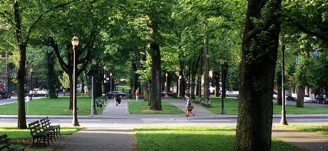
```
]

---
# Excludability

## Definition

> The extent to which a consumer of a good can restrict others from using it. 

**Excludable:** Access to the benefits of a good is restricted to those who pay for the good.

- *e.g.,* groceries, apartments, vehicles, *etc.*

**Non-Excludable:** Anyone can access the benefits of a good, whether she paid for it or not.

- *e.g.,* parks, national defense, sunshine, *etc.*

---
# Excludable or Non-Excludable?

.pull-left[
.center[**Podcast**]
```{r, fig.retina = 1, echo = FALSE}
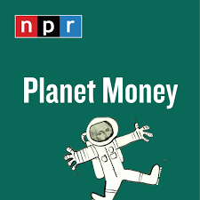
```
]

.pull-right[
.center[**Phone**]
```{r, fig.retina = 1, echo = FALSE}

```
]

---
count: false
# Excludable or Non-Excludable?

.pull-left[
.center[**Podcast**]
```{r, fig.retina = 1, echo = FALSE}

```

.center[**A:** .pink[Non-excludable.]]
]

.pull-right[
.center[**Phone**]
```{r, fig.retina = 1, echo = FALSE}

```

<br>

.center[**A:** .pink[Excludable.]]
]

---
# Excludable or Non-Excludable?

.pull-left[
.center[**Clean Air**]
```{r, fig.retina = 1.2, echo = FALSE}
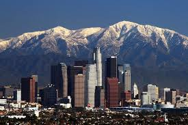
```
]

.pull-right[
.center[**Beach**]
```{r, fig.retina = 3, echo = FALSE}
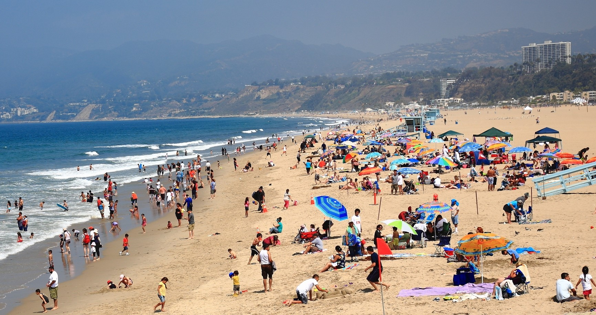
```
]

---
count: false
# Excludable or Non-Excludable?

.pull-left[
.center[**Clean Air**]
```{r, fig.retina = 1.2, echo = FALSE}

```

.center[**A:** .pink[Non-excludable.]]
]

.pull-right[
.center[**Beach**]
```{r, fig.retina = 3, echo = FALSE}

```

.center[**A:** .pink[Depends. <br> Private .mono[-->] excludable. <br> Public .mono[-->] non-excludable.]]
]

---
# Rivalry

## Definition

> Extent to which the consumption of a good by one person reduces the ability of others to consume it.

**Rival:** Consumption by one person 1) prevents others from consuming or 2) diminishes the value of the good for others.

- *e.g.,* your lunch, your toothbrush, your laptop, *etc.*

**Non-Rival:** People can consume the good simultaneously without diminishing its value.

- *e.g.,* lighthouses, scenic views, knowledge, *etc.*

---
# Rival or Non-Rival?

.pull-left[
.center[**Podcast**]
```{r, fig.retina = 1, echo = FALSE}

```
]

.pull-right[
.center[**Phone**]
```{r, fig.retina = 1, echo = FALSE}

```
]

---
count: false
# Rival or Non-Rival?

.pull-left[
.center[**Podcast**]
```{r, fig.retina = 1, echo = FALSE}

```

.center[**A:** .pink[Non-rival.]]
]

.pull-right[
.center[**Phone**]
```{r, fig.retina = 1, echo = FALSE}

```

<br>

.center[**A:** .pink[Rival.]]
]

---
# Rival or Non-Rival?

.pull-left[
.center[**Clean Air**]
```{r, fig.retina = 1.2, echo = FALSE}

```
]

.pull-right[
.center[**Beach**]
```{r, fig.retina = 3, echo = FALSE}

```
]

---
count: false
# Rival or Non-Rival?

.pull-left[
.center[**Clean Air**]
```{r, fig.retina = 1.2, echo = FALSE}

```

.center[**A:** .pink[Non-rival.]]
]

.pull-right[
.center[**Beach**]
```{r, fig.retina = 3, echo = FALSE}

```

.center[**A:** .pink[Rival.]]
]

---
# Types of Goods

```{r, echo = FALSE, fig.height = 5.5, fig.width = 5.5, dev = "svg"}
strategies_p1 <- c("Non-Excludable", "Excludable")
strategies_p2 <- c("Rival", "Non-Rival")

ggplot() + 
  scale_x_continuous(limits = c(0, 10), expand = c(0,0), breaks = c(2.5, 7.5), labels = strategies_p2, position = "top")+
  scale_y_continuous(limits = c(0, 10), expand = c(0,0), breaks = c(2.5, 7.5), labels = strategies_p1) +
  labs(x = "", y = "") +
  # Player 1 payoffs
  annotate("text", label = expression("Private Good"), x = 2.5, y = 7.5, family = "Fira Sans", size = 6, color = purple) +
  annotate("text", label = expression("Club Good"), x = 7.5, y = 7.5, family = "Fira Sans", size = 6, color = purple) +
  annotate("text", label = wrapper(expression("Common Resource"), 10), x = 2.5, y = 2.5, family = "Fira Sans", size = 6, color = red_pink) +
  annotate("text", label = expression("Public Good"), x = 7.7, y = 2.5, family = "Fira Sans", size = 6, color = red_pink) +
  # theme stuff
  theme_goods +
  geom_segment(aes(x = 5, y = 0, xend = 5, yend = 10), linetype  = "solid", size = 1) +
  geom_segment(aes(x = 0, y = 5, xend = 10, yend = 5), linetype  = "solid", size = 1) +
  geom_ribbon(aes(x = w, ymin = 0, ymax = 5), fill = red_pink, alpha = 0.2, linetype = "blank") +
  geom_ribbon(aes(x = z, ymin = 0, ymax = 5), fill = red_pink, alpha = 0.2, linetype = "blank") +
  geom_ribbon(aes(x = w, ymin = 5, ymax = 10), fill = purple, alpha = 0.2, linetype = "blank") +
  geom_ribbon(aes(x = z, ymin = 5, ymax = 10), fill = purple, alpha = 0.2, linetype = "blank")
```

---
# Private Goods

.pull-left[
```{r, echo = FALSE, fig.height = 4.5, fig.width = 4.5, dev = "svg"}
strategies_p1 <- c("Non-Excludable", "Excludable")
strategies_p2 <- c("Rival", "Non-Rival")

ggplot() + 
  scale_x_continuous(limits = c(0, 10), expand = c(0,0), breaks = c(2.5, 7.5), labels = strategies_p2, position = "top")+
  scale_y_continuous(limits = c(0, 10), expand = c(0,0), breaks = c(2.5, 7.5), labels = strategies_p1) +
  labs(x = "", y = "") +
  # Player 1 payoffs
  annotate("label", label = expression("Private Good"), x = 2.5, y = 7.5, family = "Fira Sans", size = 6, color = purple) +
  annotate("text", label = expression("Club Good"), x = 7.5, y = 7.5, family = "Fira Sans", size = 6, color = purple) +
  annotate("text", label = wrapper(expression("Common Resource"), 10), x = 2.5, y = 2.5, family = "Fira Sans", size = 6, color = red_pink) +
  annotate("text", label = expression("Public Good"), x = 7.7, y = 2.5, family = "Fira Sans", size = 6, color = red_pink) +
  # theme stuff
  theme_goods +
  geom_segment(aes(x = 5, y = 0, xend = 5, yend = 10), linetype  = "solid", size = 1) +
  geom_segment(aes(x = 0, y = 5, xend = 10, yend = 5), linetype  = "solid", size = 1) +
  geom_ribbon(aes(x = w, ymin = 0, ymax = 5), fill = red_pink, alpha = 0.2, linetype = "blank") +
  geom_ribbon(aes(x = z, ymin = 0, ymax = 5), fill = red_pink, alpha = 0.2, linetype = "blank") +
  geom_ribbon(aes(x = w, ymin = 5, ymax = 10), fill = purple, alpha = 0.2, linetype = "blank") +
  geom_ribbon(aes(x = z, ymin = 5, ymax = 10), fill = purple, alpha = 0.2, linetype = "blank")
```
]

.pull-right[

Property rights well-defined .mono[<=>] Consumer pays all costs and experiences all benefits at the margin.

Most consumer products are private goods.

- *e.g.,* jeans, watches, shoes, groceries, automobiles, notebooks, headphones, vitamins, toothbrushes, houses, *etc.*

]

---
# Private Goods

.pull-left[
```{r, echo = FALSE, fig.height = 4.5, fig.width = 4.5, dev = "svg"}
strategies_p1 <- c("Non-Excludable", "Excludable")
strategies_p2 <- c("Rival", "Non-Rival")

ggplot() + 
  scale_x_continuous(limits = c(0, 10), expand = c(0,0), breaks = c(2.5, 7.5), labels = strategies_p2, position = "top")+
  scale_y_continuous(limits = c(0, 10), expand = c(0,0), breaks = c(2.5, 7.5), labels = strategies_p1) +
  labs(x = "", y = "") +
  # Player 1 payoffs
  annotate("label", label = expression("Private Good"), x = 2.5, y = 7.5, family = "Fira Sans", size = 6, color = purple) +
  annotate("text", label = expression("Club Good"), x = 7.5, y = 7.5, family = "Fira Sans", size = 6, color = purple) +
  annotate("text", label = wrapper(expression("Common Resource"), 10), x = 2.5, y = 2.5, family = "Fira Sans", size = 6, color = red_pink) +
  annotate("text", label = expression("Public Good"), x = 7.7, y = 2.5, family = "Fira Sans", size = 6, color = red_pink) +
  # theme stuff
  theme_goods +
  geom_segment(aes(x = 5, y = 0, xend = 5, yend = 10), linetype  = "solid", size = 1) +
  geom_segment(aes(x = 0, y = 5, xend = 10, yend = 5), linetype  = "solid", size = 1) +
  geom_ribbon(aes(x = w, ymin = 0, ymax = 5), fill = red_pink, alpha = 0.2, linetype = "blank") +
  geom_ribbon(aes(x = z, ymin = 0, ymax = 5), fill = red_pink, alpha = 0.2, linetype = "blank") +
  geom_ribbon(aes(x = w, ymin = 5, ymax = 10), fill = purple, alpha = 0.2, linetype = "blank") +
  geom_ribbon(aes(x = z, ymin = 5, ymax = 10), fill = purple, alpha = 0.2, linetype = "blank")
```
]

.pull-right[

Usually provided by firms in a market setting.

- Competitive markets without externalities allocate private goods efficiently.

**Q:** Can you think of an example where the government provides private goods?

]

---
# Club Goods

.pull-left[
```{r, echo = FALSE, fig.height = 4.5, fig.width = 4.5, dev = "svg"}
strategies_p1 <- c("Non-Excludable", "Excludable")
strategies_p2 <- c("Rival", "Non-Rival")

ggplot() + 
  scale_x_continuous(limits = c(0, 10), expand = c(0,0), breaks = c(2.5, 7.5), labels = strategies_p2, position = "top")+
  scale_y_continuous(limits = c(0, 10), expand = c(0,0), breaks = c(2.5, 7.5), labels = strategies_p1) +
  labs(x = "", y = "") +
  # Player 1 payoffs
  annotate("text", label = expression("Private Good"), x = 2.5, y = 7.5, family = "Fira Sans", size = 6, color = purple) +
  annotate("label", label = expression("Club Good"), x = 7.5, y = 7.5, family = "Fira Sans", size = 6, color = purple) +
  annotate("text", label = wrapper(expression("Common Resource"), 10), x = 2.5, y = 2.5, family = "Fira Sans", size = 6, color = red_pink) +
  annotate("text", label = expression("Public Good"), x = 7.7, y = 2.5, family = "Fira Sans", size = 6, color = red_pink) +
  # theme stuff
  theme_goods +
  geom_segment(aes(x = 5, y = 0, xend = 5, yend = 10), linetype  = "solid", size = 1) +
  geom_segment(aes(x = 0, y = 5, xend = 10, yend = 5), linetype  = "solid", size = 1) +
  geom_ribbon(aes(x = w, ymin = 0, ymax = 5), fill = red_pink, alpha = 0.2, linetype = "blank") +
  geom_ribbon(aes(x = z, ymin = 0, ymax = 5), fill = red_pink, alpha = 0.2, linetype = "blank") +
  geom_ribbon(aes(x = w, ymin = 5, ymax = 10), fill = purple, alpha = 0.2, linetype = "blank") +
  geom_ribbon(aes(x = z, ymin = 5, ymax = 10), fill = purple, alpha = 0.2, linetype = "blank")
```
]

.pull-right[

Property rights not well-defined .mono[<=>] Consumer pays to "join the club," but does not necessarily pay for the marginal costs of using the good thereafter.

Many subscription or membership-based services are club goods.

- *e.g.,* Cable, satellite TV, Netflix, Hulu, HBO, Spotify Premium, country clubs, gyms, *etc.*
]

---
# Club Goods

.pull-left[
```{r, echo = FALSE, fig.height = 4.5, fig.width = 4.5, dev = "svg"}
strategies_p1 <- c("Non-Excludable", "Excludable")
strategies_p2 <- c("Rival", "Non-Rival")

ggplot() + 
  scale_x_continuous(limits = c(0, 10), expand = c(0,0), breaks = c(2.5, 7.5), labels = strategies_p2, position = "top")+
  scale_y_continuous(limits = c(0, 10), expand = c(0,0), breaks = c(2.5, 7.5), labels = strategies_p1) +
  labs(x = "", y = "") +
  # Player 1 payoffs
  annotate("text", label = expression("Private Good"), x = 2.5, y = 7.5, family = "Fira Sans", size = 6, color = purple) +
  annotate("label", label = expression("Club Good"), x = 7.5, y = 7.5, family = "Fira Sans", size = 6, color = purple) +
  annotate("text", label = wrapper(expression("Common Resource"), 10), x = 2.5, y = 2.5, family = "Fira Sans", size = 6, color = red_pink) +
  annotate("text", label = expression("Public Good"), x = 7.7, y = 2.5, family = "Fira Sans", size = 6, color = red_pink) +
  # theme stuff
  theme_goods +
  geom_segment(aes(x = 5, y = 0, xend = 5, yend = 10), linetype  = "solid", size = 1) +
  geom_segment(aes(x = 0, y = 5, xend = 10, yend = 5), linetype  = "solid", size = 1) +
  geom_ribbon(aes(x = w, ymin = 0, ymax = 5), fill = red_pink, alpha = 0.2, linetype = "blank") +
  geom_ribbon(aes(x = z, ymin = 0, ymax = 5), fill = red_pink, alpha = 0.2, linetype = "blank") +
  geom_ribbon(aes(x = w, ymin = 5, ymax = 10), fill = purple, alpha = 0.2, linetype = "blank") +
  geom_ribbon(aes(x = z, ymin = 5, ymax = 10), fill = purple, alpha = 0.2, linetype = "blank")
```
]

.pull-right[

Often provided by firms rather than governments.

Providers of club goods usually have market power (*e.g.,* Comcast).

- Fixed cost of network is high, but marginal cost of new subscription is low.

- Firms set price where MV .mono[>] MC <br> .mono[-->] artificial scarcity <br>  .mono[-->] inefficient!

]

---
# Common-Resource Goods

.pull-left[
```{r, echo = FALSE, fig.height = 4.5, fig.width = 4.5, dev = "svg"}
strategies_p1 <- c("Non-Excludable", "Excludable")
strategies_p2 <- c("Rival", "Non-Rival")

ggplot() + 
  scale_x_continuous(limits = c(0, 10), expand = c(0,0), breaks = c(2.5, 7.5), labels = strategies_p2, position = "top")+
  scale_y_continuous(limits = c(0, 10), expand = c(0,0), breaks = c(2.5, 7.5), labels = strategies_p1) +
  labs(x = "", y = "") +
  # Player 1 payoffs
  annotate("text", label = expression("Private Good"), x = 2.5, y = 7.5, family = "Fira Sans", size = 6, color = purple) +
  annotate("text", label = expression("Club Good"), x = 7.5, y = 7.5, family = "Fira Sans", size = 6, color = purple) +
  annotate("label", label = wrapper(expression("Common Resource"), 10), x = 2.5, y = 2.5, family = "Fira Sans", size = 6, color = red_pink) +
  annotate("text", label = expression("Public Good"), x = 7.7, y = 2.5, family = "Fira Sans", size = 6, color = red_pink) +
  # theme stuff
  theme_goods +
  geom_segment(aes(x = 5, y = 0, xend = 5, yend = 10), linetype  = "solid", size = 1) +
  geom_segment(aes(x = 0, y = 5, xend = 10, yend = 5), linetype  = "solid", size = 1) +
  geom_ribbon(aes(x = w, ymin = 0, ymax = 5), fill = red_pink, alpha = 0.2, linetype = "blank") +
  geom_ribbon(aes(x = z, ymin = 0, ymax = 5), fill = red_pink, alpha = 0.2, linetype = "blank") +
  geom_ribbon(aes(x = w, ymin = 5, ymax = 10), fill = purple, alpha = 0.2, linetype = "blank") +
  geom_ribbon(aes(x = z, ymin = 5, ymax = 10), fill = purple, alpha = 0.2, linetype = "blank")
```
]

.pull-right[

Property rights not well-defined .mono[<=>] Consumer experiences all marginal benefits, but does not pay all marginal costs.

Some common resources are prone to overextraction.

- *e.g.,* fish, deer or elk on public land, hors d'oeuvres at a party, booze at an open bar, *etc.*

]

---
# Common-Resource Goods

.pull-left[
```{r, echo = FALSE, fig.height = 4.5, fig.width = 4.5, dev = "svg"}
strategies_p1 <- c("Non-Excludable", "Excludable")
strategies_p2 <- c("Rival", "Non-Rival")

ggplot() + 
  scale_x_continuous(limits = c(0, 10), expand = c(0,0), breaks = c(2.5, 7.5), labels = strategies_p2, position = "top")+
  scale_y_continuous(limits = c(0, 10), expand = c(0,0), breaks = c(2.5, 7.5), labels = strategies_p1) +
  labs(x = "", y = "") +
  # Player 1 payoffs
  annotate("text", label = expression("Private Good"), x = 2.5, y = 7.5, family = "Fira Sans", size = 6, color = purple) +
  annotate("text", label = expression("Club Good"), x = 7.5, y = 7.5, family = "Fira Sans", size = 6, color = purple) +
  annotate("label", label = wrapper(expression("Common Resource"), 10), x = 2.5, y = 2.5, family = "Fira Sans", size = 6, color = red_pink) +
  annotate("text", label = expression("Public Good"), x = 7.7, y = 2.5, family = "Fira Sans", size = 6, color = red_pink) +
  # theme stuff
  theme_goods +
  geom_segment(aes(x = 5, y = 0, xend = 5, yend = 10), linetype  = "solid", size = 1) +
  geom_segment(aes(x = 0, y = 5, xend = 10, yend = 5), linetype  = "solid", size = 1) +
  geom_ribbon(aes(x = w, ymin = 0, ymax = 5), fill = red_pink, alpha = 0.2, linetype = "blank") +
  geom_ribbon(aes(x = z, ymin = 0, ymax = 5), fill = red_pink, alpha = 0.2, linetype = "blank") +
  geom_ribbon(aes(x = w, ymin = 5, ymax = 10), fill = purple, alpha = 0.2, linetype = "blank") +
  geom_ribbon(aes(x = z, ymin = 5, ymax = 10), fill = purple, alpha = 0.2, linetype = "blank")
```
]

.pull-right[

Property rights not well-defined .mono[<=>] Consumer experiences all marginal benefits, but does not pay all marginal costs.

Other common resources are prone to congestion or pollution.

- *e.g.,* roads, clean water, national parks, your dorm room, *etc.*


]

---
# Common-Resource Goods

.pull-left[
```{r, echo = FALSE, fig.height = 4.5, fig.width = 4.5, dev = "svg"}
strategies_p1 <- c("Non-Excludable", "Excludable")
strategies_p2 <- c("Rival", "Non-Rival")

ggplot() + 
  scale_x_continuous(limits = c(0, 10), expand = c(0,0), breaks = c(2.5, 7.5), labels = strategies_p2, position = "top")+
  scale_y_continuous(limits = c(0, 10), expand = c(0,0), breaks = c(2.5, 7.5), labels = strategies_p1) +
  labs(x = "", y = "") +
  # Player 1 payoffs
  annotate("text", label = expression("Private Good"), x = 2.5, y = 7.5, family = "Fira Sans", size = 6, color = purple) +
  annotate("text", label = expression("Club Good"), x = 7.5, y = 7.5, family = "Fira Sans", size = 6, color = purple) +
  annotate("label", label = wrapper(expression("Common Resource"), 10), x = 2.5, y = 2.5, family = "Fira Sans", size = 6, color = red_pink) +
  annotate("text", label = expression("Public Good"), x = 7.7, y = 2.5, family = "Fira Sans", size = 6, color = red_pink) +
  # theme stuff
  theme_goods +
  geom_segment(aes(x = 5, y = 0, xend = 5, yend = 10), linetype  = "solid", size = 1) +
  geom_segment(aes(x = 0, y = 5, xend = 10, yend = 5), linetype  = "solid", size = 1) +
  geom_ribbon(aes(x = w, ymin = 0, ymax = 5), fill = red_pink, alpha = 0.2, linetype = "blank") +
  geom_ribbon(aes(x = z, ymin = 0, ymax = 5), fill = red_pink, alpha = 0.2, linetype = "blank") +
  geom_ribbon(aes(x = w, ymin = 5, ymax = 10), fill = purple, alpha = 0.2, linetype = "blank") +
  geom_ribbon(aes(x = z, ymin = 5, ymax = 10), fill = purple, alpha = 0.2, linetype = "blank")
```
]

.pull-right[

Unregulated markets often fail to manage commons resources efficiently. 

- Rivalry creates a sense of urgency among users to extract the resource before others.

- Non-excludability makes maintenance of the resource unattractive to users.

- **Result:** Overuse and neglect.

]

---
# Public Goods

.pull-left[
```{r, echo = FALSE, fig.height = 4.5, fig.width = 4.5, dev = "svg"}
strategies_p1 <- c("Non-Excludable", "Excludable")
strategies_p2 <- c("Rival", "Non-Rival")

ggplot() + 
  scale_x_continuous(limits = c(0, 10), expand = c(0,0), breaks = c(2.5, 7.5), labels = strategies_p2, position = "top")+
  scale_y_continuous(limits = c(0, 10), expand = c(0,0), breaks = c(2.5, 7.5), labels = strategies_p1) +
  labs(x = "", y = "") +
  # Player 1 payoffs
  annotate("text", label = expression("Private Good"), x = 2.5, y = 7.5, family = "Fira Sans", size = 6, color = purple) +
  annotate("text", label = expression("Club Good"), x = 7.5, y = 7.5, family = "Fira Sans", size = 6, color = purple) +
  annotate("text", label = wrapper(expression("Common Resource"), 10), x = 2.5, y = 2.5, family = "Fira Sans", size = 6, color = red_pink) +
  annotate("label", label = expression("Public Good"), x = 7.7, y = 2.5, family = "Fira Sans", size = 6, color = red_pink) +
  # theme stuff
  theme_goods +
  geom_segment(aes(x = 5, y = 0, xend = 5, yend = 10), linetype  = "solid", size = 1) +
  geom_segment(aes(x = 0, y = 5, xend = 10, yend = 5), linetype  = "solid", size = 1) +
  geom_ribbon(aes(x = w, ymin = 0, ymax = 5), fill = red_pink, alpha = 0.2, linetype = "blank") +
  geom_ribbon(aes(x = z, ymin = 0, ymax = 5), fill = red_pink, alpha = 0.2, linetype = "blank") +
  geom_ribbon(aes(x = w, ymin = 5, ymax = 10), fill = purple, alpha = 0.2, linetype = "blank") +
  geom_ribbon(aes(x = z, ymin = 5, ymax = 10), fill = purple, alpha = 0.2, linetype = "blank")
```
]

.pull-right[

Property rights not well-defined .mono[<=>] Consumer experiences all marginal benefits, but does not pay all marginal costs.

Usually provided by governments.

- **Government:** National defense, legal system, flood control dams, autopsies, lighthouses, official statistics, fire protection, *etc.*
- **Other:** Clean air, open-source software, knowledge, *etc.*

]

---
# Public Goods

.pull-left[
```{r, echo = FALSE, fig.height = 4.5, fig.width = 4.5, dev = "svg"}
strategies_p1 <- c("Non-Excludable", "Excludable")
strategies_p2 <- c("Rival", "Non-Rival")

ggplot() + 
  scale_x_continuous(limits = c(0, 10), expand = c(0,0), breaks = c(2.5, 7.5), labels = strategies_p2, position = "top")+
  scale_y_continuous(limits = c(0, 10), expand = c(0,0), breaks = c(2.5, 7.5), labels = strategies_p1) +
  labs(x = "", y = "") +
  # Player 1 payoffs
  annotate("text", label = expression("Private Good"), x = 2.5, y = 7.5, family = "Fira Sans", size = 6, color = purple) +
  annotate("text", label = expression("Club Good"), x = 7.5, y = 7.5, family = "Fira Sans", size = 6, color = purple) +
  annotate("text", label = wrapper(expression("Common Resource"), 10), x = 2.5, y = 2.5, family = "Fira Sans", size = 6, color = red_pink) +
  annotate("label", label = expression("Public Good"), x = 7.7, y = 2.5, family = "Fira Sans", size = 6, color = red_pink) +
  # theme stuff
  theme_goods +
  geom_segment(aes(x = 5, y = 0, xend = 5, yend = 10), linetype  = "solid", size = 1) +
  geom_segment(aes(x = 0, y = 5, xend = 10, yend = 5), linetype  = "solid", size = 1) +
  geom_ribbon(aes(x = w, ymin = 0, ymax = 5), fill = red_pink, alpha = 0.2, linetype = "blank") +
  geom_ribbon(aes(x = z, ymin = 0, ymax = 5), fill = red_pink, alpha = 0.2, linetype = "blank") +
  geom_ribbon(aes(x = w, ymin = 5, ymax = 10), fill = purple, alpha = 0.2, linetype = "blank") +
  geom_ribbon(aes(x = z, ymin = 5, ymax = 10), fill = purple, alpha = 0.2, linetype = "blank")
```
]

.pull-right[

Markets for public goods do not exist!

- Providing public goods is not profitable for firms and too costly for most individuals.

- **Reason:** Cannot exclude those who do not pay.

- **Result:** Too few public goods <br> .mono[-->] inefficient!

]

---
class: inverse, middle

# Collective Action Problems

---
# Collective Action Problems

.pull-left[
```{r, echo = FALSE, fig.height = 4.5, fig.width = 4.5, dev = "svg"}
strategies_p1 <- c("Defect", "Cooperate")
strategies_p2 <- c("Cooperate", "Defect")

pd_1 <- ggplot() + 
  scale_x_continuous(limits = c(0, 10), expand = c(0,0), breaks = c(2.5, 7.5), labels = strategies_p2, position = "top")+
  scale_y_continuous(limits = c(0, 10), expand = c(0,0), breaks = c(2.5, 7.5), labels = strategies_p1) +
  labs(x = "Player 2", y = "Player 1") +
  # Player 1 payoffs
  annotate("text", label = wrapper(expression("Get Benefits, Share Cost"), 15), x = 1.75, y = 6, family = "Fira Sans", size = 4, color = red_pink) +
  annotate("text", label = wrapper(expression("Get Benefits, Pay Entire Cost"), 15), x = 6.75, y = 6, family = "Fira Sans", size = 4, color = red_pink) +
  annotate("text", label = wrapper(expression("Get Benefits, Pay No Cost"), 15), x = 1.75, y = 1, family = "Fira Sans", size = 4, color = red_pink) +
  annotate("text", label = wrapper(expression("No Benefits, No Cost"), 15), x = 6.75, y = 1, family = "Fira Sans", size = 4, color = red_pink) +
  # Player 2 payoffs
  annotate("text", label = wrapper(expression("Get Benefits, Share Cost"), 15), x = 3.25, y = 9, family = "Fira Sans", size = 4, color = purple) +
  annotate("text", label = wrapper(expression("Get Benefits, Pay No Cost"), 15), x = 8.25, y = 9, family = "Fira Sans", size = 4, color = purple) +
  annotate("text", label = wrapper(expression("Get Benefits, Pay Entire Cost"), 15), x = 3.25, y = 4, family = "Fira Sans", size = 4, color = purple) +
  annotate("text", label = wrapper(expression("No Benefits, No Cost"), 15), x = 8.25, y = 4, family = "Fira Sans", size = 4, color = purple) +
  # theme stuff
  theme_game +
  geom_segment(aes(x = 0, y = 10, xend = 10, yend = 0), linetype  = "dashed", size = 0.5) +
  geom_segment(aes(x = 5, y = 10, xend = 10, yend = 5), linetype  = "dashed", size = 0.5) +
  geom_segment(aes(x = 0, y = 5, xend = 5, yend = 0), linetype  = "dashed", size = 0.5) +
  geom_segment(aes(x = 5, y = 0, xend = 5, yend = 10), linetype  = "solid", size = 1) +
  geom_segment(aes(x = 0, y = 5, xend = 10, yend = 5), linetype  = "solid", size = 1) +
  geom_ribbon(aes(x = w, ymin = 0, ymax = game_box_1(w)), fill = red_pink, alpha = 0.2, linetype = "blank") +
  geom_ribbon(aes(x = w, ymin = 5, ymax = game_box_2(w)), fill = red_pink, alpha = 0.2, linetype = "blank") +
  geom_ribbon(aes(x = z, ymin = 5, ymax = game_box_3(z)), fill = red_pink, alpha = 0.2, linetype = "blank") +
  geom_ribbon(aes(x = z, ymin = 0, ymax = game_box_2(z)), fill = red_pink, alpha = 0.2, linetype = "blank") +
  geom_ribbon(aes(x = w, ymin = game_box_1(w), ymax = 5), fill = purple, alpha = 0.2, linetype = "blank") +
  geom_ribbon(aes(x = w, ymin = game_box_2(w), ymax = 10), fill = purple, alpha = 0.2, linetype = "blank") +
  geom_ribbon(aes(x = z, ymin = game_box_3(z), ymax = 10), fill = purple, alpha = 0.2, linetype = "blank") +
  geom_ribbon(aes(x = z, ymin = game_box_2(z), ymax = 5), fill = purple, alpha = 0.2, linetype = "blank")
pd_1
```
]

.pull-right[

**Q:** Why are public goods underprovided?

- **A:** The free-rider problem!

**Q:** Why are common resources neglected or overused?

- **A:** Tragedy of the commons!

]

---
count: false
# Collective Action Problems

.pull-left[
```{r, echo = FALSE, fig.height = 4.5, fig.width = 4.5, dev = "svg"}
strategies_p1 <- c("Defect", "Cooperate")
strategies_p2 <- c("Cooperate", "Defect")

pd_1 <- ggplot() + 
  scale_x_continuous(limits = c(0, 10), expand = c(0,0), breaks = c(2.5, 7.5), labels = strategies_p2, position = "top")+
  scale_y_continuous(limits = c(0, 10), expand = c(0,0), breaks = c(2.5, 7.5), labels = strategies_p1) +
  labs(x = "Player 2", y = "Player 1") +
  # Player 1 payoffs
  annotate("text", label = wrapper(expression("Get Benefits, Share Cost"), 15), x = 1.75, y = 6, family = "Fira Sans", size = 4, color = red_pink) +
  annotate("text", label = wrapper(expression("Get Benefits, Pay Entire Cost"), 15), x = 6.75, y = 6, family = "Fira Sans", size = 4, color = red_pink) +
  annotate("text", label = wrapper(expression("Get Benefits, Pay No Cost"), 15), x = 1.75, y = 1, family = "Fira Sans", size = 4, color = red_pink) +
  annotate("text", label = wrapper(expression("No Benefits, No Cost"), 15), x = 6.75, y = 1, family = "Fira Sans", size = 4, color = red_pink) +
  # Player 2 payoffs
  annotate("text", label = wrapper(expression("Get Benefits, Share Cost"), 15), x = 3.25, y = 9, family = "Fira Sans", size = 4, color = purple) +
  annotate("text", label = wrapper(expression("Get Benefits, Pay No Cost"), 15), x = 8.25, y = 9, family = "Fira Sans", size = 4, color = purple) +
  annotate("text", label = wrapper(expression("Get Benefits, Pay Entire Cost"), 15), x = 3.25, y = 4, family = "Fira Sans", size = 4, color = purple) +
  annotate("text", label = wrapper(expression("No Benefits, No Cost"), 15), x = 8.25, y = 4, family = "Fira Sans", size = 4, color = purple) +
  # theme stuff
  theme_game +
  geom_segment(aes(x = 0, y = 10, xend = 10, yend = 0), linetype  = "dashed", size = 0.5) +
  geom_segment(aes(x = 5, y = 10, xend = 10, yend = 5), linetype  = "dashed", size = 0.5) +
  geom_segment(aes(x = 0, y = 5, xend = 5, yend = 0), linetype  = "dashed", size = 0.5) +
  geom_segment(aes(x = 5, y = 0, xend = 5, yend = 10), linetype  = "solid", size = 1) +
  geom_segment(aes(x = 0, y = 5, xend = 10, yend = 5), linetype  = "solid", size = 1) +
  geom_ribbon(aes(x = w, ymin = 0, ymax = game_box_1(w)), fill = red_pink, alpha = 0.2, linetype = "blank") +
  geom_ribbon(aes(x = w, ymin = 5, ymax = game_box_2(w)), fill = red_pink, alpha = 0.2, linetype = "blank") +
  geom_ribbon(aes(x = z, ymin = 5, ymax = game_box_3(z)), fill = red_pink, alpha = 0.2, linetype = "blank") +
  geom_ribbon(aes(x = z, ymin = 0, ymax = game_box_2(z)), fill = red_pink, alpha = 0.2, linetype = "blank") +
  geom_ribbon(aes(x = w, ymin = game_box_1(w), ymax = 5), fill = purple, alpha = 0.2, linetype = "blank") +
  geom_ribbon(aes(x = w, ymin = game_box_2(w), ymax = 10), fill = purple, alpha = 0.2, linetype = "blank") +
  geom_ribbon(aes(x = z, ymin = game_box_3(z), ymax = 10), fill = purple, alpha = 0.2, linetype = "blank") +
  geom_ribbon(aes(x = z, ymin = game_box_2(z), ymax = 5), fill = purple, alpha = 0.2, linetype = "blank")
pd_1
```
]

.pull-right[

**Q:** Why are public goods underprovided?

- **A:** The free-rider problem!

**Q:** Why are common resources neglected or overused?

- **A:** Tragedy of the commons!

**Prisoner's Dilemma, Reprise:** (.pink[Cooperate], .purple[Cooperate]) usually *Pareto dominates* (.pink[Defect], .purple[Defect]), but (.pink[Defect], .purple[Defect]) is often the Nash equilibrium!

]

---
# Free-Rider Problem

## Example: Providing Public Goods

.more-left[

Suppose that a streetlight costs $20 to install.

- Cost exceeds each neighbor's willingness to pay <br> .pink[.mono[-->] No neighbor would install the streetlight on their own!]


]

.less-right[
```{R, echo = F, escape = F}
tab <- data.frame(
  v1 = c("Darrell", "Zhang", "Amani", "Ivan", "Saoirse", "Lucy", "Ibrahim", "Maria"),
  v2 = c("$9.00", "$9.00", "$8.00", "$8.00", "$6.00", "$5.00", "$4.00", "$2.00")
) %>% kable(
  escape = F,
  col.names = c("Neighbor", "Maximum WTP"),
  align = c("l", "c")
) %>%
  kable_styling() %>% 
  row_spec(1:4, extra_css = "line-height: 110%;")
tab 
```

]

---
count: false
# Free-Rider Problem

## Example: Providing Public Goods

.more-left[

Suppose that a streetlight costs $20 to install.

- Cost exceeds each neighbor's willingness to pay <br> .pink[.mono[-->] No neighbor would install the streetlight on their own!]

Marginal social benefit <br> $\quad$ .mono[=] 9 .mono[+] 9 .mono[+] 8 .mono[+] 8 .mono[+] 6 .mono[+] 5 .mono[+] 4 .mono[+] 2 .mono[=] $51.

- Exceeds cost <br> .pink[.mono[-->] Efficient to install the streetlight!]

]

.less-right[
```{R, echo = F, escape = F}
tab 
```

]

---
# Free-Rider Problem

## Example: Group Project

.pull-left[
```{r, echo = FALSE, fig.height = 4.5, fig.width = 4.5, dev = "svg"}
strategies_p1 <- c("Slack Off", "Contribute")
strategies_p2 <- c("Contribute", "Slack Off")

ggplot() + 
  scale_x_continuous(limits = c(0, 10), expand = c(0,0), breaks = c(2.5, 7.5), labels = strategies_p2, position = "top")+
  scale_y_continuous(limits = c(0, 10), expand = c(0,0), breaks = c(2.5, 7.5), labels = strategies_p1) +
  labs(x = "Student 2", y = "Student 1") +
  # Player 1 payoffs
  annotate("text", label = expression(2), x = 1.75, y = 6, family = "Fira Sans", size = 6, color = red_pink) +
  annotate("text", label = expression(-2), x = 6.75, y = 6, family = "Fira Sans", size = 6, color = red_pink) +
  annotate("text", label = expression(4), x = 1.75, y = 1, family = "Fira Sans", size = 6, color = red_pink) +
  annotate("text", label = expression(-1), x = 6.75, y = 1, family = "Fira Sans", size = 6, color = red_pink) +
  # Player 2 payoffs
  annotate("text", label = expression(3), x = 3.25, y = 9, family = "Fira Sans", size = 6, color = purple) +
  annotate("text", label = expression(5), x = 8.25, y = 9, family = "Fira Sans", size = 6, color = purple) +
  annotate("text", label = expression(-3), x = 3.25, y = 4, family = "Fira Sans", size = 6, color = purple) +
  annotate("text", label = expression(-1), x = 8.25, y = 4, family = "Fira Sans", size = 6, color = purple) +
  # theme stuff
  theme_game +
  geom_segment(aes(x = 0, y = 10, xend = 10, yend = 0), linetype  = "dashed", size = 0.5) +
  geom_segment(aes(x = 5, y = 10, xend = 10, yend = 5), linetype  = "dashed", size = 0.5) +
  geom_segment(aes(x = 0, y = 5, xend = 5, yend = 0), linetype  = "dashed", size = 0.5) +
  geom_segment(aes(x = 5, y = 0, xend = 5, yend = 10), linetype  = "solid", size = 1) +
  geom_segment(aes(x = 0, y = 5, xend = 10, yend = 5), linetype  = "solid", size = 1) +
  geom_ribbon(aes(x = w, ymin = 0, ymax = game_box_1(w)), fill = red_pink, alpha = 0.2, linetype = "blank") +
  geom_ribbon(aes(x = w, ymin = 5, ymax = game_box_2(w)), fill = red_pink, alpha = 0.2, linetype = "blank") +
  geom_ribbon(aes(x = z, ymin = 5, ymax = game_box_3(z)), fill = red_pink, alpha = 0.2, linetype = "blank") +
  geom_ribbon(aes(x = z, ymin = 0, ymax = game_box_2(z)), fill = red_pink, alpha = 0.2, linetype = "blank") +
  geom_ribbon(aes(x = w, ymin = game_box_1(w), ymax = 5), fill = purple, alpha = 0.2, linetype = "blank") +
  geom_ribbon(aes(x = w, ymin = game_box_2(w), ymax = 10), fill = purple, alpha = 0.2, linetype = "blank") +
  geom_ribbon(aes(x = z, ymin = game_box_3(z), ymax = 10), fill = purple, alpha = 0.2, linetype = "blank") +
  geom_ribbon(aes(x = z, ymin = game_box_2(z), ymax = 5), fill = purple, alpha = 0.2, linetype = "blank")
```
]

.pull-right[

**Q:** What happens in equilibrium?

]

---
count: false
# Free-Rider Problem

## Example: Group Project

.pull-left[
```{r, echo = FALSE, fig.height = 4.5, fig.width = 4.5, dev = "svg"}
strategies_p1 <- c("Slack Off", "Contribute")
strategies_p2 <- c("Contribute", "Slack Off")

ggplot() + 
  scale_x_continuous(limits = c(0, 10), expand = c(0,0), breaks = c(2.5, 7.5), labels = strategies_p2, position = "top")+
  scale_y_continuous(limits = c(0, 10), expand = c(0,0), breaks = c(2.5, 7.5), labels = strategies_p1) +
  labs(x = "Student 2", y = "Student 1") +
  # Player 1 payoffs
  annotate("text", label = expression(2), x = 1.75, y = 6, family = "Fira Sans", size = 6, color = red_pink) +
  annotate("text", label = expression(-2), x = 6.75, y = 6, family = "Fira Sans", size = 6, color = red_pink) +
  annotate("label", label = expression(4), x = 1.75, y = 1, family = "Fira Sans", size = 6, color = red_pink) +
  annotate("label", label = expression(-1), x = 6.75, y = 1, family = "Fira Sans", size = 6, color = red_pink) +
  # Player 2 payoffs
  annotate("text", label = expression(3), x = 3.25, y = 9, family = "Fira Sans", size = 6, color = purple) +
  annotate("label", label = expression(5), x = 8.25, y = 9, family = "Fira Sans", size = 6, color = purple) +
  annotate("text", label = expression(-3), x = 3.25, y = 4, family = "Fira Sans", size = 6, color = purple) +
  annotate("label", label = expression(-1), x = 8.25, y = 4, family = "Fira Sans", size = 6, color = purple) +
  # theme stuff
  theme_game +
  geom_segment(aes(x = 0, y = 10, xend = 10, yend = 0), linetype  = "dashed", size = 0.5) +
  geom_segment(aes(x = 5, y = 10, xend = 10, yend = 5), linetype  = "dashed", size = 0.5) +
  geom_segment(aes(x = 0, y = 5, xend = 5, yend = 0), linetype  = "dashed", size = 0.5) +
  geom_segment(aes(x = 5, y = 0, xend = 5, yend = 10), linetype  = "solid", size = 1) +
  geom_segment(aes(x = 0, y = 5, xend = 10, yend = 5), linetype  = "solid", size = 1) +
  geom_ribbon(aes(x = w, ymin = 0, ymax = game_box_1(w)), fill = red_pink, alpha = 0.2, linetype = "blank") +
  geom_ribbon(aes(x = w, ymin = 5, ymax = game_box_2(w)), fill = red_pink, alpha = 0.2, linetype = "blank") +
  geom_ribbon(aes(x = z, ymin = 5, ymax = game_box_3(z)), fill = red_pink, alpha = 0.2, linetype = "blank") +
  geom_ribbon(aes(x = z, ymin = 0, ymax = game_box_2(z)), fill = red_pink, alpha = 0.2, linetype = "blank") +
  geom_ribbon(aes(x = w, ymin = game_box_1(w), ymax = 5), fill = purple, alpha = 0.2, linetype = "blank") +
  geom_ribbon(aes(x = w, ymin = game_box_2(w), ymax = 10), fill = purple, alpha = 0.2, linetype = "blank") +
  geom_ribbon(aes(x = z, ymin = game_box_3(z), ymax = 10), fill = purple, alpha = 0.2, linetype = "blank") +
  geom_ribbon(aes(x = z, ymin = game_box_2(z), ymax = 5), fill = purple, alpha = 0.2, linetype = "blank")
```
]

.pull-right[

**Q:** What happens in equilibrium?

**A:** Both students slack off.

- Why?

]

---
# Free-Rider Problem

## Example: Group Project

.pull-left[
```{r, echo = FALSE, fig.height = 4.5, fig.width = 4.5, dev = "svg"}
strategies_p1 <- c("Slack Off", "Contribute")
strategies_p2 <- c("Contribute", "Slack Off")

ggplot() + 
  scale_x_continuous(limits = c(0, 10), expand = c(0,0), breaks = c(2.5, 7.5), labels = strategies_p2, position = "top")+
  scale_y_continuous(limits = c(0, 10), expand = c(0,0), breaks = c(2.5, 7.5), labels = strategies_p1) +
  labs(x = "Student 2", y = "Student 1") +
  # Player 1 payoffs
  annotate("text", label = expression(4), x = 1.75, y = 6, family = "Fira Sans", size = 6, color = red_pink) +
  annotate("text", label = expression(1), x = 6.75, y = 6, family = "Fira Sans", size = 6, color = red_pink) +
  annotate("text", label = expression(7), x = 1.75, y = 1, family = "Fira Sans", size = 6, color = red_pink) +
  annotate("text", label = expression(-5), x = 6.75, y = 1, family = "Fira Sans", size = 6, color = red_pink) +
  # Player 2 payoffs
  annotate("text", label = expression(5), x = 3.25, y = 9, family = "Fira Sans", size = 6, color = purple) +
  annotate("text", label = expression(6), x = 8.25, y = 9, family = "Fira Sans", size = 6, color = purple) +
  annotate("text", label = expression(1), x = 3.25, y = 4, family = "Fira Sans", size = 6, color = purple) +
  annotate("text", label = expression(-5), x = 8.25, y = 4, family = "Fira Sans", size = 6, color = purple) +
  # theme stuff
  theme_game +
  geom_segment(aes(x = 0, y = 10, xend = 10, yend = 0), linetype  = "dashed", size = 0.5) +
  geom_segment(aes(x = 5, y = 10, xend = 10, yend = 5), linetype  = "dashed", size = 0.5) +
  geom_segment(aes(x = 0, y = 5, xend = 5, yend = 0), linetype  = "dashed", size = 0.5) +
  geom_segment(aes(x = 5, y = 0, xend = 5, yend = 10), linetype  = "solid", size = 1) +
  geom_segment(aes(x = 0, y = 5, xend = 10, yend = 5), linetype  = "solid", size = 1) +
  geom_ribbon(aes(x = w, ymin = 0, ymax = game_box_1(w)), fill = red_pink, alpha = 0.2, linetype = "blank") +
  geom_ribbon(aes(x = w, ymin = 5, ymax = game_box_2(w)), fill = red_pink, alpha = 0.2, linetype = "blank") +
  geom_ribbon(aes(x = z, ymin = 5, ymax = game_box_3(z)), fill = red_pink, alpha = 0.2, linetype = "blank") +
  geom_ribbon(aes(x = z, ymin = 0, ymax = game_box_2(z)), fill = red_pink, alpha = 0.2, linetype = "blank") +
  geom_ribbon(aes(x = w, ymin = game_box_1(w), ymax = 5), fill = purple, alpha = 0.2, linetype = "blank") +
  geom_ribbon(aes(x = w, ymin = game_box_2(w), ymax = 10), fill = purple, alpha = 0.2, linetype = "blank") +
  geom_ribbon(aes(x = z, ymin = game_box_3(z), ymax = 10), fill = purple, alpha = 0.2, linetype = "blank") +
  geom_ribbon(aes(x = z, ymin = game_box_2(z), ymax = 5), fill = purple, alpha = 0.2, linetype = "blank")
```
]

.pull-right[

**Q:** What happens in equilibrium?

]

---
count: false
# Free-Rider Problem

## Example: Group Project

.pull-left[
```{r, echo = FALSE, fig.height = 4.5, fig.width = 4.5, dev = "svg"}
strategies_p1 <- c("Slack Off", "Contribute")
strategies_p2 <- c("Contribute", "Slack Off")

ggplot() + 
  scale_x_continuous(limits = c(0, 10), expand = c(0,0), breaks = c(2.5, 7.5), labels = strategies_p2, position = "top")+
  scale_y_continuous(limits = c(0, 10), expand = c(0,0), breaks = c(2.5, 7.5), labels = strategies_p1) +
  labs(x = "Student 2", y = "Student 1") +
  # Player 1 payoffs
  annotate("text", label = expression(4), x = 1.75, y = 6, family = "Fira Sans", size = 6, color = red_pink) +
  annotate("label", label = expression(1), x = 6.75, y = 6, family = "Fira Sans", size = 6, color = red_pink) +
  annotate("label", label = expression(7), x = 1.75, y = 1, family = "Fira Sans", size = 6, color = red_pink) +
  annotate("text", label = expression(-5), x = 6.75, y = 1, family = "Fira Sans", size = 6, color = red_pink) +
  # Player 2 payoffs
  annotate("text", label = expression(5), x = 3.25, y = 9, family = "Fira Sans", size = 6, color = purple) +
  annotate("label", label = expression(6), x = 8.25, y = 9, family = "Fira Sans", size = 6, color = purple) +
  annotate("label", label = expression(1), x = 3.25, y = 4, family = "Fira Sans", size = 6, color = purple) +
  annotate("text", label = expression(-5), x = 8.25, y = 4, family = "Fira Sans", size = 6, color = purple) +
  # theme stuff
  theme_game +
  geom_segment(aes(x = 0, y = 10, xend = 10, yend = 0), linetype  = "dashed", size = 0.5) +
  geom_segment(aes(x = 5, y = 10, xend = 10, yend = 5), linetype  = "dashed", size = 0.5) +
  geom_segment(aes(x = 0, y = 5, xend = 5, yend = 0), linetype  = "dashed", size = 0.5) +
  geom_segment(aes(x = 5, y = 0, xend = 5, yend = 10), linetype  = "solid", size = 1) +
  geom_segment(aes(x = 0, y = 5, xend = 10, yend = 5), linetype  = "solid", size = 1) +
  geom_ribbon(aes(x = w, ymin = 0, ymax = game_box_1(w)), fill = red_pink, alpha = 0.2, linetype = "blank") +
  geom_ribbon(aes(x = w, ymin = 5, ymax = game_box_2(w)), fill = red_pink, alpha = 0.2, linetype = "blank") +
  geom_ribbon(aes(x = z, ymin = 5, ymax = game_box_3(z)), fill = red_pink, alpha = 0.2, linetype = "blank") +
  geom_ribbon(aes(x = z, ymin = 0, ymax = game_box_2(z)), fill = red_pink, alpha = 0.2, linetype = "blank") +
  geom_ribbon(aes(x = w, ymin = game_box_1(w), ymax = 5), fill = purple, alpha = 0.2, linetype = "blank") +
  geom_ribbon(aes(x = w, ymin = game_box_2(w), ymax = 10), fill = purple, alpha = 0.2, linetype = "blank") +
  geom_ribbon(aes(x = z, ymin = game_box_3(z), ymax = 10), fill = purple, alpha = 0.2, linetype = "blank") +
  geom_ribbon(aes(x = z, ymin = game_box_2(z), ymax = 5), fill = purple, alpha = 0.2, linetype = "blank")
```
]

.pull-right[

**Q:** What happens in equilibrium?

**A:** One student does all the work.

- Why?

]

---
# Free-Rider Problem

## Example: Group Project

.pull-left[
```{r, echo = FALSE, fig.height = 4.5, fig.width = 4.5, dev = "svg"}
strategies_p1 <- c("Slack Off", "Contribute")
strategies_p2 <- c("Contribute", "Slack Off")

ggplot() + 
  scale_x_continuous(limits = c(0, 10), expand = c(0,0), breaks = c(2.5, 7.5), labels = strategies_p2, position = "top")+
  scale_y_continuous(limits = c(0, 10), expand = c(0,0), breaks = c(2.5, 7.5), labels = strategies_p1) +
  labs(x = "Student 2", y = "Student 1") +
  # Player 1 payoffs
  annotate("text", label = expression(10), x = 1.75, y = 6, family = "Fira Sans", size = 6, color = red_pink) +
  annotate("text", label = expression(5), x = 6.75, y = 6, family = "Fira Sans", size = 6, color = red_pink) +
  annotate("text", label = expression(4), x = 1.75, y = 1, family = "Fira Sans", size = 6, color = red_pink) +
  annotate("text", label = expression(-2), x = 6.75, y = 1, family = "Fira Sans", size = 6, color = red_pink) +
  # Player 2 payoffs
  annotate("text", label = expression(-2), x = 3.25, y = 9, family = "Fira Sans", size = 6, color = purple) +
  annotate("text", label = expression(1), x = 8.25, y = 9, family = "Fira Sans", size = 6, color = purple) +
  annotate("text", label = expression(-2), x = 3.25, y = 4, family = "Fira Sans", size = 6, color = purple) +
  annotate("text", label = expression(-1), x = 8.25, y = 4, family = "Fira Sans", size = 6, color = purple) +
  # theme stuff
  theme_game +
  geom_segment(aes(x = 0, y = 10, xend = 10, yend = 0), linetype  = "dashed", size = 0.5) +
  geom_segment(aes(x = 5, y = 10, xend = 10, yend = 5), linetype  = "dashed", size = 0.5) +
  geom_segment(aes(x = 0, y = 5, xend = 5, yend = 0), linetype  = "dashed", size = 0.5) +
  geom_segment(aes(x = 5, y = 0, xend = 5, yend = 10), linetype  = "solid", size = 1) +
  geom_segment(aes(x = 0, y = 5, xend = 10, yend = 5), linetype  = "solid", size = 1) +
  geom_ribbon(aes(x = w, ymin = 0, ymax = game_box_1(w)), fill = red_pink, alpha = 0.2, linetype = "blank") +
  geom_ribbon(aes(x = w, ymin = 5, ymax = game_box_2(w)), fill = red_pink, alpha = 0.2, linetype = "blank") +
  geom_ribbon(aes(x = z, ymin = 5, ymax = game_box_3(z)), fill = red_pink, alpha = 0.2, linetype = "blank") +
  geom_ribbon(aes(x = z, ymin = 0, ymax = game_box_2(z)), fill = red_pink, alpha = 0.2, linetype = "blank") +
  geom_ribbon(aes(x = w, ymin = game_box_1(w), ymax = 5), fill = purple, alpha = 0.2, linetype = "blank") +
  geom_ribbon(aes(x = w, ymin = game_box_2(w), ymax = 10), fill = purple, alpha = 0.2, linetype = "blank") +
  geom_ribbon(aes(x = z, ymin = game_box_3(z), ymax = 10), fill = purple, alpha = 0.2, linetype = "blank") +
  geom_ribbon(aes(x = z, ymin = game_box_2(z), ymax = 5), fill = purple, alpha = 0.2, linetype = "blank")
```
]

.pull-right[

**Q:** What happens in equilibrium?

]

---
count: false
# Free-Rider Problem

## Example: Group Project

.pull-left[
```{r, echo = FALSE, fig.height = 4.5, fig.width = 4.5, dev = "svg"}
strategies_p1 <- c("Slack Off", "Contribute")
strategies_p2 <- c("Contribute", "Slack Off")

ggplot() + 
  scale_x_continuous(limits = c(0, 10), expand = c(0,0), breaks = c(2.5, 7.5), labels = strategies_p2, position = "top")+
  scale_y_continuous(limits = c(0, 10), expand = c(0,0), breaks = c(2.5, 7.5), labels = strategies_p1) +
  labs(x = "Student 2", y = "Student 1") +
  # Player 1 payoffs
  annotate("label", label = expression(10), x = 1.75, y = 6, family = "Fira Sans", size = 6, color = red_pink) +
  annotate("label", label = expression(5), x = 6.75, y = 6, family = "Fira Sans", size = 6, color = red_pink) +
  annotate("text", label = expression(4), x = 1.75, y = 1, family = "Fira Sans", size = 6, color = red_pink) +
  annotate("text", label = expression(-2), x = 6.75, y = 1, family = "Fira Sans", size = 6, color = red_pink) +
  # Player 2 payoffs
  annotate("text", label = expression(-2), x = 3.25, y = 9, family = "Fira Sans", size = 6, color = purple) +
  annotate("label", label = expression(1), x = 8.25, y = 9, family = "Fira Sans", size = 6, color = purple) +
  annotate("text", label = expression(-2), x = 3.25, y = 4, family = "Fira Sans", size = 6, color = purple) +
  annotate("label", label = expression(-1), x = 8.25, y = 4, family = "Fira Sans", size = 6, color = purple) +
  # theme stuff
  theme_game +
  geom_segment(aes(x = 0, y = 10, xend = 10, yend = 0), linetype  = "dashed", size = 0.5) +
  geom_segment(aes(x = 5, y = 10, xend = 10, yend = 5), linetype  = "dashed", size = 0.5) +
  geom_segment(aes(x = 0, y = 5, xend = 5, yend = 0), linetype  = "dashed", size = 0.5) +
  geom_segment(aes(x = 5, y = 0, xend = 5, yend = 10), linetype  = "solid", size = 1) +
  geom_segment(aes(x = 0, y = 5, xend = 10, yend = 5), linetype  = "solid", size = 1) +
  geom_ribbon(aes(x = w, ymin = 0, ymax = game_box_1(w)), fill = red_pink, alpha = 0.2, linetype = "blank") +
  geom_ribbon(aes(x = w, ymin = 5, ymax = game_box_2(w)), fill = red_pink, alpha = 0.2, linetype = "blank") +
  geom_ribbon(aes(x = z, ymin = 5, ymax = game_box_3(z)), fill = red_pink, alpha = 0.2, linetype = "blank") +
  geom_ribbon(aes(x = z, ymin = 0, ymax = game_box_2(z)), fill = red_pink, alpha = 0.2, linetype = "blank") +
  geom_ribbon(aes(x = w, ymin = game_box_1(w), ymax = 5), fill = purple, alpha = 0.2, linetype = "blank") +
  geom_ribbon(aes(x = w, ymin = game_box_2(w), ymax = 10), fill = purple, alpha = 0.2, linetype = "blank") +
  geom_ribbon(aes(x = z, ymin = game_box_3(z), ymax = 10), fill = purple, alpha = 0.2, linetype = "blank") +
  geom_ribbon(aes(x = z, ymin = game_box_2(z), ymax = 5), fill = purple, alpha = 0.2, linetype = "blank")
```
]

.pull-right[

**Q:** What happens in equilibrium?

**A:** Student 1 does all the work.

- Why?

]

---
# Free-Rider Problem

## Example: Unions

.pull-left[
```{r, echo = FALSE, fig.height = 4.5, fig.width = 4.5, dev = "svg"}
strategies_p1 <- c("Don't Join", "Join")
strategies_p2 <- c("Join", "Don't Join")

ggplot() + 
  scale_x_continuous(limits = c(0, 10), expand = c(0,0), breaks = c(2.5, 7.5), labels = strategies_p2, position = "top")+
  scale_y_continuous(limits = c(0, 10), expand = c(0,0), breaks = c(2.5, 7.5), labels = strategies_p1) +
  labs(x = "Worker 2", y = "Worker 1") +
  # Player 1 payoffs
  annotate("text", label = wrapper(expression("Best CBA + Solidarity - Full Dues"), 15), x = 1.75, y = 6, family = "Fira Sans", size = 4, color = red_pink) +
  annotate("text", label = wrapper(expression("Good CBA + Solidarity - Full Dues"), 15), x = 6.75, y = 6, family = "Fira Sans", size = 4, color = red_pink) +
  annotate("text", label = wrapper(expression("Good CBA - Fair-Share Dues"), 15), x = 1.75, y = 1, family = "Fira Sans", size = 4, color = red_pink) +
  annotate("text", label = wrapper(expression("Okay CBA - Fair-Share Dues"), 15), x = 6.75, y = 1, family = "Fira Sans", size = 4, color = red_pink) +
  # Player 2 payoffs
  annotate("text", label = wrapper(expression("Best CBA + Solidarity - Full Dues"), 15), x = 3.25, y = 9, family = "Fira Sans", size = 4, color = purple) +
  annotate("text", label = wrapper(expression("Good CBA - Fair-Share Dues"), 15), x = 8.25, y = 9, family = "Fira Sans", size = 4, color = purple) +
  annotate("text", label = wrapper(expression("Good CBA + Solidarity - Full Dues"), 15), x = 3.25, y = 4, family = "Fira Sans", size = 4, color = purple) +
  annotate("text", label = wrapper(expression("Okay CBA - Fair-Share Dues"), 15), x = 8.25, y = 4, family = "Fira Sans", size = 4, color = purple) +
  # theme stuff
  theme_game +
  geom_segment(aes(x = 0, y = 10, xend = 10, yend = 0), linetype  = "dashed", size = 0.5) +
  geom_segment(aes(x = 5, y = 10, xend = 10, yend = 5), linetype  = "dashed", size = 0.5) +
  geom_segment(aes(x = 0, y = 5, xend = 5, yend = 0), linetype  = "dashed", size = 0.5) +
  geom_segment(aes(x = 5, y = 0, xend = 5, yend = 10), linetype  = "solid", size = 1) +
  geom_segment(aes(x = 0, y = 5, xend = 10, yend = 5), linetype  = "solid", size = 1) +
  geom_ribbon(aes(x = w, ymin = 0, ymax = game_box_1(w)), fill = red_pink, alpha = 0.2, linetype = "blank") +
  geom_ribbon(aes(x = w, ymin = 5, ymax = game_box_2(w)), fill = red_pink, alpha = 0.2, linetype = "blank") +
  geom_ribbon(aes(x = z, ymin = 5, ymax = game_box_3(z)), fill = red_pink, alpha = 0.2, linetype = "blank") +
  geom_ribbon(aes(x = z, ymin = 0, ymax = game_box_2(z)), fill = red_pink, alpha = 0.2, linetype = "blank") +
  geom_ribbon(aes(x = w, ymin = game_box_1(w), ymax = 5), fill = purple, alpha = 0.2, linetype = "blank") +
  geom_ribbon(aes(x = w, ymin = game_box_2(w), ymax = 10), fill = purple, alpha = 0.2, linetype = "blank") +
  geom_ribbon(aes(x = z, ymin = game_box_3(z), ymax = 10), fill = purple, alpha = 0.2, linetype = "blank") +
  geom_ribbon(aes(x = z, ymin = game_box_2(z), ymax = 5), fill = purple, alpha = 0.2, linetype = "blank")
```
]

.pull-right[

Unions use dues to fund collective bargaining efforts.

- Better CBA .mono[-->] Higher compensation and safer working conditions.

- By law, CBA cannot exclude non-union members.

- To overcome the free-rider problem, unions could charge "fair-share" dues to non-members.

]

---
count: false
# Free-Rider Problem

## Example: Unions

.pull-left[
```{r, echo = FALSE, fig.height = 4.5, fig.width = 4.5, dev = "svg"}
strategies_p1 <- c("Don't Join", "Join")
strategies_p2 <- c("Join", "Don't Join")

ggplot() + 
  scale_x_continuous(limits = c(0, 10), expand = c(0,0), breaks = c(2.5, 7.5), labels = strategies_p2, position = "top")+
  scale_y_continuous(limits = c(0, 10), expand = c(0,0), breaks = c(2.5, 7.5), labels = strategies_p1) +
  labs(x = "Worker 2", y = "Worker 1") +
  # Player 1 payoffs
  annotate("label", label = expression(10), x = 1.75, y = 6, family = "Fira Sans", size = 6, color = red_pink) +
  annotate("label", label = expression(8), x = 6.75, y = 6, family = "Fira Sans", size = 6, color = red_pink) +
  annotate("text", label = expression(9), x = 1.75, y = 1, family = "Fira Sans", size = 6, color = red_pink) +
  annotate("text", label = expression(7), x = 6.75, y = 1, family = "Fira Sans", size = 6, color = red_pink) +
  # Player 2 payoffs
  annotate("label", label = expression(11), x = 3.25, y = 9, family = "Fira Sans", size = 6, color = purple) +
  annotate("text", label = expression(7), x = 8.25, y = 9, family = "Fira Sans", size = 6, color = purple) +
  annotate("label", label = expression(8), x = 3.25, y = 4, family = "Fira Sans", size = 6, color = purple) +
  annotate("text", label = expression(5), x = 8.25, y = 4, family = "Fira Sans", size = 6, color = purple) +
  # theme stuff
  theme_game +
  geom_segment(aes(x = 0, y = 10, xend = 10, yend = 0), linetype  = "dashed", size = 0.5) +
  geom_segment(aes(x = 5, y = 10, xend = 10, yend = 5), linetype  = "dashed", size = 0.5) +
  geom_segment(aes(x = 0, y = 5, xend = 5, yend = 0), linetype  = "dashed", size = 0.5) +
  geom_segment(aes(x = 5, y = 0, xend = 5, yend = 10), linetype  = "solid", size = 1) +
  geom_segment(aes(x = 0, y = 5, xend = 10, yend = 5), linetype  = "solid", size = 1) +
  geom_ribbon(aes(x = w, ymin = 0, ymax = game_box_1(w)), fill = red_pink, alpha = 0.2, linetype = "blank") +
  geom_ribbon(aes(x = w, ymin = 5, ymax = game_box_2(w)), fill = red_pink, alpha = 0.2, linetype = "blank") +
  geom_ribbon(aes(x = z, ymin = 5, ymax = game_box_3(z)), fill = red_pink, alpha = 0.2, linetype = "blank") +
  geom_ribbon(aes(x = z, ymin = 0, ymax = game_box_2(z)), fill = red_pink, alpha = 0.2, linetype = "blank") +
  geom_ribbon(aes(x = w, ymin = game_box_1(w), ymax = 5), fill = purple, alpha = 0.2, linetype = "blank") +
  geom_ribbon(aes(x = w, ymin = game_box_2(w), ymax = 10), fill = purple, alpha = 0.2, linetype = "blank") +
  geom_ribbon(aes(x = z, ymin = game_box_3(z), ymax = 10), fill = purple, alpha = 0.2, linetype = "blank") +
  geom_ribbon(aes(x = z, ymin = game_box_2(z), ymax = 5), fill = purple, alpha = 0.2, linetype = "blank")
```
]

.pull-right[

Unions use dues to fund collective bargaining efforts.

- Better CBA .mono[-->] Higher compensation and safer working conditions.

- By law, CBA cannot exclude non-union members.

- To overcome the free-rider problem, unions could charge "fair-share" dues to non-members.

]

---
# Free-Rider Problem

## Example: Unions

.pull-left[
```{r, echo = FALSE, fig.height = 4.5, fig.width = 4.5, dev = "svg"}
strategies_p1 <- c("Don't Join", "Join")
strategies_p2 <- c("Join", "Don't Join")

ggplot() + 
  scale_x_continuous(limits = c(0, 10), expand = c(0,0), breaks = c(2.5, 7.5), labels = strategies_p2, position = "top")+
  scale_y_continuous(limits = c(0, 10), expand = c(0,0), breaks = c(2.5, 7.5), labels = strategies_p1) +
  labs(x = "Worker 2", y = "Worker 1") +
  # Player 1 payoffs
  annotate("text", label = wrapper(expression("Best CBA + Solidarity - Full Dues"), 15), x = 1.75, y = 6, family = "Fira Sans", size = 4, color = red_pink) +
  annotate("text", label = wrapper(expression("Okay CBA + Solidarity - Full Dues"), 15), x = 6.75, y = 6, family = "Fira Sans", size = 4, color = red_pink) +
  annotate("text", label = wrapper(expression("Okay CBA"), 15), x = 1.75, y = 1, family = "Fira Sans", size = 4, color = red_pink) +
  annotate("text", label = wrapper(expression("Bad CBA"), 15), x = 6.75, y = 1, family = "Fira Sans", size = 4, color = red_pink) +
  # Player 2 payoffs
  annotate("text", label = wrapper(expression("Best CBA + Solidarity - Full Dues"), 15), x = 3.25, y = 9, family = "Fira Sans", size = 4, color = purple) +
  annotate("text", label = wrapper(expression("Okay CBA"), 15), x = 8.25, y = 9, family = "Fira Sans", size = 4, color = purple) +
  annotate("text", label = wrapper(expression("Okay CBA + Solidarity - Full Dues"), 15), x = 3.25, y = 4, family = "Fira Sans", size = 4, color = purple) +
  annotate("text", label = wrapper(expression("Bad CBA"), 15), x = 8.25, y = 4, family = "Fira Sans", size = 4, color = purple) +
  # theme stuff
  theme_game +
  geom_segment(aes(x = 0, y = 10, xend = 10, yend = 0), linetype  = "dashed", size = 0.5) +
  geom_segment(aes(x = 5, y = 10, xend = 10, yend = 5), linetype  = "dashed", size = 0.5) +
  geom_segment(aes(x = 0, y = 5, xend = 5, yend = 0), linetype  = "dashed", size = 0.5) +
  geom_segment(aes(x = 5, y = 0, xend = 5, yend = 10), linetype  = "solid", size = 1) +
  geom_segment(aes(x = 0, y = 5, xend = 10, yend = 5), linetype  = "solid", size = 1) +
  geom_ribbon(aes(x = w, ymin = 0, ymax = game_box_1(w)), fill = red_pink, alpha = 0.2, linetype = "blank") +
  geom_ribbon(aes(x = w, ymin = 5, ymax = game_box_2(w)), fill = red_pink, alpha = 0.2, linetype = "blank") +
  geom_ribbon(aes(x = z, ymin = 5, ymax = game_box_3(z)), fill = red_pink, alpha = 0.2, linetype = "blank") +
  geom_ribbon(aes(x = z, ymin = 0, ymax = game_box_2(z)), fill = red_pink, alpha = 0.2, linetype = "blank") +
  geom_ribbon(aes(x = w, ymin = game_box_1(w), ymax = 5), fill = purple, alpha = 0.2, linetype = "blank") +
  geom_ribbon(aes(x = w, ymin = game_box_2(w), ymax = 10), fill = purple, alpha = 0.2, linetype = "blank") +
  geom_ribbon(aes(x = z, ymin = game_box_3(z), ymax = 10), fill = purple, alpha = 0.2, linetype = "blank") +
  geom_ribbon(aes(x = z, ymin = game_box_2(z), ymax = 5), fill = purple, alpha = 0.2, linetype = "blank")
```
]

.pull-right[

Policy changes have reintroduced a free-rider problem.

- Many states now have "right-to-work" laws that prohibit unions from collecting fair-share dues.

- The Supreme Court's decision in *Janus v. AFSCME* prohibits public-sector unions from collecting fair-share dues.

]

---
count: false
# Free-Rider Problem

## Example: Unions

.pull-left[
```{r, echo = FALSE, fig.height = 4.5, fig.width = 4.5, dev = "svg"}
strategies_p1 <- c("Don't Join", "Join")
strategies_p2 <- c("Join", "Don't Join")

ggplot() + 
  scale_x_continuous(limits = c(0, 10), expand = c(0,0), breaks = c(2.5, 7.5), labels = strategies_p2, position = "top")+
  scale_y_continuous(limits = c(0, 10), expand = c(0,0), breaks = c(2.5, 7.5), labels = strategies_p1) +
  labs(x = "Worker 2", y = "Worker 1") +
  # Player 1 payoffs
  annotate("text", label = expression(10), x = 1.75, y = 6, family = "Fira Sans", size = 6, color = red_pink) +
  annotate("text", label = expression(3), x = 6.75, y = 6, family = "Fira Sans", size = 6, color = red_pink) +
  annotate("label", label = expression(11), x = 1.75, y = 1, family = "Fira Sans", size = 6, color = red_pink) +
  annotate("label", label = expression(4), x = 6.75, y = 1, family = "Fira Sans", size = 6, color = red_pink) +
  # Player 2 payoffs
  annotate("text", label = expression(11), x = 3.25, y = 9, family = "Fira Sans", size = 6, color = purple) +
  annotate("label", label = expression(12), x = 8.25, y = 9, family = "Fira Sans", size = 6, color = purple) +
  annotate("text", label = expression(3), x = 3.25, y = 4, family = "Fira Sans", size = 6, color = purple) +
  annotate("label", label = expression(4), x = 8.25, y = 4, family = "Fira Sans", size = 6, color = purple) +
  # theme stuff
  theme_game +
  geom_segment(aes(x = 0, y = 10, xend = 10, yend = 0), linetype  = "dashed", size = 0.5) +
  geom_segment(aes(x = 5, y = 10, xend = 10, yend = 5), linetype  = "dashed", size = 0.5) +
  geom_segment(aes(x = 0, y = 5, xend = 5, yend = 0), linetype  = "dashed", size = 0.5) +
  geom_segment(aes(x = 5, y = 0, xend = 5, yend = 10), linetype  = "solid", size = 1) +
  geom_segment(aes(x = 0, y = 5, xend = 10, yend = 5), linetype  = "solid", size = 1) +
  geom_ribbon(aes(x = w, ymin = 0, ymax = game_box_1(w)), fill = red_pink, alpha = 0.2, linetype = "blank") +
  geom_ribbon(aes(x = w, ymin = 5, ymax = game_box_2(w)), fill = red_pink, alpha = 0.2, linetype = "blank") +
  geom_ribbon(aes(x = z, ymin = 5, ymax = game_box_3(z)), fill = red_pink, alpha = 0.2, linetype = "blank") +
  geom_ribbon(aes(x = z, ymin = 0, ymax = game_box_2(z)), fill = red_pink, alpha = 0.2, linetype = "blank") +
  geom_ribbon(aes(x = w, ymin = game_box_1(w), ymax = 5), fill = purple, alpha = 0.2, linetype = "blank") +
  geom_ribbon(aes(x = w, ymin = game_box_2(w), ymax = 10), fill = purple, alpha = 0.2, linetype = "blank") +
  geom_ribbon(aes(x = z, ymin = game_box_3(z), ymax = 10), fill = purple, alpha = 0.2, linetype = "blank") +
  geom_ribbon(aes(x = z, ymin = game_box_2(z), ymax = 5), fill = purple, alpha = 0.2, linetype = "blank")
```
]

.pull-right[

Policy changes have reintroduced a free-rider problem.

- Many states now have "right-to-work" laws that prohibit unions from collecting fair-share dues.

- The Supreme Court's decision in *Janus v. AFSCME* prohibits public-sector unions from collecting fair-share dues.

]

---
# Free-Rider Problem

## Example: Columbia River Crossing

Bridge connects Portland, OR with Vancouver, WA.

- Built in 1917, decades before scientists discovered plate tectonics.
- Bottleneck for traffic, transit, and freight.
.pull-left[
.center[**Current Bridge**]
```{r, fig.retina = 2.75, echo = FALSE}
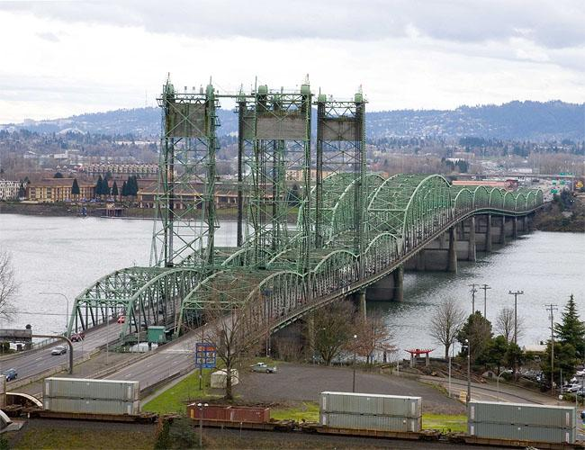
```
]
.pull-right[
.center[**Proposed Replacement**]
```{r, fig.retina = 2.75, echo = FALSE}
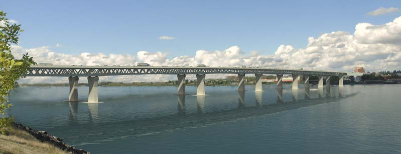
```
]

---
# Free-Rider Problem

## Example: Columbia River Crossing

.pull-left[
```{r, echo = FALSE, fig.height = 4.5, fig.width = 4.5, dev = "svg"}
strategies_p1 <- c("Don't Fund", "Fund")
strategies_p2 <- c("Fund", "Don't Fund")

ggplot() + 
  scale_x_continuous(limits = c(0, 10), expand = c(0,0), breaks = c(2.5, 7.5), labels = strategies_p2, position = "top")+
  scale_y_continuous(limits = c(0, 10), expand = c(0,0), breaks = c(2.5, 7.5), labels = strategies_p1) +
  labs(x = "Washington Legislature", y = "Oregon Legislature") +
  # Player 1 payoffs
  annotate("text", label = expression(500), x = 1.75, y = 6, family = "Fira Sans", size = 6, color = red_pink) +
  annotate("text", label = expression(-100), x = 6.75, y = 6, family = "Fira Sans", size = 6, color = red_pink) +
  annotate("text", label = expression(650), x = 1.75, y = 1, family = "Fira Sans", size = 6, color = red_pink) +
  annotate("text", label = expression(0), x = 6.75, y = 1, family = "Fira Sans", size = 6, color = red_pink) +
  # Player 2 payoffs
  annotate("text", label = expression(750), x = 3.25, y = 9, family = "Fira Sans", size = 6, color = purple) +
  annotate("text", label = expression(1000), x = 8.25, y = 9, family = "Fira Sans", size = 6, color = purple) +
  annotate("text", label = expression(-50), x = 3.25, y = 4, family = "Fira Sans", size = 6, color = purple) +
  annotate("text", label = expression(0), x = 8.25, y = 4, family = "Fira Sans", size = 6, color = purple) +
  # theme stuff
  theme_game +
  geom_segment(aes(x = 0, y = 10, xend = 10, yend = 0), linetype  = "dashed", size = 0.5) +
  geom_segment(aes(x = 5, y = 10, xend = 10, yend = 5), linetype  = "dashed", size = 0.5) +
  geom_segment(aes(x = 0, y = 5, xend = 5, yend = 0), linetype  = "dashed", size = 0.5) +
  geom_segment(aes(x = 5, y = 0, xend = 5, yend = 10), linetype  = "solid", size = 1) +
  geom_segment(aes(x = 0, y = 5, xend = 10, yend = 5), linetype  = "solid", size = 1) +
  geom_ribbon(aes(x = w, ymin = 0, ymax = game_box_1(w)), fill = red_pink, alpha = 0.2, linetype = "blank") +
  geom_ribbon(aes(x = w, ymin = 5, ymax = game_box_2(w)), fill = red_pink, alpha = 0.2, linetype = "blank") +
  geom_ribbon(aes(x = z, ymin = 5, ymax = game_box_3(z)), fill = red_pink, alpha = 0.2, linetype = "blank") +
  geom_ribbon(aes(x = z, ymin = 0, ymax = game_box_2(z)), fill = red_pink, alpha = 0.2, linetype = "blank") +
  geom_ribbon(aes(x = w, ymin = game_box_1(w), ymax = 5), fill = purple, alpha = 0.2, linetype = "blank") +
  geom_ribbon(aes(x = w, ymin = game_box_2(w), ymax = 10), fill = purple, alpha = 0.2, linetype = "blank") +
  geom_ribbon(aes(x = z, ymin = game_box_3(z), ymax = 10), fill = purple, alpha = 0.2, linetype = "blank") +
  geom_ribbon(aes(x = z, ymin = game_box_2(z), ymax = 5), fill = purple, alpha = 0.2, linetype = "blank")
```
]

.pull-right[

Several governments, one expensive bridge.

**Q:** What happened?

]

---
count: false
# Free-Rider Problem

## Example: Columbia River Crossing

.pull-left[
```{r, echo = FALSE, fig.height = 4.5, fig.width = 4.5, dev = "svg"}
strategies_p1 <- c("Don't Fund", "Fund")
strategies_p2 <- c("Fund", "Don't Fund")

ggplot() + 
  scale_x_continuous(limits = c(0, 10), expand = c(0,0), breaks = c(2.5, 7.5), labels = strategies_p2, position = "top")+
  scale_y_continuous(limits = c(0, 10), expand = c(0,0), breaks = c(2.5, 7.5), labels = strategies_p1) +
  labs(x = "Washington Legislature", y = "Oregon Legislature") +
  # Player 1 payoffs
  annotate("text", label = expression(500), x = 1.75, y = 6, family = "Fira Sans", size = 6, color = red_pink) +
  annotate("text", label = expression(-100), x = 6.75, y = 6, family = "Fira Sans", size = 6, color = red_pink) +
  annotate("label", label = expression(650), x = 1.75, y = 1, family = "Fira Sans", size = 6, color = red_pink) +
  annotate("label", label = expression(0), x = 6.75, y = 1, family = "Fira Sans", size = 6, color = red_pink) +
  # Player 2 payoffs
  annotate("text", label = expression(750), x = 3.25, y = 9, family = "Fira Sans", size = 6, color = purple) +
  annotate("label", label = expression(1000), x = 8.25, y = 9, family = "Fira Sans", size = 6, color = purple) +
  annotate("text", label = expression(-50), x = 3.25, y = 4, family = "Fira Sans", size = 6, color = purple) +
  annotate("label", label = expression(0), x = 8.25, y = 4, family = "Fira Sans", size = 6, color = purple) +
  # theme stuff
  theme_game +
  geom_segment(aes(x = 0, y = 10, xend = 10, yend = 0), linetype  = "dashed", size = 0.5) +
  geom_segment(aes(x = 5, y = 10, xend = 10, yend = 5), linetype  = "dashed", size = 0.5) +
  geom_segment(aes(x = 0, y = 5, xend = 5, yend = 0), linetype  = "dashed", size = 0.5) +
  geom_segment(aes(x = 5, y = 0, xend = 5, yend = 10), linetype  = "solid", size = 1) +
  geom_segment(aes(x = 0, y = 5, xend = 10, yend = 5), linetype  = "solid", size = 1) +
  geom_ribbon(aes(x = w, ymin = 0, ymax = game_box_1(w)), fill = red_pink, alpha = 0.2, linetype = "blank") +
  geom_ribbon(aes(x = w, ymin = 5, ymax = game_box_2(w)), fill = red_pink, alpha = 0.2, linetype = "blank") +
  geom_ribbon(aes(x = z, ymin = 5, ymax = game_box_3(z)), fill = red_pink, alpha = 0.2, linetype = "blank") +
  geom_ribbon(aes(x = z, ymin = 0, ymax = game_box_2(z)), fill = red_pink, alpha = 0.2, linetype = "blank") +
  geom_ribbon(aes(x = w, ymin = game_box_1(w), ymax = 5), fill = purple, alpha = 0.2, linetype = "blank") +
  geom_ribbon(aes(x = w, ymin = game_box_2(w), ymax = 10), fill = purple, alpha = 0.2, linetype = "blank") +
  geom_ribbon(aes(x = z, ymin = game_box_3(z), ymax = 10), fill = purple, alpha = 0.2, linetype = "blank") +
  geom_ribbon(aes(x = z, ymin = game_box_2(z), ymax = 5), fill = purple, alpha = 0.2, linetype = "blank")
```
]

.pull-right[

Several governments, one expensive bridge.

**Q:** What happened?

**A:** The replacement bridge was never built.

]

---
# Tragedy of the Commons

## Example: Common Pasture

.pull-left[
```{r, echo = FALSE, fig.height = 4.5, fig.width = 4.5, dev = "svg"}
strategies_p1 <- c("Overgraze", "Graze Sustainably")
strategies_p2 <- c("Graze Sustainably", "Overgraze")

ggplot() + 
  scale_x_continuous(limits = c(0, 10), expand = c(0,0), breaks = c(2.5, 7.5), labels = strategies_p2, position = "top")+
  scale_y_continuous(limits = c(0, 10), expand = c(0,0), breaks = c(2.5, 7.5), labels = strategies_p1) +
  labs(x = "Herder 2", y = "Herder 1") +
  # Player 1 payoffs
  annotate("text", label = expression(100), x = 1.75, y = 6, family = "Fira Sans", size = 6, color = red_pink) +
  annotate("text", label = expression(20), x = 6.75, y = 6, family = "Fira Sans", size = 6, color = red_pink) +
  annotate("text", label = expression(120), x = 1.75, y = 1, family = "Fira Sans", size = 6, color = red_pink) +
  annotate("text", label = expression(30), x = 6.75, y = 1, family = "Fira Sans", size = 6, color = red_pink) +
  # Player 2 payoffs
  annotate("text", label = expression(100), x = 3.25, y = 9, family = "Fira Sans", size = 6, color = purple) +
  annotate("text", label = expression(120), x = 8.25, y = 9, family = "Fira Sans", size = 6, color = purple) +
  annotate("text", label = expression(20), x = 3.25, y = 4, family = "Fira Sans", size = 6, color = purple) +
  annotate("text", label = expression(30), x = 8.25, y = 4, family = "Fira Sans", size = 6, color = purple) +
  # theme stuff
  theme_game +
  geom_segment(aes(x = 0, y = 10, xend = 10, yend = 0), linetype  = "dashed", size = 0.5) +
  geom_segment(aes(x = 5, y = 10, xend = 10, yend = 5), linetype  = "dashed", size = 0.5) +
  geom_segment(aes(x = 0, y = 5, xend = 5, yend = 0), linetype  = "dashed", size = 0.5) +
  geom_segment(aes(x = 5, y = 0, xend = 5, yend = 10), linetype  = "solid", size = 1) +
  geom_segment(aes(x = 0, y = 5, xend = 10, yend = 5), linetype  = "solid", size = 1) +
  geom_ribbon(aes(x = w, ymin = 0, ymax = game_box_1(w)), fill = red_pink, alpha = 0.2, linetype = "blank") +
  geom_ribbon(aes(x = w, ymin = 5, ymax = game_box_2(w)), fill = red_pink, alpha = 0.2, linetype = "blank") +
  geom_ribbon(aes(x = z, ymin = 5, ymax = game_box_3(z)), fill = red_pink, alpha = 0.2, linetype = "blank") +
  geom_ribbon(aes(x = z, ymin = 0, ymax = game_box_2(z)), fill = red_pink, alpha = 0.2, linetype = "blank") +
  geom_ribbon(aes(x = w, ymin = game_box_1(w), ymax = 5), fill = purple, alpha = 0.2, linetype = "blank") +
  geom_ribbon(aes(x = w, ymin = game_box_2(w), ymax = 10), fill = purple, alpha = 0.2, linetype = "blank") +
  geom_ribbon(aes(x = z, ymin = game_box_3(z), ymax = 10), fill = purple, alpha = 0.2, linetype = "blank") +
  geom_ribbon(aes(x = z, ymin = game_box_2(z), ymax = 5), fill = purple, alpha = 0.2, linetype = "blank")
```
]

.pull-right[

**Q:** What happens in equilibrium?

]

---
count: false
# Tragedy of the Commons

## Example: Common Pasture

.pull-left[
```{r, echo = FALSE, fig.height = 4.5, fig.width = 4.5, dev = "svg"}
strategies_p1 <- c("Overgraze", "Graze Sustainably")
strategies_p2 <- c("Graze Sustainably", "Overgraze")

ggplot() + 
  scale_x_continuous(limits = c(0, 10), expand = c(0,0), breaks = c(2.5, 7.5), labels = strategies_p2, position = "top")+
  scale_y_continuous(limits = c(0, 10), expand = c(0,0), breaks = c(2.5, 7.5), labels = strategies_p1) +
  labs(x = "Herder 2", y = "Herder 1") +
  # Player 1 payoffs
  annotate("text", label = expression(100), x = 1.75, y = 6, family = "Fira Sans", size = 6, color = red_pink) +
  annotate("text", label = expression(20), x = 6.75, y = 6, family = "Fira Sans", size = 6, color = red_pink) +
  annotate("label", label = expression(120), x = 1.75, y = 1, family = "Fira Sans", size = 6, color = red_pink) +
  annotate("label", label = expression(30), x = 6.75, y = 1, family = "Fira Sans", size = 6, color = red_pink) +
  # Player 2 payoffs
  annotate("text", label = expression(100), x = 3.25, y = 9, family = "Fira Sans", size = 6, color = purple) +
  annotate("label", label = expression(120), x = 8.25, y = 9, family = "Fira Sans", size = 6, color = purple) +
  annotate("text", label = expression(20), x = 3.25, y = 4, family = "Fira Sans", size = 6, color = purple) +
  annotate("label", label = expression(30), x = 8.25, y = 4, family = "Fira Sans", size = 6, color = purple) +
  # theme stuff
  theme_game +
  geom_segment(aes(x = 0, y = 10, xend = 10, yend = 0), linetype  = "dashed", size = 0.5) +
  geom_segment(aes(x = 5, y = 10, xend = 10, yend = 5), linetype  = "dashed", size = 0.5) +
  geom_segment(aes(x = 0, y = 5, xend = 5, yend = 0), linetype  = "dashed", size = 0.5) +
  geom_segment(aes(x = 5, y = 0, xend = 5, yend = 10), linetype  = "solid", size = 1) +
  geom_segment(aes(x = 0, y = 5, xend = 10, yend = 5), linetype  = "solid", size = 1) +
  geom_ribbon(aes(x = w, ymin = 0, ymax = game_box_1(w)), fill = red_pink, alpha = 0.2, linetype = "blank") +
  geom_ribbon(aes(x = w, ymin = 5, ymax = game_box_2(w)), fill = red_pink, alpha = 0.2, linetype = "blank") +
  geom_ribbon(aes(x = z, ymin = 5, ymax = game_box_3(z)), fill = red_pink, alpha = 0.2, linetype = "blank") +
  geom_ribbon(aes(x = z, ymin = 0, ymax = game_box_2(z)), fill = red_pink, alpha = 0.2, linetype = "blank") +
  geom_ribbon(aes(x = w, ymin = game_box_1(w), ymax = 5), fill = purple, alpha = 0.2, linetype = "blank") +
  geom_ribbon(aes(x = w, ymin = game_box_2(w), ymax = 10), fill = purple, alpha = 0.2, linetype = "blank") +
  geom_ribbon(aes(x = z, ymin = game_box_3(z), ymax = 10), fill = purple, alpha = 0.2, linetype = "blank") +
  geom_ribbon(aes(x = z, ymin = game_box_2(z), ymax = 5), fill = purple, alpha = 0.2, linetype = "blank")
```
]

.pull-right[

**Q:** What happens in equilibrium?

**A:** Both herders overgraze.

```{r, fig.retina = 2, echo = FALSE}
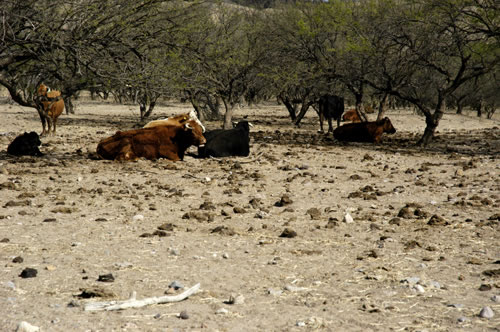
```

]

---
# Tragedy of the Commons

## Example: Common Pasture

.pull-left[
```{r, echo = FALSE, fig.height = 4.5, fig.width = 4.5, dev = "svg"}
strategies_p1 <- c("Overgraze", "Graze Sustainably")
strategies_p2 <- c("Graze Sustainably", "Overgraze")

ggplot() + 
  scale_x_continuous(limits = c(0, 10), expand = c(0,0), breaks = c(2.5, 7.5), labels = strategies_p2, position = "top")+
  scale_y_continuous(limits = c(0, 10), expand = c(0,0), breaks = c(2.5, 7.5), labels = strategies_p1) +
  labs(x = "Herder 2", y = "Herder 1") +
  # Player 1 payoffs
  annotate("label", label = expression(100), x = 1.75, y = 6, family = "Fira Sans", size = 6, color = red_pink) +
  annotate("label", label = expression(100), x = 6.75, y = 6, family = "Fira Sans", size = 6, color = red_pink) +
  annotate("text", label = expression(30), x = 1.75, y = 1, family = "Fira Sans", size = 6, color = red_pink) +
  annotate("text", label = expression(30), x = 6.75, y = 1, family = "Fira Sans", size = 6, color = red_pink) +
  # Player 2 payoffs
  annotate("label", label = expression(100), x = 3.25, y = 9, family = "Fira Sans", size = 6, color = purple) +
  annotate("text", label = expression(30), x = 8.25, y = 9, family = "Fira Sans", size = 6, color = purple) +
  annotate("label", label = expression(100), x = 3.25, y = 4, family = "Fira Sans", size = 6, color = purple) +
  annotate("text", label = expression(30), x = 8.25, y = 4, family = "Fira Sans", size = 6, color = purple) +
  # theme stuff
  theme_game +
  geom_segment(aes(x = 0, y = 10, xend = 10, yend = 0), linetype  = "dashed", size = 0.5) +
  geom_segment(aes(x = 5, y = 10, xend = 10, yend = 5), linetype  = "dashed", size = 0.5) +
  geom_segment(aes(x = 0, y = 5, xend = 5, yend = 0), linetype  = "dashed", size = 0.5) +
  geom_segment(aes(x = 5, y = 0, xend = 5, yend = 10), linetype  = "solid", size = 1) +
  geom_segment(aes(x = 0, y = 5, xend = 10, yend = 5), linetype  = "solid", size = 1) +
  geom_ribbon(aes(x = w, ymin = 0, ymax = game_box_1(w)), fill = red_pink, alpha = 0.2, linetype = "blank") +
  geom_ribbon(aes(x = w, ymin = 5, ymax = game_box_2(w)), fill = red_pink, alpha = 0.2, linetype = "blank") +
  geom_ribbon(aes(x = z, ymin = 5, ymax = game_box_3(z)), fill = red_pink, alpha = 0.2, linetype = "blank") +
  geom_ribbon(aes(x = z, ymin = 0, ymax = game_box_2(z)), fill = red_pink, alpha = 0.2, linetype = "blank") +
  geom_ribbon(aes(x = w, ymin = game_box_1(w), ymax = 5), fill = purple, alpha = 0.2, linetype = "blank") +
  geom_ribbon(aes(x = w, ymin = game_box_2(w), ymax = 10), fill = purple, alpha = 0.2, linetype = "blank") +
  geom_ribbon(aes(x = z, ymin = game_box_3(z), ymax = 10), fill = purple, alpha = 0.2, linetype = "blank") +
  geom_ribbon(aes(x = z, ymin = game_box_2(z), ymax = 5), fill = purple, alpha = 0.2, linetype = "blank")
```
]

.pull-right[

**Solution:** Give each herder property rights to part of the common.

**Example:** England's Enclosure Acts.

```{r, fig.retina = 2.75, echo = FALSE}
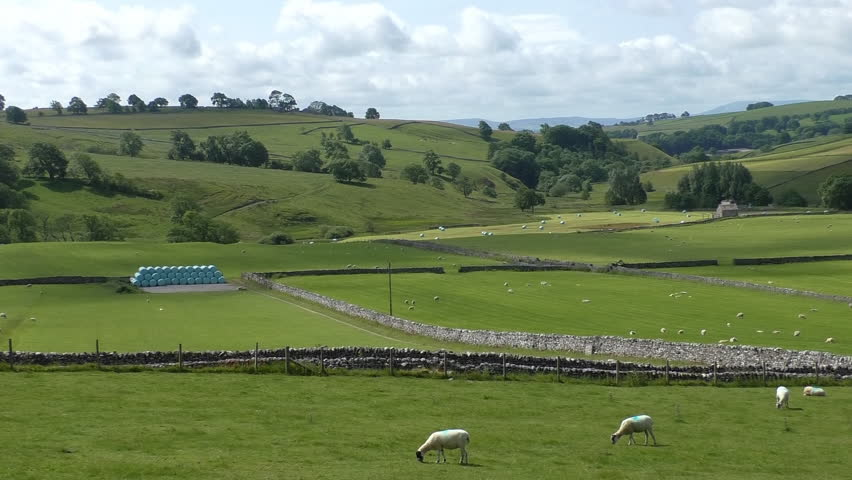
```

]

---
class: clear-slide

**Podcast Question:** What do farmers do when their wells run dry?

> **A.** They stop farming.

> **B.** They dig deeper wells.

> **C.** They plant different crops.

---
count: false
class: clear-slide

**Podcast Question:** What do farmers do when their wells run dry?

> **A.** They stop farming.

> .pink[**B.** They dig deeper wells.]

> **C.** They plant different crops.


---
class: clear-slide

**Podcast Question:** Which of the following best describes Elinor Ostrom's idea that small groups of people can work together to solve the tragedy of the commons?

> **A.** Pigouvian taxes.

> **B.** Government regulation.

> **C.** Unregulated markes.

> **D.** Coase theorem.

> **E.** Property is theft.

---
count: false
class: clear-slide

**Podcast Question:** Which of the following best describes Elinor Ostrom's idea that small groups of people can work together to solve the tragedy of the commons?

> **A.** Pigouvian taxes.

> **B.** Government regulation.

> **C.** Unregulated markes.

> .pink[**D.** Coase theorem.]

> **E.** Property is theft.

---
# Tragedy of the Commons

## Example: Aquifers

Since 2000, farmers in California's Central Valley have experienced several severe droughts.

Groundwater from aquifers .mono[=] substitute for rainwater.
.pull-left[

- **Difference:** Many farmers share a single aquifer.

- California does not yet regulate groundwater use <br> .pink[.mono[-->] Undefined property rights!]

]
.pull-right[
```{r, fig.retina = 2, echo = FALSE}
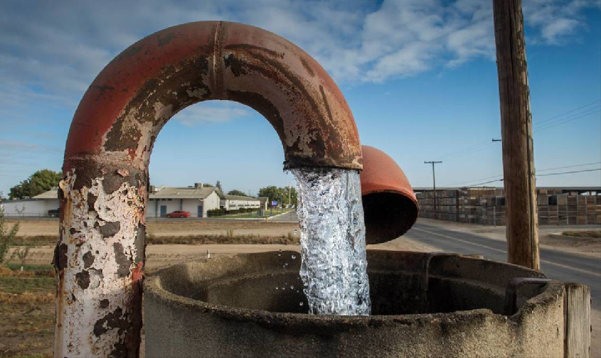
```
]

---
# Tragedy of the Commons

## Example: Aquifers

.pull-left[
```{r, echo = FALSE, fig.height = 4.5, fig.width = 4.5, dev = "svg"}
strategies_p1 <- c("Keep Pumping", "Cut Back")
strategies_p2 <- c("Cut Back", "Keep Pumping")

ggplot() + 
  scale_x_continuous(limits = c(0, 10), expand = c(0,0), breaks = c(2.5, 7.5), labels = strategies_p2, position = "top")+
  scale_y_continuous(limits = c(0, 10), expand = c(0,0), breaks = c(2.5, 7.5), labels = strategies_p1) +
  labs(x = "Farmer 2", y = "Farmer 1") +
  # Player 1 payoffs
  annotate("text", label = expression(85), x = 1.75, y = 6, family = "Fira Sans", size = 6, color = red_pink) +
  annotate("text", label = expression(-30), x = 6.75, y = 6, family = "Fira Sans", size = 6, color = red_pink) +
  annotate("text", label = expression(95), x = 1.75, y = 1, family = "Fira Sans", size = 6, color = red_pink) +
  annotate("text", label = expression(-10), x = 6.75, y = 1, family = "Fira Sans", size = 6, color = red_pink) +
  # Player 2 payoffs
  annotate("text", label = expression(80), x = 3.25, y = 9, family = "Fira Sans", size = 6, color = purple) +
  annotate("text", label = expression(110), x = 8.25, y = 9, family = "Fira Sans", size = 6, color = purple) +
  annotate("text", label = expression(-30), x = 3.25, y = 4, family = "Fira Sans", size = 6, color = purple) +
  annotate("text", label = expression(-12), x = 8.25, y = 4, family = "Fira Sans", size = 6, color = purple) +
  # theme stuff
  theme_game +
  geom_segment(aes(x = 0, y = 10, xend = 10, yend = 0), linetype  = "dashed", size = 0.5) +
  geom_segment(aes(x = 5, y = 10, xend = 10, yend = 5), linetype  = "dashed", size = 0.5) +
  geom_segment(aes(x = 0, y = 5, xend = 5, yend = 0), linetype  = "dashed", size = 0.5) +
  geom_segment(aes(x = 5, y = 0, xend = 5, yend = 10), linetype  = "solid", size = 1) +
  geom_segment(aes(x = 0, y = 5, xend = 10, yend = 5), linetype  = "solid", size = 1) +
  geom_ribbon(aes(x = w, ymin = 0, ymax = game_box_1(w)), fill = red_pink, alpha = 0.2, linetype = "blank") +
  geom_ribbon(aes(x = w, ymin = 5, ymax = game_box_2(w)), fill = red_pink, alpha = 0.2, linetype = "blank") +
  geom_ribbon(aes(x = z, ymin = 5, ymax = game_box_3(z)), fill = red_pink, alpha = 0.2, linetype = "blank") +
  geom_ribbon(aes(x = z, ymin = 0, ymax = game_box_2(z)), fill = red_pink, alpha = 0.2, linetype = "blank") +
  geom_ribbon(aes(x = w, ymin = game_box_1(w), ymax = 5), fill = purple, alpha = 0.2, linetype = "blank") +
  geom_ribbon(aes(x = w, ymin = game_box_2(w), ymax = 10), fill = purple, alpha = 0.2, linetype = "blank") +
  geom_ribbon(aes(x = z, ymin = game_box_3(z), ymax = 10), fill = purple, alpha = 0.2, linetype = "blank") +
  geom_ribbon(aes(x = z, ymin = game_box_2(z), ymax = 5), fill = purple, alpha = 0.2, linetype = "blank")
```
]

.pull-right[

Without rainwater, farmers must rely on groundwater.

- **Choice:** Keep pumping water from aquifer or cut back.

]

---
count: false
# Tragedy of the Commons

## Example: Aquifers

.pull-left[
```{r, echo = FALSE, fig.height = 4.5, fig.width = 4.5, dev = "svg"}
strategies_p1 <- c("Keep Pumping", "Cut Back")
strategies_p2 <- c("Cut Back", "Keep Pumping")

ggplot() + 
  scale_x_continuous(limits = c(0, 10), expand = c(0,0), breaks = c(2.5, 7.5), labels = strategies_p2, position = "top")+
  scale_y_continuous(limits = c(0, 10), expand = c(0,0), breaks = c(2.5, 7.5), labels = strategies_p1) +
  labs(x = "Farmer 2", y = "Farmer 1") +
  # Player 1 payoffs
  annotate("text", label = expression(85), x = 1.75, y = 6, family = "Fira Sans", size = 6, color = red_pink) +
  annotate("text", label = expression(-30), x = 6.75, y = 6, family = "Fira Sans", size = 6, color = red_pink) +
  annotate("label", label = expression(95), x = 1.75, y = 1, family = "Fira Sans", size = 6, color = red_pink) +
  annotate("label", label = expression(-10), x = 6.75, y = 1, family = "Fira Sans", size = 6, color = red_pink) +
  # Player 2 payoffs
  annotate("text", label = expression(80), x = 3.25, y = 9, family = "Fira Sans", size = 6, color = purple) +
  annotate("label", label = expression(110), x = 8.25, y = 9, family = "Fira Sans", size = 6, color = purple) +
  annotate("text", label = expression(-30), x = 3.25, y = 4, family = "Fira Sans", size = 6, color = purple) +
  annotate("label", label = expression(-12), x = 8.25, y = 4, family = "Fira Sans", size = 6, color = purple) +
  # theme stuff
  theme_game +
  geom_segment(aes(x = 0, y = 10, xend = 10, yend = 0), linetype  = "dashed", size = 0.5) +
  geom_segment(aes(x = 5, y = 10, xend = 10, yend = 5), linetype  = "dashed", size = 0.5) +
  geom_segment(aes(x = 0, y = 5, xend = 5, yend = 0), linetype  = "dashed", size = 0.5) +
  geom_segment(aes(x = 5, y = 0, xend = 5, yend = 10), linetype  = "solid", size = 1) +
  geom_segment(aes(x = 0, y = 5, xend = 10, yend = 5), linetype  = "solid", size = 1) +
  geom_ribbon(aes(x = w, ymin = 0, ymax = game_box_1(w)), fill = red_pink, alpha = 0.2, linetype = "blank") +
  geom_ribbon(aes(x = w, ymin = 5, ymax = game_box_2(w)), fill = red_pink, alpha = 0.2, linetype = "blank") +
  geom_ribbon(aes(x = z, ymin = 5, ymax = game_box_3(z)), fill = red_pink, alpha = 0.2, linetype = "blank") +
  geom_ribbon(aes(x = z, ymin = 0, ymax = game_box_2(z)), fill = red_pink, alpha = 0.2, linetype = "blank") +
  geom_ribbon(aes(x = w, ymin = game_box_1(w), ymax = 5), fill = purple, alpha = 0.2, linetype = "blank") +
  geom_ribbon(aes(x = w, ymin = game_box_2(w), ymax = 10), fill = purple, alpha = 0.2, linetype = "blank") +
  geom_ribbon(aes(x = z, ymin = game_box_3(z), ymax = 10), fill = purple, alpha = 0.2, linetype = "blank") +
  geom_ribbon(aes(x = z, ymin = game_box_2(z), ymax = 5), fill = purple, alpha = 0.2, linetype = "blank")
```
]

.pull-right[

Without rainwater, farmers must rely on groundwater.

- **Choice:** Keep pumping water from aquifer or cut back.

Farmers know that they would earn higher profits if everyone cut back, but incentives are such that .green[**everyone keeps pumping!**]

]

---
# Tragedy of the Commons

## Example: Aquifers

**Solutions?**

1. Agreements to cut back water consumption with neighbors?

    - Difficult to enforce!
    
2. Coase theorem?

    - Requires property rights and low transaction costs. Neither exist here!
    
3. Regulation or Pigouvian taxes?

    - Maybe. Requires costly monitoring system, though.

---
# Tragedy of the Commons

## Example: *Deadliest Catch*

Before 2005, Alaska had a derby for king crab fishing.

- Short window each season to catch as much crab as possible.

```{r, fig.retina = 2, echo = FALSE}
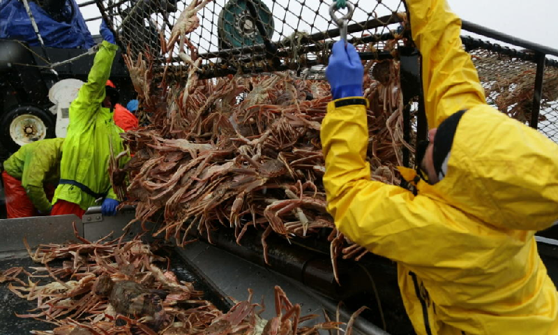
```

---
# Tragedy of the Commons

## Example: *Deadliest Catch*

.pull-left[
```{r, echo = FALSE, fig.height = 4.5, fig.width = 4.5, dev = "svg"}
strategies_p1 <- c("Overfish", "Fish Responsibly")
strategies_p2 <- c("Fish Responsibly", "Overfish")

ggplot() + 
  scale_x_continuous(limits = c(0, 10), expand = c(0,0), breaks = c(2.5, 7.5), labels = strategies_p2, position = "top")+
  scale_y_continuous(limits = c(0, 10), expand = c(0,0), breaks = c(2.5, 7.5), labels = strategies_p1) +
  labs(x = "Sig Hansen", y = "Phil Harris") +
  # Player 1 payoffs
  annotate("text", label = expression(60000), x = 1.75, y = 6, family = "Fira Sans", size = 6, color = red_pink) +
  annotate("text", label = expression(0), x = 6.75, y = 6, family = "Fira Sans", size = 6, color = red_pink) +
  annotate("text", label = expression(90000), x = 1.75, y = 1, family = "Fira Sans", size = 6, color = red_pink) +
  annotate("text", label = expression(20000), x = 6.75, y = 1, family = "Fira Sans", size = 6, color = red_pink) +
  # Player 2 payoffs
  annotate("text", label = expression(60000), x = 3.25, y = 9, family = "Fira Sans", size = 6, color = purple) +
  annotate("text", label = expression(90000), x = 8.25, y = 9, family = "Fira Sans", size = 6, color = purple) +
  annotate("text", label = expression(0), x = 3.25, y = 4, family = "Fira Sans", size = 6, color = purple) +
  annotate("text", label = expression(20000), x = 8.25, y = 4, family = "Fira Sans", size = 6, color = purple) +
  # theme stuff
  theme_game +
  geom_segment(aes(x = 0, y = 10, xend = 10, yend = 0), linetype  = "dashed", size = 0.5) +
  geom_segment(aes(x = 5, y = 10, xend = 10, yend = 5), linetype  = "dashed", size = 0.5) +
  geom_segment(aes(x = 0, y = 5, xend = 5, yend = 0), linetype  = "dashed", size = 0.5) +
  geom_segment(aes(x = 5, y = 0, xend = 5, yend = 10), linetype  = "solid", size = 1) +
  geom_segment(aes(x = 0, y = 5, xend = 10, yend = 5), linetype  = "solid", size = 1) +
  geom_ribbon(aes(x = w, ymin = 0, ymax = game_box_1(w)), fill = red_pink, alpha = 0.2, linetype = "blank") +
  geom_ribbon(aes(x = w, ymin = 5, ymax = game_box_2(w)), fill = red_pink, alpha = 0.2, linetype = "blank") +
  geom_ribbon(aes(x = z, ymin = 5, ymax = game_box_3(z)), fill = red_pink, alpha = 0.2, linetype = "blank") +
  geom_ribbon(aes(x = z, ymin = 0, ymax = game_box_2(z)), fill = red_pink, alpha = 0.2, linetype = "blank") +
  geom_ribbon(aes(x = w, ymin = game_box_1(w), ymax = 5), fill = purple, alpha = 0.2, linetype = "blank") +
  geom_ribbon(aes(x = w, ymin = game_box_2(w), ymax = 10), fill = purple, alpha = 0.2, linetype = "blank") +
  geom_ribbon(aes(x = z, ymin = game_box_3(z), ymax = 10), fill = purple, alpha = 0.2, linetype = "blank") +
  geom_ribbon(aes(x = z, ymin = game_box_2(z), ymax = 5), fill = purple, alpha = 0.2, linetype = "blank")
```
]

.pull-right[

**Q:** How do fishers compete in a derby?

]

---
count: false
# Tragedy of the Commons

## Example: *Deadliest Catch*

.pull-left[
```{r, echo = FALSE, fig.height = 4.5, fig.width = 4.5, dev = "svg"}
strategies_p1 <- c("Overfish", "Fish Responsibly")
strategies_p2 <- c("Fish Responsibly", "Overfish")

ggplot() + 
  scale_x_continuous(limits = c(0, 10), expand = c(0,0), breaks = c(2.5, 7.5), labels = strategies_p2, position = "top")+
  scale_y_continuous(limits = c(0, 10), expand = c(0,0), breaks = c(2.5, 7.5), labels = strategies_p1) +
  labs(x = "Sig Hansen", y = "Phil Harris") +
  # Player 1 payoffs
  annotate("text", label = expression(60000), x = 1.75, y = 6, family = "Fira Sans", size = 6, color = red_pink) +
  annotate("text", label = expression(0), x = 6.75, y = 6, family = "Fira Sans", size = 6, color = red_pink) +
  annotate("label", label = expression(90000), x = 1.75, y = 1, family = "Fira Sans", size = 6, color = red_pink) +
  annotate("label", label = expression(20000), x = 6.75, y = 1, family = "Fira Sans", size = 6, color = red_pink) +
  # Player 2 payoffs
  annotate("text", label = expression(60000), x = 3.25, y = 9, family = "Fira Sans", size = 6, color = purple) +
  annotate("label", label = expression(90000), x = 8.25, y = 9, family = "Fira Sans", size = 6, color = purple) +
  annotate("text", label = expression(0), x = 3.25, y = 4, family = "Fira Sans", size = 6, color = purple) +
  annotate("label", label = expression(20000), x = 8.25, y = 4, family = "Fira Sans", size = 6, color = purple) +
  # theme stuff
  theme_game +
  geom_segment(aes(x = 0, y = 10, xend = 10, yend = 0), linetype  = "dashed", size = 0.5) +
  geom_segment(aes(x = 5, y = 10, xend = 10, yend = 5), linetype  = "dashed", size = 0.5) +
  geom_segment(aes(x = 0, y = 5, xend = 5, yend = 0), linetype  = "dashed", size = 0.5) +
  geom_segment(aes(x = 5, y = 0, xend = 5, yend = 10), linetype  = "solid", size = 1) +
  geom_segment(aes(x = 0, y = 5, xend = 10, yend = 5), linetype  = "solid", size = 1) +
  geom_ribbon(aes(x = w, ymin = 0, ymax = game_box_1(w)), fill = red_pink, alpha = 0.2, linetype = "blank") +
  geom_ribbon(aes(x = w, ymin = 5, ymax = game_box_2(w)), fill = red_pink, alpha = 0.2, linetype = "blank") +
  geom_ribbon(aes(x = z, ymin = 5, ymax = game_box_3(z)), fill = red_pink, alpha = 0.2, linetype = "blank") +
  geom_ribbon(aes(x = z, ymin = 0, ymax = game_box_2(z)), fill = red_pink, alpha = 0.2, linetype = "blank") +
  geom_ribbon(aes(x = w, ymin = game_box_1(w), ymax = 5), fill = purple, alpha = 0.2, linetype = "blank") +
  geom_ribbon(aes(x = w, ymin = game_box_2(w), ymax = 10), fill = purple, alpha = 0.2, linetype = "blank") +
  geom_ribbon(aes(x = z, ymin = game_box_3(z), ymax = 10), fill = purple, alpha = 0.2, linetype = "blank") +
  geom_ribbon(aes(x = z, ymin = game_box_2(z), ymax = 5), fill = purple, alpha = 0.2, linetype = "blank")
```
]

.pull-right[

**Q:** How do fishers compete in a derby?

**A:** They overfish.  

- Smaller payoffs .mono[+] more fatalities.

- As the game repeats over time, payoffs decrease from increasingly small crab populations.
]

---
# Tragedy of the Commons

## Example: *Deadliest Catch*

**Solution:** Alaska adopted an .pink[individual fishing quota] system in 2005.

- Each boat receives quota to be filled over a longer period of time.

--

**Results:**

- Fewer fatalities.

- Smaller fleets.

- Higher crab prices .mono[-->] higher profits.

---
# Tragedy of the Commons

## Example: Climate Change

.pull-left[
```{r, echo = FALSE, fig.height = 4.5, fig.width = 4.5, dev = "svg"}
strategies_p1 <- c("Ignore", "Restrict")
strategies_p2 <- c("Restrict", "Ignore")

ggplot() + 
  scale_x_continuous(limits = c(0, 10), expand = c(0,0), breaks = c(2.5, 7.5), labels = strategies_p2, position = "top")+
  scale_y_continuous(limits = c(0, 10), expand = c(0,0), breaks = c(2.5, 7.5), labels = strategies_p1) +
  labs(x = "US", y = "China") +
  # Player 1 payoffs
  annotate("label", label = wrapper(expression("Best"), 15), x = 1.75, y = 6, family = "Fira Sans", size = 6, color = red_pink) +
  annotate("text", label = wrapper(expression("Worst"), 15), x = 6.75, y = 6, family = "Fira Sans", size = 6, color = red_pink) +
  annotate("text", label = wrapper(expression("Good"), 15), x = 1.75, y = 1, family = "Fira Sans", size = 6, color = red_pink) +
  annotate("label", label = wrapper(expression("Bad"), 15), x = 6.75, y = 1, family = "Fira Sans", size = 6, color = red_pink) +
  # Player 2 payoffs
  annotate("label", label = wrapper(expression("Best"), 15), x = 3.25, y = 9, family = "Fira Sans", size = 6, color = purple) +
  annotate("text", label = wrapper(expression("Good"), 15), x = 8.25, y = 9, family = "Fira Sans", size = 6, color = purple) +
  annotate("text", label = wrapper(expression("Worst"), 15), x = 3.25, y = 4, family = "Fira Sans", size = 6, color = purple) +
  annotate("label", label = wrapper(expression("Bad"), 15), x = 8.25, y = 4, family = "Fira Sans", size = 6, color = purple) +
  # theme stuff
  theme_game +
  geom_segment(aes(x = 0, y = 10, xend = 10, yend = 0), linetype  = "dashed", size = 0.5) +
  geom_segment(aes(x = 5, y = 10, xend = 10, yend = 5), linetype  = "dashed", size = 0.5) +
  geom_segment(aes(x = 0, y = 5, xend = 5, yend = 0), linetype  = "dashed", size = 0.5) +
  geom_segment(aes(x = 5, y = 0, xend = 5, yend = 10), linetype  = "solid", size = 1) +
  geom_segment(aes(x = 0, y = 5, xend = 10, yend = 5), linetype  = "solid", size = 1) +
  geom_ribbon(aes(x = w, ymin = 0, ymax = game_box_1(w)), fill = red_pink, alpha = 0.2, linetype = "blank") +
  geom_ribbon(aes(x = w, ymin = 5, ymax = game_box_2(w)), fill = red_pink, alpha = 0.2, linetype = "blank") +
  geom_ribbon(aes(x = z, ymin = 5, ymax = game_box_3(z)), fill = red_pink, alpha = 0.2, linetype = "blank") +
  geom_ribbon(aes(x = z, ymin = 0, ymax = game_box_2(z)), fill = red_pink, alpha = 0.2, linetype = "blank") +
  geom_ribbon(aes(x = w, ymin = game_box_1(w), ymax = 5), fill = purple, alpha = 0.2, linetype = "blank") +
  geom_ribbon(aes(x = w, ymin = game_box_2(w), ymax = 10), fill = purple, alpha = 0.2, linetype = "blank") +
  geom_ribbon(aes(x = z, ymin = game_box_3(z), ymax = 10), fill = purple, alpha = 0.2, linetype = "blank") +
  geom_ribbon(aes(x = z, ymin = game_box_2(z), ymax = 5), fill = purple, alpha = 0.2, linetype = "blank")
```
]

.pull-right[

The US and China could reduce the severity of climate change if both countries restrict carbon emissions.

**Q:** The current equilibrium is (.pink[Ignore], .purple[Ignore]). How could the US and China reach (.pink[Restrict], .purple[Restrict])?

]

---
# Tragedy of the Commons

## Example: Roommates .mono[+] Kitchen Sink

.pull-left[
```{r, echo = FALSE, fig.height = 4.5, fig.width = 4.5, dev = "svg"}
strategies_p1 <- c("Leave Dishes", "Do Dishes")
strategies_p2 <- c("Do Dishes", "Leave Dishes")

ggplot() + 
  scale_x_continuous(limits = c(0, 10), expand = c(0,0), breaks = c(2.5, 7.5), labels = strategies_p2, position = "top")+
  scale_y_continuous(limits = c(0, 10), expand = c(0,0), breaks = c(2.5, 7.5), labels = strategies_p1) +
  labs(x = "Roommate 2", y = "Roommate 1") +
  # Player 1 payoffs
  annotate("text", label = expression(0), x = 1.75, y = 6, family = "Fira Sans", size = 6, color = red_pink) +
  annotate("text", label = expression(-2), x = 6.75, y = 6, family = "Fira Sans", size = 6, color = red_pink) +
  annotate("label", label = expression(2), x = 1.75, y = 1, family = "Fira Sans", size = 6, color = red_pink) +
  annotate("label", label = expression(-1), x = 6.75, y = 1, family = "Fira Sans", size = 6, color = red_pink) +
  # Player 2 payoffs
  annotate("text", label = expression(0), x = 3.25, y = 9, family = "Fira Sans", size = 6, color = purple) +
  annotate("label", label = expression(1), x = 8.25, y = 9, family = "Fira Sans", size = 6, color = purple) +
  annotate("text", label = expression(-3), x = 3.25, y = 4, family = "Fira Sans", size = 6, color = purple) +
  annotate("label", label = expression(-1), x = 8.25, y = 4, family = "Fira Sans", size = 6, color = purple) +
  # theme stuff
  theme_game +
  geom_segment(aes(x = 0, y = 10, xend = 10, yend = 0), linetype  = "dashed", size = 0.5) +
  geom_segment(aes(x = 5, y = 10, xend = 10, yend = 5), linetype  = "dashed", size = 0.5) +
  geom_segment(aes(x = 0, y = 5, xend = 5, yend = 0), linetype  = "dashed", size = 0.5) +
  geom_segment(aes(x = 5, y = 0, xend = 5, yend = 10), linetype  = "solid", size = 1) +
  geom_segment(aes(x = 0, y = 5, xend = 10, yend = 5), linetype  = "solid", size = 1) +
  geom_ribbon(aes(x = w, ymin = 0, ymax = game_box_1(w)), fill = red_pink, alpha = 0.2, linetype = "blank") +
  geom_ribbon(aes(x = w, ymin = 5, ymax = game_box_2(w)), fill = red_pink, alpha = 0.2, linetype = "blank") +
  geom_ribbon(aes(x = z, ymin = 5, ymax = game_box_3(z)), fill = red_pink, alpha = 0.2, linetype = "blank") +
  geom_ribbon(aes(x = z, ymin = 0, ymax = game_box_2(z)), fill = red_pink, alpha = 0.2, linetype = "blank") +
  geom_ribbon(aes(x = w, ymin = game_box_1(w), ymax = 5), fill = purple, alpha = 0.2, linetype = "blank") +
  geom_ribbon(aes(x = w, ymin = game_box_2(w), ymax = 10), fill = purple, alpha = 0.2, linetype = "blank") +
  geom_ribbon(aes(x = z, ymin = game_box_3(z), ymax = 10), fill = purple, alpha = 0.2, linetype = "blank") +
  geom_ribbon(aes(x = z, ymin = game_box_2(z), ymax = 5), fill = purple, alpha = 0.2, linetype = "blank")
```
]

.pull-right[

**Q:** How can you and your roommates prevent this tragedy?

```{r, fig.retina = 3, echo = FALSE}
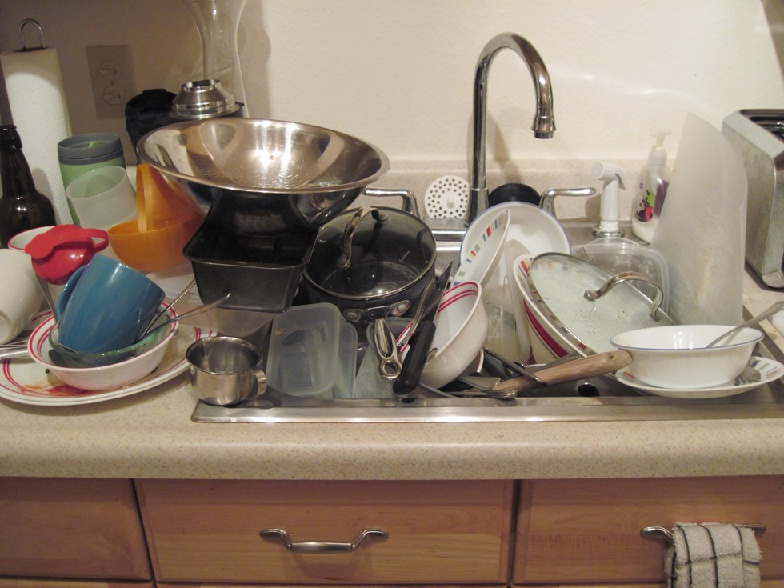
```

]

---
# Collective Action Problems

## Solutions?

1. Assign property rights.

    - *e.g.,* private property, enforceable contracts, conditions for Coase theorem, *etc.*

2. Pigouvian taxes/subsidies.

    - *e.g.,* Oregon's Bottle Bill, water pricing, *etc.*

3. Regulation.

    - *e.g.,* anti-littering laws, individual fishing quotas, *etc.*


